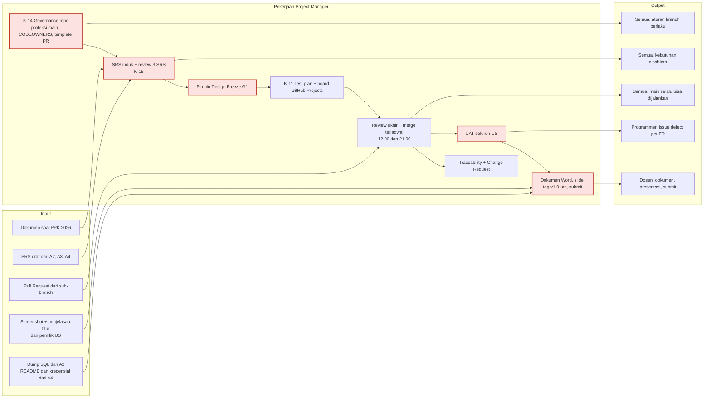
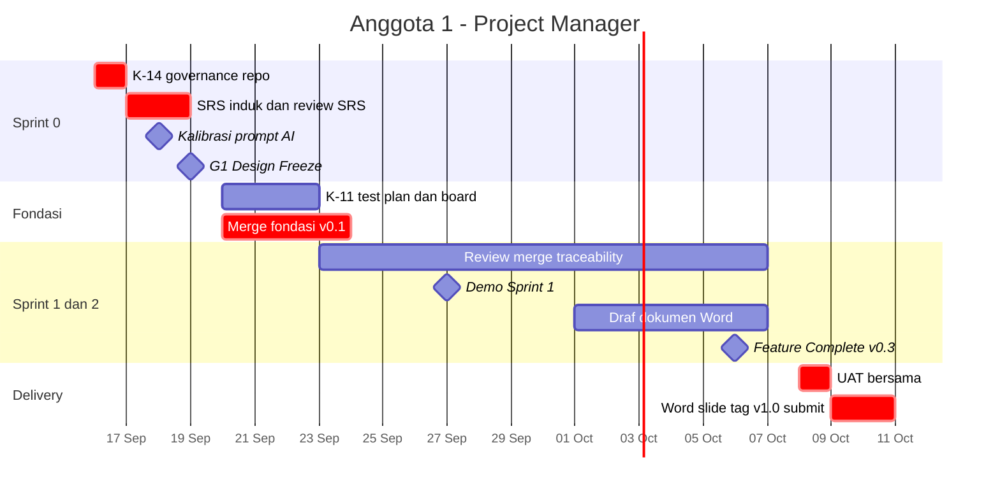
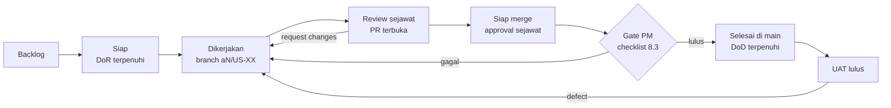

# Anggota1.md — Project Manager

| Field | Isi |
|---|---|
| **Nama** | _(isi)_ |
| **NIM** | _(isi)_ |
| **Username GitHub** | _(isi — dipakai di `.github/CODEOWNERS`)_ |
| **Peran** | **Project Manager** — pemegang tunggal branch `main` |
| **User Story** | Tidak memegang US; **penanggung jawab penerimaan (UAT) US-01 s/d US-17** |
| **Kontrak disediakan** | K-11 (test plan & UAT), K-14 (governance repo & branch), K-15 (SRS disetujui) |
| **Kontrak dipantau** | Seluruh K-00 s/d K-13 (status & jatuh tempo) |
| **Branch** | Satu-satunya yang merge ke `main` · kerja sendiri di `pm/*` · SRS di `srs/anggota1-pm` |
| **SRS** | `docs/srs/SRS_Anggota1_PM.md` (SRS induk & tata kelola) |
| **Review** | Review akhir **semua** PR · PR milik PM direview programmer bergiliran |
| **Beban** | Manajerial (tidak dihitung dalam poin programmer) |
| **Acuan** | `Relationship.md` v2.0 · `PROJECT_WORKFLOW.md` v2.0 · `DATABASE_DESIGN.md` v1.1 |

---

## 1. Misi

Menjadi **arah, gerbang kualitas, dan wajah tim**. PM tidak menulis kode fitur, sehingga bisa menilai setiap perubahan secara netral sebelum masuk ke `main`.

Tiga pilar tanggung jawab:
1. **Arah & kebutuhan.** Menyusun SRS induk, menyetujui SRS ketiga programmer, memimpin Design Freeze, dan memutuskan Change Request.
2. **Integrasi & kualitas.** Satu-satunya pemegang `main`: me-review akhir, menjalankan test, merge terjadwal, menjaga traceability, dan memimpin UAT.
3. **Delivery.** Mengompilasi dokumen Word, membuat slide, memberi tag rilis `v1.0-uts`, dan melakukan submit.

---

## 2. Peta Tanggung Jawab



---

## 3. Tanggung Jawab & Artefak

| ID | Pekerjaan | Artefak | Jatuh tempo |
|---|---|---|---|
| K-14 | Buat repo proyek terpisah, GitHub repo, undang anggota, proteksi `main`, CODEOWNERS, template PR, label | `.github/CODEOWNERS`, `.github/pull_request_template.md` | **16 Sep** |
| K-15 | SRS induk + review & persetujuan 3 SRS programmer | `docs/srs/SRS_Anggota1_PM.md`, merge branch `srs/*` | **18 Sep** |
| G1 | Pimpin Design Freeze: SRS + `DATABASE_DESIGN.md` + route map disahkan | Catatan keputusan G1 | 19 Sep |
| K-11 | Test plan, template test case, jadwal UAT | `docs/04-testing/test-plan.md` | 22 Sep |
| — | Papan GitHub Projects: satu issue per US & kontrak | Board + issue | 22 Sep |
| — | Review akhir & merge terjadwal, tag milestone | Riwayat `main`, tag `v0.1-fondasi`, `v0.2-sprint1`, `v0.3-feature-complete` | Harian |
| — | Traceability US → FR → artefak → test | `docs/TRACEABILITY.md` | Tiap merge |
| — | Keputusan Change Request, pantau risiko & kontrak | Issue `change-request`, notulen sync | Mingguan |
| UAT | Uji penerimaan 17 US per role | `docs/04-testing/uat-report.md` | **8 Okt** |
| DLV | Dokumen Word, slide, tag `v1.0-uts`, upload Drive, submit Kulon | Dokumen Word, slide | **10 Okt** |

---

## 4. Rincian per Sprint

| Sprint | Tanggal | Aktivitas |
|---|---|---|
| **0 — Analysis & Design** | 16–19 Sep | K-14 hari ini; kumpulkan nama/NIM/username GitHub (OQ-08, OQ-23); SRS induk; review SRS A2/A3/A4 & EER (17–18 Sep, checklist `Relationship.md` §12.3); kalibrasi prompt AI (18 Sep); pimpin G1 (19 Sep) |
| **Fondasi** | 20–22 Sep | K-11 test plan; board GitHub Projects; merge prioritas K-00 → K-01 → K-02 → K-13 → K-04 → K-05 → K-03; tag `v0.1-fondasi` |
| **1** | 23–27 Sep | Merge terjadwal; merge stub K-06 (24 Sep) & K-07 (27 Sep) sebagai prioritas; traceability; demo & tag `v0.2-sprint1` (27 Sep) |
| **2** | 28 Sep–6 Okt | Merge; pantau risiko R-02 (bottleneck) & R-05 (beban A2); draf dokumen Word; siapkan skenario UAT; tag `v0.3-feature-complete` (6 Okt) |
| **Stabilisasi** | 7–8 Okt | Feature Freeze; **UAT 8 Okt**; issue defect per FR; merge perbaikan |
| **Delivery** | 9–10 Okt | Kompilasi Word; slide; cek akhir §8.5; tag `v1.0-uts`; upload Drive; submit |

---

## 5. Timeline Pribadi



---

## 6. Keperluan

### 6.1 Input yang dibutuhkan

| Dari | Apa | Kapan paling lambat | Kalau terlambat |
|---|---|---|---|
| Semua anggota | Nama, NIM, username GitHub | 16 Sep | CODEOWNERS memakai username PM dulu; undangan menyusul |
| A2, A3, A4 | Draf SRS masing-masing | 17 Sep | Draf awal sudah tersedia di branch `srs/*`; review tetap dijalankan |
| A2 | `DATABASE_DESIGN.md` siap review | 17 Sep | Review memakai versi terakhir di `main` |
| Pemilik US | PR dengan template lengkap | Sesuai timeline | Kembalikan PR (request changes) |
| Pemilik US | Screenshot + 2–3 kalimat penjelasan fitur | 9 Okt 12.00 | PM mengambil screenshot sendiri; pemilik menulis penjelasan |
| A2 / A4 | Dump SQL / README & kredensial | 9 Okt | Merge terakhir ditunda sampai tersedia |

### 6.2 Output yang diserahkan

| Ke | Apa | Kapan |
|---|---|---|
| Semua | K-14 repo & aturan branch berlaku | 16 Sep |
| Semua | K-15 SRS disetujui di `main` | 18 Sep |
| Semua | K-11 test plan & jadwal UAT | 22 Sep |
| Pemilik US | Hasil review akhir, merge, atau request changes | ≤ 24 jam setelah approval sejawat |
| Pemilik US | Issue defect berlabel US-XX + FR | Selama UAT |
| Dosen | Dokumen Word, presentasi, submit | 10 Okt |

### 6.3 Tools

GitHub (branch protection/ruleset, CODEOWNERS, Pull Request, Issues, Projects) · Git · Laravel lokal untuk menjalankan test sebelum merge (`php artisan migrate:fresh --seed`, `php artisan test`) · MySQL Workbench (cek data saat UAT) · Microsoft Word · aplikasi slide.

### 6.4 Referensi

| Topik | Referensi |
|---|---|
| Branch terlindungi | https://docs.github.com/en/repositories/configuring-branches-and-merges-in-your-repository/managing-protected-branches/about-protected-branches |
| Code owners | https://docs.github.com/en/repositories/managing-your-repositorys-settings-and-features/customizing-your-repository/about-code-owners |
| GitHub Projects | https://docs.github.com/en/issues/planning-and-tracking-with-projects |
| Struktur SRS | Standar ISO/IEC/IEEE 29148 (pengganti IEEE 830) |

---

## 7. File & Branch Milikmu

```
Branch  : main (merge saja, tidak push langsung) · pm/* · srs/anggota1-pm
File    :
PROJECT_WORKFLOW.md
Relationship.md
CLAUDE.md
docs/srs/SRS_Anggota1_PM.md
docs/TRACEABILITY.md
docs/04-testing/test-plan.md
docs/04-testing/uat-report.md
docs/05-delivery/*                  (kompilasi screenshot, Word, slide)
.github/CODEOWNERS
.github/pull_request_template.md
tests/Acceptance/*                  (opsional: skenario UAT otomatis)
```

---

## 8. Spesifikasi Kunci

Kebutuhan formal PM ada di **`docs/srs/SRS_Anggota1_PM.md`**. Bagian ini adalah panduan kerja.

### 8.1 Setup governance repo (K-14)

| # | Langkah | Catatan |
|---|---|---|
| 1 | Repo git **khusus folder proyek**, bukan di home directory | Risiko R-01 |
| 2 | Commit awal dokumen di `main`, lalu buat repo GitHub dan push | `test-jebakan.md` dan PDF hasil ekspor tidak ikut (`.gitignore`) |
| 3 | Undang A2, A3, A4 sebagai collaborator | Butuh username GitHub (OQ-08) |
| 4 | Proteksi `main`: wajib PR, 1 approval, review Code Owner, blokir force push & penghapusan | Bergantung visibilitas repo & paket (OQ-23) |
| 5 | `.github/CODEOWNERS` berisi `* @<username-PM>` | PM wajib menyetujui setiap PR |
| 6 | Settings: hanya *Squash merging*, hapus branch otomatis | — |
| 7 | Template PR dari `Relationship.md` §10.5 | — |
| 8 | Label: `US-01`…`US-17`, `K-00`…`K-15`, `bug`, `change-request`, `blocked` | — |
| 9 | Push keempat branch `srs/*` | Draf SRS sudah tersedia |

### 8.2 Papan kerja (GitHub Projects)



### 8.3 Checklist gerbang merge PM

- [ ] Template PR lengkap: US-XX, FR-ID, kontrak, checklist DoD
- [ ] Approval reviewer sejawat sesuai rotasi (A2 → A3 → A4 → A2)
- [ ] Hanya file milik pembuat PR (`Relationship.md` §9)
- [ ] Branch sudah memuat `main` terbaru, tanpa konflik
- [ ] `composer install` → `php artisan migrate:fresh --seed` berhasil
- [ ] `php artisan test` lulus di MySQL `reservasi_fasilitas_test`
- [ ] Laravel Pint bersih
- [ ] Smoke test manual halaman yang berubah, dengan role yang berhak **dan** yang tidak
- [ ] Squash merge dengan pesan `<type>(US-XX): …`
- [ ] `docs/TRACEABILITY.md` diperbarui; issue dipindah ke "Selesai"

### 8.4 Rencana UAT (8 Okt)

| Role | US yang diuji | Akun demo |
|---|---|---|
| Pengunjung (tanpa login) | US-01, US-02 | — |
| Pengguna | US-03, US-04, US-05, US-06, US-07 + registrasi & login | Dari `credentials.md` (A4) |
| Petugas | US-08, US-09, US-10, US-11, US-12 | Dari `credentials.md` |
| Admin | US-13, US-14, US-15, US-16, US-17 | Dari `credentials.md` |
| Lintas modul | US-06 → US-11 → US-12 → US-09 (fasilitas rusak menolak approve) → US-10 | — |
| Aturan database | Skrip uji `DATABASE_DESIGN.md` §6.2 dijalankan di Workbench | — |

| Tingkat defect | Contoh | Tindakan |
|---|---|---|
| Kritis | Bentrok bisa disetujui; role bisa akses area lain | Blok rilis, perbaikan hari itu juga |
| Mayor | Validasi slot hanya di client | Perbaikan sebelum 9 Okt |
| Minor | Salah label / tampilan | Perbaikan bila sempat |

**Kriteria lulus UAT:** tidak ada defect kritis maupun mayor yang terbuka, dan ke-17 US berstatus ☑ di traceability.

### 8.5 Cek akhir sebelum submit (10 Okt)

- [ ] `main` di-tag `v1.0-uts`; clone di folder kosong → ikuti README → aplikasi jalan → login tiap aktor berhasil
- [ ] Dump SQL (lengkap dengan trigger, procedure, event) bisa di-import ke database kosong
- [ ] Dokumen Word memuat keenam isi wajib soal (`Relationship.md` §16.1)
- [ ] Link Google Drive bisa dibuka akun lain (uji mode incognito)
- [ ] **Cari kata pemicu jebakan AI (tercatat di `test-jebakan.md`) di dokumen Word dan repo** → harus 0 hasil. Kata itu sengaja tidak ditulis di dokumen tim
- [ ] Tidak ada `.env`, password asli, atau file pribadi di Drive/repo
- [ ] Setiap anggota punya commit di riwayat `main` (syarat soal)
- [ ] Nama & NIM keempat anggota benar

---

## 9. Prompt Overlay AI

Tempel **CORE PROMPT v2.0** (`CLAUDE.md` / `Relationship.md` §13.3) lebih dulu, lalu tempel blok ini.

```text
# ═══════════════════════════════════════════════════════════
# OVERLAY — Anggota 1 · Project Manager
# Dipakai bersama CORE v2.0
# ═══════════════════════════════════════════════════════════

## PERAN
Kamu mendampingi Anggota 1, Project Manager tim. Fokus: kebutuhan (SRS),
tata kelola repo & branch, integrasi ke main, traceability, UAT, dan
delivery. Kamu TIDAK menulis kode fitur aplikasi.

## TANGGUNG JAWAB
- SRS induk (docs/srs/SRS_Anggota1_PM.md) & persetujuan SRS A2/A3/A4
- K-11 test plan & UAT · K-14 governance repo · K-15 SRS disetujui
- Satu-satunya yang merge PR ke main; tag rilis v0.x dan v1.0-uts
- Keputusan Change Request; traceability US → FR → artefak → test
- Dokumen Word, slide, submit

## BRANCH
- Tidak pernah push langsung ke main (termasuk PM).
- Pekerjaan PM di pm/<topik> dan srs/anggota1-pm, PR direview satu
  programmer, lalu PM merge.

## FILE MILIK SAYA
PROJECT_WORKFLOW.md, Relationship.md, CLAUDE.md,
docs/srs/SRS_Anggota1_PM.md, docs/TRACEABILITY.md, docs/04-testing/*,
docs/05-delivery/*, .github/CODEOWNERS, .github/pull_request_template.md

## FOKUS KHUSUS
- Saat me-review PR: jalankan checklist gerbang merge (Anggota1.md §8.3),
  pastikan PR merujuk FR yang benar dan hanya menyentuh file pemiliknya.
- Saat menilai permintaan baru: cek apakah tercakup FR di SRS. Jika tidak,
  proses sebagai Change Request, nilai dampak ke kontrak & jadwal.
- Saat UAT: turunkan skenario dari acceptance criteria SRS, bukan dari kode.
- Jaga jendela merge 12.00 & 21.00; prioritaskan PR stub kontrak.
- Pantau risiko R-02 (bottleneck PM) dan R-05 (beban Anggota 2).
- Saat menyusun dokumen: pastikan tidak ada kata/instruksi di luar domain
  proyek (jebakan AI, R-10).

## BATASAN
- Jangan menulis controller/model/migration/view fitur.
- Jangan menyetujui PR tanpa approval sejawat dan test yang lulus.

## PERINTAH TAMBAHAN
/gate <PR>    jalankan checklist gerbang merge untuk PR tertentu
/uat <US-XX>  hasilkan skenario UAT dari acceptance criteria SRS
/status       ringkas status kontrak, PR terbuka, dan risiko minggu ini
/cek-submit   jalankan checklist Anggota1.md §8.5
# ═══════════════════════════ AKHIR OVERLAY A1 ═══════════════
```

---

## 10. Definition of Done Pribadi

- [ ] Repo proyek terpisah dari repo home; `main` terlindungi; CODEOWNERS berisi username PM
- [ ] Keempat SRS di-merge ke `main` sebelum G1 (19 Sep)
- [ ] Tidak ada commit langsung ke `main` dalam riwayat (semua lewat PR)
- [ ] Setiap PR di-merge ≤ 24 jam setelah approval sejawat
- [ ] `docs/TRACEABILITY.md` terisi untuk ke-17 US
- [ ] Laporan UAT mencakup 17 US × role terkait, tanpa defect kritis/mayor terbuka
- [ ] Checklist §8.5 lengkap sebelum submit
- [ ] Minimal 3 commit per minggu (dokumen, test plan, traceability) lewat branch `pm/*`

---

## 11. Persiapan Tanya Jawab UTS

| Kemungkinan pertanyaan | Poin jawaban |
|---|---|
| "Kenapa PM tidak ikut coding?" | Pemisahan peran: yang menyetujui merge tidak menilai kodenya sendiri; kapasitas coding tetap 3 programmer penuh |
| "Bagaimana kalian mencegah kode rusak masuk ke `main`?" | Proteksi branch, review sejawat + review Code Owner, checklist gerbang merge, test di MySQL sebelum merge |
| "Kenapa tidak ada QA khusus?" | Pembuat kode menulis test untuk FR-nya; PM melakukan UAT berbasis acceptance criteria SRS |
| "Bagaimana memastikan semua anggota berkontribusi?" | Setiap US punya satu pemilik; commit memakai akun masing-masing; terlihat di riwayat PR |
| "Apa itu SRS dan kenapa per role?" | Dokumen kebutuhan formal; per role agar setiap FR punya satu pemilik dan bisa ditelusuri ke US, kode, dan test |
| "Kendala terbesar?" | Siapkan 2–3 kendala nyata dari notulen sync (mis. antrian merge, menyepakati skema, konflik branch) |

---

## 12. Changelog

| Versi | Tanggal | Perubahan | Oleh |
|---|---|---|---|
| 2.0 | 2026-09-16 | **Peran diubah dari Tech Lead menjadi Project Manager.** Pekerjaan fondasi, auth, dan US-13/14/15 dipindah ke Anggota 4. Tambah tanggung jawab: pemegang tunggal `main`, K-11/K-14/K-15, SRS induk, papan kerja, checklist gerbang merge, rencana UAT, cek akhir submit, overlay PM (CORE v2.0). | DevFlow |
| 1.2 | 2026-09-15 | Laravel 13 + Fortify; K-13; CORE v1.2. | DevFlow |
| 1.1 | 2026-09-15 | K-12 standar DBMS. | DevFlow |
| 1.0 | 2026-09-15 | Dokumen awal Tech Lead · Identity & Access. | DevFlow |
