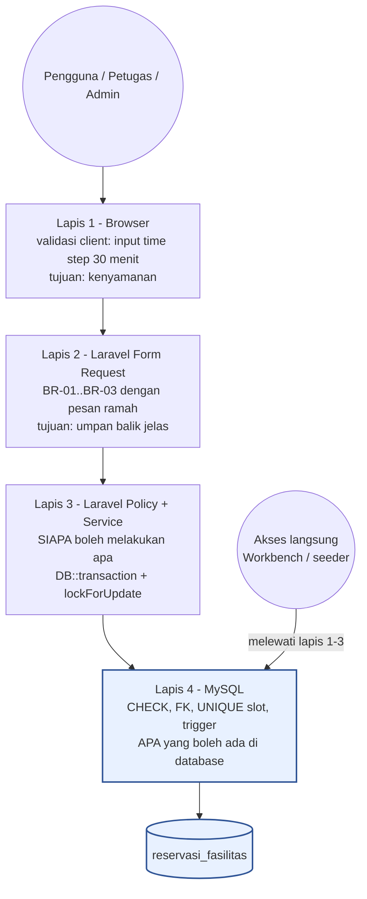
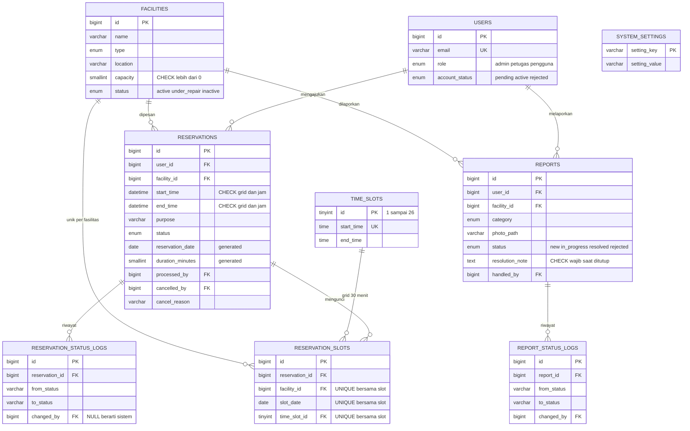
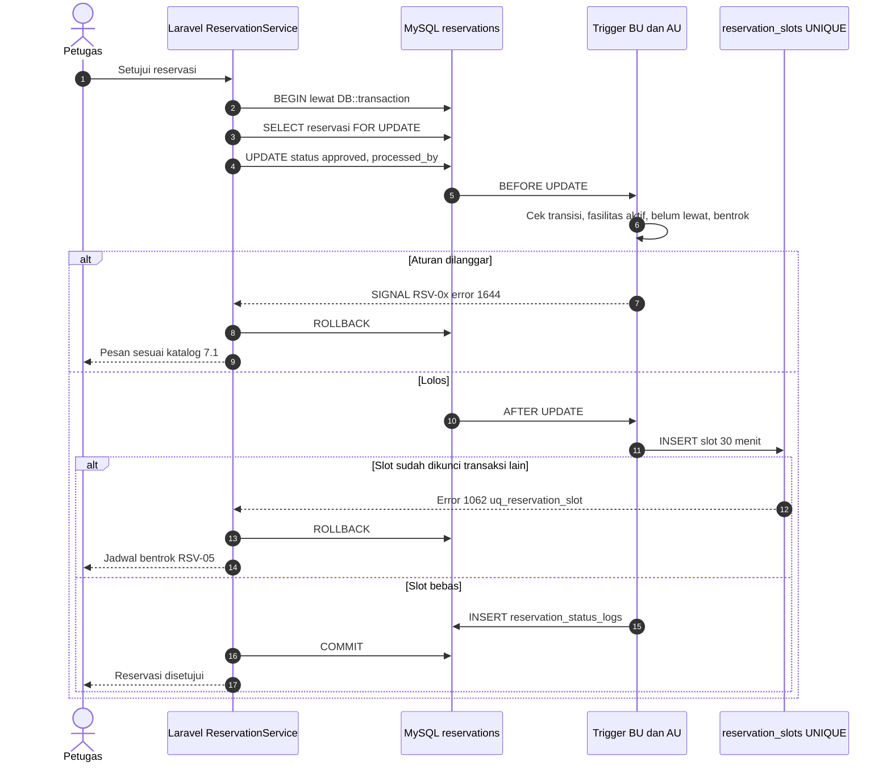
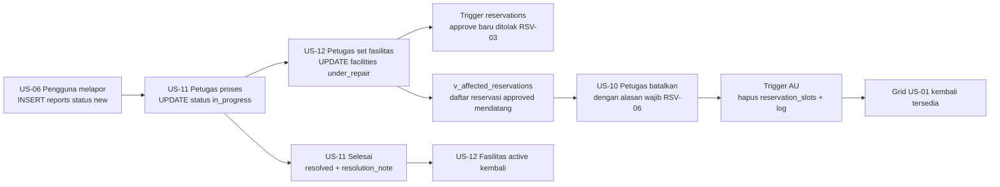

# DATABASE_DESIGN.md — Rancangan RDBMS MySQL

**Proyek:** Sistem Reservasi & Pelaporan Fasilitas Kampus (PPK 2026 — UTS)
**DBMS:** MySQL Server **≥ 8.0.16** (InnoDB, `utf8mb4`) — diasumsikan sudah terpasang di laptop keempat anggota
**Framework:** Laravel 13 (PHP ≥ 8.3)
**Acuan:** `Project PPK 2026.pdf` · `PROJECT_WORKFLOW.md` · `Relationship.md` · `Anggota2.md`
**Pemilik:** Anggota 2 (Programmer — Data, Fasilitas & Insight) · kontributor spesifikasi: Anggota 3 (reservasi & ketersediaan), Anggota 4 (akun & laporan) · disahkan & di-merge ke `main` oleh PM (Anggota 1)
**Kontrak:** K-12 standar koneksi (§14) · K-13 objek RDBMS (§5–§10, §13) — lihat `Relationship.md` §7
**Status:** DRAFT — bahan review EER 17 Sep, dibekukan di Design Freeze G1 (19 Sep)
**Versi:** 1.1

> Dokumen ini adalah **sumber tunggal** rancangan database. Semua SQL di sini adalah **spesifikasi desain** yang diuji di MySQL Workbench. SQL ini baru menjadi migration setelah G1 disetujui.

---

## 1. Kenapa Database Harus Ikut "Berpikir"

Praktikum mata kuliah ini memakai **RDBMS**. Artinya, penilaian tidak berhenti pada "data tersimpan"; database juga diharapkan menjalankan perannya sebagai sistem relasional. Pada proyek ini ada tiga peran:

| Peran | Pertanyaan yang dijawab database | Contoh di proyek ini |
|---|---|---|
| **Validasi** | "Bolehkah data ini ada?" | `start_time` 09.15 ditolak; laporan ditutup tanpa catatan resolusi ditolak |
| **Eksekusi interaksi** | "Apa yang otomatis terjadi saat status berubah?" | Reservasi disetujui → slot terkunci + riwayat tercatat; bentrok → seluruh perubahan dibatalkan |
| **Rekap** | "Apa ringkasan dari seluruh data?" | Okupansi per fasilitas, peringkat kerusakan per lokasi, antrian petugas |

**Prinsip utama:** aturan yang **harus selalu benar**, siapa pun pengaksesnya, diletakkan di database. Pengaksesnya bisa aplikasi Laravel, Workbench, atau seeder yang salah tulis. Dengan begitu, walaupun dosen menjalankan `INSERT` langsung dari Workbench, data yang melanggar aturan tetap ditolak.

---

## 2. Brainstorming Mekanisme RDBMS

Setiap fitur MySQL ditimbang terhadap kebutuhan proyek. Keputusan akhirnya ada di kolom paling kanan.

| # | Mekanisme MySQL | Kandidat penggunaan | Kelebihan | Risiko / batasan | Keputusan |
|---|---|---|---|---|---|
| M-1 | **CHECK constraint** (enforced sejak 8.0.16) | Jam 07.00–20.00, kelipatan 30 menit, `end > start`, satu hari, kapasitas > 0, catatan resolusi wajib | Deklaratif, tidak bisa dilewati, pesan error menyebut nama constraint | Tidak boleh `NOW()`, subquery, variabel; kolom yang dipakai tidak boleh punya aksi FK `ON DELETE/UPDATE` | ✅ **Dipakai** |
| M-2 | **Foreign key** + `RESTRICT` | Semua relasi; data master tidak bisa dihapus bila masih dipakai | Integritas referensial | Hapus data jadi "sulit" — memang disengaja | ✅ **Dipakai** |
| M-3 | **UNIQUE pada tabel slot** (`reservation_slots`) | **Anti-bentrok BR-04** yang kebal *race condition* | Dua approve bersamaan → salah satu pasti gagal di level index, tanpa bergantung isolasi transaksi | Butuh tabel tambahan + trigger pengisi (denormalisasi terkendali) | ✅ **Dipakai — penjaga utama BR-04** |
| M-4 | **Tabel referensi `time_slots`** (26 baris) | Grid slot 30 menit sebagai data, bukan hitungan di kode | Grid ketersediaan = `CROSS JOIN`; FK menjamin slot valid | — | ✅ **Dipakai** |
| M-5 | **Trigger BEFORE** | Mesin status (transisi sah), waktu belum lewat, fasilitas bookable, alasan wajib bila petugas membatalkan | Aturan lintas kolom/tabel yang tidak bisa jadi CHECK | Logika tersembunyi dari PHP → wajib didokumentasikan + katalog kode error | ✅ **Dipakai** |
| M-6 | **Trigger AFTER** | Isi/hapus `reservation_slots`, tulis log status | Eksekusi interaksi otomatis & atomik | Tidak boleh mengubah tabel pemicu yang sama | ✅ **Dipakai** |
| M-7 | **Generated column** (`STORED`) | `reservation_date`, `duration_minutes` | Index untuk rekap harian, tidak perlu dihitung ulang | Tidak boleh diisi dari Laravel | ✅ **Dipakai** |
| M-8 | **View** | Ketersediaan publik tanpa data pemohon (BR-09), antrian petugas, rekap | Privasi ditegakkan sejak query; query rekap cukup ditulis sekali | View tidak menerima parameter | ✅ **Dipakai** |
| M-9 | **Stored procedure baca** | Grid satu fasilitas per tanggal, rekap periode dengan window function | Menerima parameter; bisa langsung di-`CALL` dari Workbench saat demo | Logika SQL berada di luar repo PHP → disimpan sebagai file `.sql` di repo | ✅ **Dipakai (read-only)** |
| M-10 | **Stored procedure tulis** dengan `START TRANSACTION` di dalamnya | Approve / batal | Satu panggilan | **Implicit commit** memutus transaksi Laravel (`DB::transaction`, `RefreshDatabase`); ada dua pemilik batas transaksi | ❌ **Tidak dipakai** — batas transaksi dipegang Laravel |
| M-11 | **Transaksi + `SELECT … FOR UPDATE`** | Approve (US-09) | Pesan bentrok yang ramah sebelum menyentuh index | Tanpa M-3, masih rawan bila lock salah pasang | ✅ **Dipakai sebagai lapis pertama** |
| M-12 | **Event scheduler** | Reservasi `pending` yang waktunya lewat → `expired` | Tidak butuh cron/queue Laravel | Status `expired` belum ada di soal (OQ-18) | 🟡 **Usulan** |
| M-13 | **Window function** (`RANK`, `SUM() OVER`) | Peringkat okupansi & kerusakan, pangsa laporan per lokasi | Rekap lebih informatif untuk US-17 | Wajib MySQL 8.0 | ✅ **Dipakai** |
| M-14 | **Recursive CTE** | Mengisi 26 baris `time_slots` | Tanpa menulis 26 `INSERT` | — | ✅ **Dipakai** |
| M-15 | **Tabel `system_settings`** | Batas pembatalan mandiri (OQ-02), ambang antrian | Nilai bisa diubah tanpa deploy; trigger & view membacanya | CHECK tidak bisa membaca tabel → hanya untuk trigger/view | ✅ **Dipakai** |
| M-16 | **Tabel log status** (audit trail) | Riwayat perubahan reservasi & laporan | Bukti proses, bahan rata-rata waktu proses (US-17) | Tabel tumbuh — kecil untuk skala kuliah | ✅ **Dipakai** |
| M-17 | **User DB terpisah** (DDL vs DML) | `ppk_app` hanya DML + `EXECUTE` | Keamanan berlapis | Migration butuh user berhak DDL → konfigurasi ekstra | 🟡 **Opsional (nilai tambah)** |
| M-18 | **Partisi tabel** | Reservasi per tahun | — | Berlebihan untuk skala kuliah; FK tidak didukung pada tabel berpartisi | ❌ **Tidak dipakai** |

---

## 3. Arsitektur Lapisan Pertahanan



| Lapis | Menjawab | Jika dilewati |
|---|---|---|
| 1 Browser | "Nyaman diisi?" | Tidak masalah — lapis 2 menangkap |
| 2 Form Request | "Formatnya benar?" | Lapis 4 tetap menolak |
| 3 Policy & Service | "**Siapa** yang boleh?" | Database tidak tahu siapa yang login → **wajib ada di Laravel** |
| 4 MySQL | "**Apa** yang boleh ada?" | Tidak bisa dilewati |

**Validasi ganda di lapis 2 dan 4 disengaja.** Lapis 2 menghasilkan pesan dalam Bahasa Indonesia yang ramah. Lapis 4 adalah jaminan terakhir. Keduanya harus merujuk aturan BR yang sama.

---

## 4. Model Data Fisik

9 tabel domain, ditambah tabel bawaan Laravel (`sessions`, `cache`, `jobs`, `password_reset_tokens`, dan kolom tambahan dari starter kit) yang tidak dibahas di sini.



Relasi petugas (`processed_by`, `cancelled_by`, `handled_by`, `changed_by` → `users`) tidak digambar agar diagram tetap terbaca.

### 4.1 Perubahan dibanding draft `Anggota2.md` §8.1

| Perubahan | Alasan |
|---|---|
| **+ `time_slots`** | Grid 30 menit menjadi data (M-4) |
| **+ `reservation_slots`** | Penjaga anti-bentrok yang kebal race condition (M-3) |
| **+ `reservation_status_logs`, `report_status_logs`** | Audit trail & bahan rekap waktu proses (M-16) |
| **+ `system_settings`** | Batas pembatalan & ambang antrian yang bisa diubah (M-15) |
| **+ `reservation_date`, `duration_minutes`** (generated) | Index & rekap harian (M-7) |
| **+ `cancelled_by`, `cancelled_at`** | Membedakan batal mandiri vs batal petugas (BR-06) |
| **+ status `expired`** | Usulan M-12, menunggu OQ-18 |

### 4.2 Kenapa `start_time`/`end_time` bertipe `DATETIME`, bukan `TIMESTAMP`

Jam operasional 07.00–20.00 adalah **jam dinding kampus (WIB)**. `TIMESTAMP` dikonversi otomatis menurut `time_zone` sesi, sehingga `09.00 WIB` bisa tersimpan sebagai `02.00` bila sesi memakai UTC, dan CHECK jam operasional akan salah menilai. `DATETIME` menyimpan nilai apa adanya. Aturannya: kolom jadwal = `DATETIME`, kolom jejak (`created_at`/`updated_at`) = `TIMESTAMP` bawaan Laravel.

---

## 5. DDL — Tabel, Constraint, Index

Kompatibel MySQL **8.0.16+**. Urutan eksekusi mengikuti ketergantungan FK. Simpan sebagai `database/sql/01_tables.sql`.

```sql
-- =========================================================================
-- 01_tables.sql · DATABASE_DESIGN.md §5 · MySQL >= 8.0.16 · InnoDB · utf8mb4
-- =========================================================================

-- 5.1 users ---------------------------------------------------------- US-13..15
CREATE TABLE users (
  id                 BIGINT UNSIGNED AUTO_INCREMENT PRIMARY KEY,
  name               VARCHAR(255) NOT NULL,
  email              VARCHAR(255) NOT NULL,
  email_verified_at  TIMESTAMP NULL,
  password           VARCHAR(255) NOT NULL,
  role               ENUM('admin','petugas','pengguna') NOT NULL DEFAULT 'pengguna',
  account_status     ENUM('pending','active','rejected') NOT NULL DEFAULT 'pending',
  remember_token     VARCHAR(100) NULL,
  created_at         TIMESTAMP NULL,
  updated_at         TIMESTAMP NULL,
  CONSTRAINT uq_users_email UNIQUE (email),
  CONSTRAINT chk_users_name CHECK (CHAR_LENGTH(TRIM(name)) > 0),
  INDEX idx_users_verification (account_status, role)
) ENGINE=InnoDB DEFAULT CHARSET=utf8mb4 COLLATE=utf8mb4_unicode_ci;

-- 5.2 facilities ----------------------------------------------------- US-02, US-12, US-16
CREATE TABLE facilities (
  id           BIGINT UNSIGNED AUTO_INCREMENT PRIMARY KEY,
  name         VARCHAR(150) NOT NULL,
  type         ENUM('ruang_kelas','aula','laboratorium','alat','lapangan') NOT NULL,
  location     VARCHAR(150) NOT NULL,
  capacity     SMALLINT UNSIGNED NOT NULL,
  description  TEXT NULL,
  status       ENUM('active','under_repair','inactive') NOT NULL DEFAULT 'active',
  created_at   TIMESTAMP NULL,
  updated_at   TIMESTAMP NULL,
  CONSTRAINT uq_facilities_name_location UNIQUE (name, location),
  CONSTRAINT chk_fac_name     CHECK (CHAR_LENGTH(TRIM(name)) > 0),
  CONSTRAINT chk_fac_capacity CHECK (capacity > 0),
  INDEX idx_fac_search (status, type, location, capacity)
) ENGINE=InnoDB DEFAULT CHARSET=utf8mb4 COLLATE=utf8mb4_unicode_ci;

-- 5.3 time_slots ------------------------------------------------------ BR-01, BR-02
CREATE TABLE time_slots (
  id          TINYINT UNSIGNED PRIMARY KEY,
  start_time  TIME NOT NULL,
  end_time    TIME NOT NULL,
  CONSTRAINT uq_time_slots_start UNIQUE (start_time),
  CONSTRAINT chk_ts_id       CHECK (id BETWEEN 1 AND 26),
  CONSTRAINT chk_ts_duration CHECK (TIMEDIFF(end_time, start_time) = '00:30:00'),
  CONSTRAINT chk_ts_range    CHECK (start_time >= '07:00:00' AND end_time <= '20:00:00'),
  CONSTRAINT chk_ts_grid     CHECK (MINUTE(start_time) IN (0, 30) AND SECOND(start_time) = 0)
) ENGINE=InnoDB DEFAULT CHARSET=utf8mb4 COLLATE=utf8mb4_unicode_ci;

-- 26 slot (07.00-07.30 ... 19.30-20.00) lewat recursive CTE
INSERT INTO time_slots (id, start_time, end_time)
WITH RECURSIVE s (n, t) AS (
  SELECT 1, CAST('07:00:00' AS TIME)
  UNION ALL
  SELECT n + 1, ADDTIME(t, '00:30:00') FROM s WHERE n < 26
)
SELECT n, t, ADDTIME(t, '00:30:00') FROM s;

-- 5.4 system_settings -------------------------------------------------- OQ-02, US-08
CREATE TABLE system_settings (
  setting_key    VARCHAR(64)  PRIMARY KEY,
  setting_value  VARCHAR(255) NOT NULL,
  description    VARCHAR(255) NULL,
  updated_at     TIMESTAMP NULL
) ENGINE=InnoDB DEFAULT CHARSET=utf8mb4 COLLATE=utf8mb4_unicode_ci;

INSERT INTO system_settings (setting_key, setting_value, description) VALUES
  ('cancel_deadline_minutes',       '120', 'Batas batal mandiri sebelum start_time (OQ-02, nilai sementara)'),
  ('queue_urgent_reservation_hours', '24', 'Reservasi pending ditandai mendesak bila mulai kurang dari N jam'),
  ('queue_overdue_report_hours',     '48', 'Laporan new ditandai terlambat bila lebih dari N jam');

-- 5.5 reservations ------------------------------------------------------ US-03..US-05, US-09, US-10
CREATE TABLE reservations (
  id                BIGINT UNSIGNED AUTO_INCREMENT PRIMARY KEY,
  user_id           BIGINT UNSIGNED NOT NULL,
  facility_id       BIGINT UNSIGNED NOT NULL,
  start_time        DATETIME NOT NULL,
  end_time          DATETIME NOT NULL,
  purpose           VARCHAR(255) NOT NULL,
  status            ENUM('pending','approved','rejected','cancelled','expired') NOT NULL DEFAULT 'pending',
  reservation_date  DATE     GENERATED ALWAYS AS (CAST(start_time AS DATE)) STORED,
  duration_minutes  SMALLINT GENERATED ALWAYS AS (TIMESTAMPDIFF(MINUTE, start_time, end_time)) STORED,
  processed_by      BIGINT UNSIGNED NULL,
  processed_at      DATETIME NULL,
  cancelled_by      BIGINT UNSIGNED NULL,
  cancelled_at      DATETIME NULL,
  cancel_reason     VARCHAR(255) NULL,
  created_at        TIMESTAMP NULL,
  updated_at        TIMESTAMP NULL,

  CONSTRAINT fk_reservations_users      FOREIGN KEY (user_id)      REFERENCES users (id),
  CONSTRAINT fk_reservations_facilities FOREIGN KEY (facility_id)  REFERENCES facilities (id),
  CONSTRAINT fk_reservations_processor  FOREIGN KEY (processed_by) REFERENCES users (id),
  CONSTRAINT fk_reservations_canceller  FOREIGN KEY (cancelled_by) REFERENCES users (id),

  -- BR-01..BR-03 ditegakkan di level database
  CONSTRAINT chk_res_order      CHECK (end_time > start_time),
  CONSTRAINT chk_res_same_day   CHECK (CAST(start_time AS DATE) = CAST(end_time AS DATE)),
  CONSTRAINT chk_res_open       CHECK (CAST(start_time AS TIME) >= '07:00:00'),
  CONSTRAINT chk_res_close      CHECK (CAST(end_time   AS TIME) <= '20:00:00'),
  CONSTRAINT chk_res_grid_start CHECK (MINUTE(start_time) IN (0, 30) AND SECOND(start_time) = 0),
  CONSTRAINT chk_res_grid_end   CHECK (MINUTE(end_time)   IN (0, 30) AND SECOND(end_time)   = 0),
  CONSTRAINT chk_res_purpose    CHECK (CHAR_LENGTH(TRIM(purpose)) > 0),
  CONSTRAINT chk_res_cancel_ts  CHECK ((status = 'cancelled') = (cancelled_at IS NOT NULL)),

  INDEX idx_res_conflict (facility_id, status, start_time, end_time),
  INDEX idx_res_user     (user_id, created_at),
  INDEX idx_res_queue    (status, start_time),
  INDEX idx_res_recap    (reservation_date, facility_id, status)
) ENGINE=InnoDB DEFAULT CHARSET=utf8mb4 COLLATE=utf8mb4_unicode_ci;

-- 5.6 reservation_slots -------------------------------------------------- BR-04 (penjaga utama)
-- Hanya berisi baris untuk reservasi berstatus approved. Diisi & dihapus oleh trigger (§7).
CREATE TABLE reservation_slots (
  id              BIGINT UNSIGNED AUTO_INCREMENT PRIMARY KEY,
  reservation_id  BIGINT UNSIGNED NOT NULL,
  facility_id     BIGINT UNSIGNED NOT NULL,
  slot_date       DATE NOT NULL,
  time_slot_id    TINYINT UNSIGNED NOT NULL,
  CONSTRAINT fk_rslots_reservations FOREIGN KEY (reservation_id) REFERENCES reservations (id) ON DELETE CASCADE,
  CONSTRAINT fk_rslots_facilities   FOREIGN KEY (facility_id)    REFERENCES facilities (id),
  CONSTRAINT fk_rslots_time_slots   FOREIGN KEY (time_slot_id)   REFERENCES time_slots (id),
  CONSTRAINT uq_reservation_slot UNIQUE (facility_id, slot_date, time_slot_id),
  INDEX idx_rslots_reservation (reservation_id)
) ENGINE=InnoDB DEFAULT CHARSET=utf8mb4 COLLATE=utf8mb4_unicode_ci;

-- 5.7 reservation_status_logs ----------------------------------------------- audit trail
CREATE TABLE reservation_status_logs (
  id              BIGINT UNSIGNED AUTO_INCREMENT PRIMARY KEY,
  reservation_id  BIGINT UNSIGNED NOT NULL,
  from_status     VARCHAR(20) NULL,
  to_status       VARCHAR(20) NOT NULL,
  changed_by      BIGINT UNSIGNED NULL,               -- NULL = sistem (event scheduler)
  note            VARCHAR(255) NULL,
  changed_at      DATETIME NOT NULL DEFAULT CURRENT_TIMESTAMP,
  CONSTRAINT fk_rlogs_reservations FOREIGN KEY (reservation_id) REFERENCES reservations (id),
  CONSTRAINT fk_rlogs_users        FOREIGN KEY (changed_by)     REFERENCES users (id),
  INDEX idx_rlogs_reservation (reservation_id, changed_at)
) ENGINE=InnoDB DEFAULT CHARSET=utf8mb4 COLLATE=utf8mb4_unicode_ci;

-- 5.8 reports ------------------------------------------------------------- US-06, US-07, US-11
CREATE TABLE reports (
  id               BIGINT UNSIGNED AUTO_INCREMENT PRIMARY KEY,
  user_id          BIGINT UNSIGNED NOT NULL,
  facility_id      BIGINT UNSIGNED NOT NULL,
  category         ENUM('kerusakan_fisik','kelistrikan','peralatan','kebersihan','keamanan','lainnya') NOT NULL,
  description      TEXT NOT NULL,
  photo_path       VARCHAR(255) NOT NULL,
  status           ENUM('new','in_progress','resolved','rejected') NOT NULL DEFAULT 'new',
  resolution_note  TEXT NULL,
  handled_by       BIGINT UNSIGNED NULL,
  resolved_at      DATETIME NULL,
  created_at       TIMESTAMP NULL,
  updated_at       TIMESTAMP NULL,

  CONSTRAINT fk_reports_users      FOREIGN KEY (user_id)     REFERENCES users (id),
  CONSTRAINT fk_reports_facilities FOREIGN KEY (facility_id) REFERENCES facilities (id),
  CONSTRAINT fk_reports_handler    FOREIGN KEY (handled_by)  REFERENCES users (id),

  CONSTRAINT chk_rep_description CHECK (CHAR_LENGTH(TRIM(description)) > 0),
  CONSTRAINT chk_rep_resolution  CHECK (status NOT IN ('resolved','rejected')
                                        OR CHAR_LENGTH(TRIM(COALESCE(resolution_note, ''))) > 0),
  CONSTRAINT chk_rep_resolved_ts CHECK ((status IN ('resolved','rejected')) = (resolved_at IS NOT NULL)),

  INDEX idx_rep_queue    (status, created_at),
  INDEX idx_rep_facility (facility_id, created_at),
  INDEX idx_rep_user     (user_id, created_at)
) ENGINE=InnoDB DEFAULT CHARSET=utf8mb4 COLLATE=utf8mb4_unicode_ci;

-- 5.9 report_status_logs ------------------------------------------------------ audit trail
CREATE TABLE report_status_logs (
  id           BIGINT UNSIGNED AUTO_INCREMENT PRIMARY KEY,
  report_id    BIGINT UNSIGNED NOT NULL,
  from_status  VARCHAR(20) NULL,
  to_status    VARCHAR(20) NOT NULL,
  changed_by   BIGINT UNSIGNED NULL,
  note         TEXT NULL,
  changed_at   DATETIME NOT NULL DEFAULT CURRENT_TIMESTAMP,
  CONSTRAINT fk_plogs_reports FOREIGN KEY (report_id)  REFERENCES reports (id),
  CONSTRAINT fk_plogs_users   FOREIGN KEY (changed_by) REFERENCES users (id),
  INDEX idx_plogs_report (report_id, changed_at)
) ENGINE=InnoDB DEFAULT CHARSET=utf8mb4 COLLATE=utf8mb4_unicode_ci;
```

### 5.10 Catatan desain DDL

| Keputusan | Alasan |
|---|---|
| Tidak ada kolom FK di dalam CHECK | Aturan MySQL: kolom yang dipakai CHECK tidak boleh punya aksi FK `ON DELETE/UPDATE`. Aturan yang melibatkan FK (mis. BR-06 "petugas wajib beralasan") dipindah ke trigger |
| `CHECK` tidak memeriksa "waktu belum lewat" | `NOW()` dilarang di CHECK karena nondeterministik → ditangani trigger (§7) |
| FK tanpa `ON DELETE` (default `RESTRICT`) | Fasilitas & pengguna tidak pernah dihapus; dinonaktifkan lewat status (US-16) |
| `reservation_slots.facility_id` duplikat dari `reservations` | **Denormalisasi terkendali**: diperlukan agar UNIQUE `(facility_id, slot_date, time_slot_id)` bisa ditegakkan. Konsistensinya dijamin karena hanya trigger yang mengisi |
| `type` dan `category` sebagai `ENUM` | Mengikuti rekomendasi D-1 (`Anggota2.md` §8.1); ganti ke tabel master bila review 17 Sep memutuskan lain |
| `photo_path NOT NULL` | Mengikuti bunyi US-06 "(kategori, deskripsi, foto)" |

---

## 6. Aturan Waktu Reservasi di Level Database

### 6.1 Pemetaan aturan → mekanisme

| Aturan | Bunyi | Ditegakkan oleh | Kode / constraint |
|---|---|---|---|
| BR-01 | Jam operasional 07.00–20.00 | CHECK | `chk_res_open`, `chk_res_close` |
| BR-02 | Slot tetap 30 menit | CHECK + tabel `time_slots` | `chk_res_grid_start`, `chk_res_grid_end`, `chk_ts_*` |
| BR-03 | `end_time` > `start_time`, dalam satu hari, divalidasi di server | CHECK | `chk_res_order`, `chk_res_same_day` |
| BR-03 (turunan) | Waktu mulai belum lewat | Trigger BEFORE INSERT/UPDATE | `RSV-02` |
| BR-04 | Tidak boleh ada dua reservasi approved yang bentrok | Trigger (pesan ramah) + **UNIQUE** (penjaga race condition) | `RSV-05`, `uq_reservation_slot` |
| BR-05 | Batal mandiri sebelum batas waktu | Trigger + `system_settings` | `RSV-07` |
| BR-06 | Petugas membatalkan wajib beralasan | Trigger (butuh role dari `users`) | `RSV-06` |
| — | Transisi status yang sah | Trigger | `RSV-04` |
| US-12 | Fasilitas selain `active` tidak bisa dipesan/disetujui | Trigger | `RSV-03` |
| US-11 | Laporan ditutup wajib punya catatan resolusi | CHECK | `chk_rep_resolution` |

### 6.2 Skrip uji aturan di Workbench (juga bahan demo UTS)

Siapkan dulu satu pengguna (id 3) dan satu fasilitas aktif (id 1). **Setiap statement bertanda ❌ harus gagal** dengan kode di komentarnya. Jalankan satu per satu.

```sql
-- ✅ valid: besok 09.00–10.30
INSERT INTO reservations (user_id, facility_id, start_time, end_time, purpose, created_at, updated_at)
VALUES (3, 1, CONCAT(CURDATE() + INTERVAL 1 DAY, ' 09:00:00'), CONCAT(CURDATE() + INTERVAL 1 DAY, ' 10:30:00'),
        'Rapat himpunan', NOW(), NOW());

-- ❌ 3819 chk_res_grid_start   : menit 15
INSERT INTO reservations (user_id, facility_id, start_time, end_time, purpose)
VALUES (3, 1, CONCAT(CURDATE() + INTERVAL 1 DAY, ' 09:15:00'), CONCAT(CURDATE() + INTERVAL 1 DAY, ' 10:00:00'), 'Uji');

-- ❌ 3819 chk_res_open         : sebelum 07.00
INSERT INTO reservations (user_id, facility_id, start_time, end_time, purpose)
VALUES (3, 1, CONCAT(CURDATE() + INTERVAL 1 DAY, ' 06:30:00'), CONCAT(CURDATE() + INTERVAL 1 DAY, ' 07:30:00'), 'Uji');

-- ❌ 3819 chk_res_close        : lewat 20.00
INSERT INTO reservations (user_id, facility_id, start_time, end_time, purpose)
VALUES (3, 1, CONCAT(CURDATE() + INTERVAL 1 DAY, ' 19:30:00'), CONCAT(CURDATE() + INTERVAL 1 DAY, ' 20:30:00'), 'Uji');

-- ❌ 3819 chk_res_order        : selesai sebelum mulai
INSERT INTO reservations (user_id, facility_id, start_time, end_time, purpose)
VALUES (3, 1, CONCAT(CURDATE() + INTERVAL 1 DAY, ' 10:00:00'), CONCAT(CURDATE() + INTERVAL 1 DAY, ' 09:00:00'), 'Uji');

-- ❌ 3819 chk_res_same_day     : melewati tengah malam
INSERT INTO reservations (user_id, facility_id, start_time, end_time, purpose)
VALUES (3, 1, CONCAT(CURDATE() + INTERVAL 1 DAY, ' 19:30:00'), CONCAT(CURDATE() + INTERVAL 2 DAY, ' 07:30:00'), 'Uji');

-- ❌ 1644 RSV-02               : kemarin
INSERT INTO reservations (user_id, facility_id, start_time, end_time, purpose)
VALUES (3, 1, CONCAT(CURDATE() - INTERVAL 1 DAY, ' 09:00:00'), CONCAT(CURDATE() - INTERVAL 1 DAY, ' 10:00:00'), 'Uji');

-- ❌ 1644 RSV-01               : langsung approved tanpa lewat petugas
INSERT INTO reservations (user_id, facility_id, start_time, end_time, purpose, status)
VALUES (3, 1, CONCAT(CURDATE() + INTERVAL 1 DAY, ' 13:00:00'), CONCAT(CURDATE() + INTERVAL 1 DAY, ' 14:00:00'), 'Uji', 'approved');
```

Uji bentrok: buat dua reservasi `pending` yang beririsan, setujui yang pertama (`processed_by` = id petugas), lalu setujui yang kedua → **`RSV-05`**. Untuk membuktikan penjaga race condition: di dua tab Workbench, `START TRANSACTION;` lalu `UPDATE … status='approved'` untuk masing-masing reservasi. Commit tab pertama → tab kedua gagal dengan **1062 `uq_reservation_slot`** (atau menunggu lock lalu gagal), walaupun pengecekan `RSV-05` di tab kedua sempat lolos.

---

## 7. Trigger

Simpan sebagai `database/sql/02_triggers.sql`. Blok `DELIMITER` hanya untuk Workbench/klien CLI; pemuat migration membuangnya (§13.2).

### 7.1 Katalog kode error

`SIGNAL SQLSTATE '45000'` sampai ke Laravel sebagai error MySQL **1644**. `MESSAGE_TEXT` dibatasi 128 karakter, jadi pesan diawali kode singkat. Laravel memetakan kode ini ke pesan terjemahan.

| Kode | Pesan (ringkas) | Sumber | US / BR |
|---|---|---|---|
| RSV-01 | Reservasi baru harus berstatus pending | `trg_reservations_bi` | US-03 |
| RSV-02 | Waktu mulai sudah lewat | `trg_reservations_bi`, `_bu` | BR-03 |
| RSV-03 | Fasilitas tidak dapat dipesan | `trg_reservations_bi`, `_bu` | US-12 |
| RSV-04 | Perubahan status reservasi tidak diizinkan | `trg_reservations_bu` | State machine |
| RSV-05 | Jadwal bentrok dengan reservasi yang sudah disetujui | `trg_reservations_bu` | BR-04, US-09 |
| RSV-06 | Petugas wajib mengisi alasan pembatalan | `trg_reservations_bu` | BR-06, US-10 |
| RSV-07 | Batas waktu pembatalan mandiri sudah lewat | `trg_reservations_bu` | BR-05, US-04 |
| RSV-08 | Pemilik, fasilitas, dan jadwal tidak boleh diubah | `trg_reservations_bu` | Integritas |
| RSV-09 | Petugas pemroses wajib diisi | `trg_reservations_bu` | US-09 |
| RSV-10 | Hanya pemilik atau petugas yang boleh membatalkan | `trg_reservations_bu` | US-04, US-10 |
| RPT-01 | Perubahan status laporan tidak diizinkan | `trg_reports_bu` | US-11 |
| RPT-02 | Petugas penangan wajib diisi dan berperan petugas | `trg_reports_bu` | US-11 |
| RPT-03 | Fasilitas nonaktif tidak bisa dilaporkan | `trg_reports_bi` | US-06 |
| RPT-04 | Pelapor dan fasilitas laporan tidak boleh diubah | `trg_reports_bu` | Integritas |
| RCP-01 | Tanggal akhir sebelum tanggal awal | `sp_recap_occupancy`, `sp_recap_damage` | US-17 |
| — | `3819 Check constraint '<nama>' is violated` | CHECK §5 | BR-01..03, US-11 |
| — | `1062 Duplicate entry … 'uq_reservation_slot'` | UNIQUE §5.6 | BR-04 (race) |
| — | `1451` / `1452` foreign key | FK §5 | Integritas |

### 7.2 Trigger reservasi

```sql
DELIMITER $$

-- ---------------------------------------------------------------- BEFORE INSERT
CREATE TRIGGER trg_reservations_bi
BEFORE INSERT ON reservations
FOR EACH ROW
BEGIN
  DECLARE v_facility_status VARCHAR(20);

  IF NEW.status <> 'pending' THEN
    SIGNAL SQLSTATE '45000' SET MESSAGE_TEXT = 'RSV-01: Reservasi baru harus berstatus pending';
  END IF;

  IF NEW.start_time <= NOW() THEN
    SIGNAL SQLSTATE '45000' SET MESSAGE_TEXT = 'RSV-02: Waktu mulai sudah lewat';
  END IF;

  SELECT status INTO v_facility_status FROM facilities WHERE id = NEW.facility_id;
  IF v_facility_status IS NULL OR v_facility_status <> 'active' THEN
    SIGNAL SQLSTATE '45000' SET MESSAGE_TEXT = 'RSV-03: Fasilitas tidak dapat dipesan';
  END IF;
END$$

-- ---------------------------------------------------------------- AFTER INSERT
CREATE TRIGGER trg_reservations_ai
AFTER INSERT ON reservations
FOR EACH ROW
BEGIN
  INSERT INTO reservation_status_logs (reservation_id, from_status, to_status, changed_by)
  VALUES (NEW.id, NULL, NEW.status, NEW.user_id);
END$$

-- ---------------------------------------------------------------- BEFORE UPDATE
CREATE TRIGGER trg_reservations_bu
BEFORE UPDATE ON reservations
FOR EACH ROW
BEGIN
  DECLARE v_facility_status VARCHAR(20);
  DECLARE v_actor_role      VARCHAR(20);
  DECLARE v_deadline_min    INT DEFAULT 0;

  IF NEW.user_id <> OLD.user_id OR NEW.facility_id <> OLD.facility_id
     OR NEW.start_time <> OLD.start_time OR NEW.end_time <> OLD.end_time THEN
    SIGNAL SQLSTATE '45000' SET MESSAGE_TEXT = 'RSV-08: Pemilik, fasilitas, dan jadwal tidak boleh diubah';
  END IF;

  IF NEW.status <> OLD.status THEN

    -- Transisi sah: pending -> approved|rejected|cancelled|expired ; approved -> cancelled
    IF NOT (   (OLD.status = 'pending'  AND NEW.status IN ('approved','rejected','cancelled','expired'))
            OR (OLD.status = 'approved' AND NEW.status = 'cancelled') ) THEN
      SIGNAL SQLSTATE '45000' SET MESSAGE_TEXT = 'RSV-04: Perubahan status reservasi tidak diizinkan';
    END IF;

    -- approved / rejected: wajib dicatat petugasnya
    IF NEW.status IN ('approved','rejected') THEN
      IF NEW.processed_by IS NULL THEN
        SIGNAL SQLSTATE '45000' SET MESSAGE_TEXT = 'RSV-09: Petugas pemroses wajib diisi';
      END IF;
      SET NEW.processed_at = NOW();
    END IF;

    -- approved: fasilitas masih aktif, belum lewat, tidak bentrok
    IF NEW.status = 'approved' THEN
      SELECT status INTO v_facility_status FROM facilities WHERE id = NEW.facility_id;
      IF v_facility_status <> 'active' THEN
        SIGNAL SQLSTATE '45000' SET MESSAGE_TEXT = 'RSV-03: Fasilitas tidak dapat dipesan';
      END IF;

      IF NEW.start_time <= NOW() THEN
        SIGNAL SQLSTATE '45000' SET MESSAGE_TEXT = 'RSV-02: Waktu mulai sudah lewat';
      END IF;

      IF EXISTS (
        SELECT 1 FROM reservations r
        WHERE r.facility_id = NEW.facility_id
          AND r.status      = 'approved'
          AND r.id         <> NEW.id
          AND r.start_time  < NEW.end_time
          AND r.end_time    > NEW.start_time
      ) THEN
        SIGNAL SQLSTATE '45000' SET MESSAGE_TEXT = 'RSV-05: Jadwal bentrok dengan reservasi yang sudah disetujui';
      END IF;
    END IF;

    -- cancelled: pemilik (sebelum batas) atau petugas (wajib alasan)
    IF NEW.status = 'cancelled' THEN
      IF NEW.cancelled_by IS NULL THEN
        SIGNAL SQLSTATE '45000' SET MESSAGE_TEXT = 'RSV-10: Hanya pemilik atau petugas yang boleh membatalkan';
      END IF;
      SET NEW.cancelled_at = NOW();

      SELECT role INTO v_actor_role FROM users WHERE id = NEW.cancelled_by;

      IF NEW.cancelled_by = NEW.user_id THEN
        SELECT CAST(setting_value AS UNSIGNED) INTO v_deadline_min
        FROM system_settings WHERE setting_key = 'cancel_deadline_minutes';
        IF NOW() > NEW.start_time - INTERVAL v_deadline_min MINUTE THEN
          SIGNAL SQLSTATE '45000' SET MESSAGE_TEXT = 'RSV-07: Batas waktu pembatalan mandiri sudah lewat';
        END IF;
      ELSEIF v_actor_role = 'petugas' THEN
        IF CHAR_LENGTH(TRIM(COALESCE(NEW.cancel_reason, ''))) = 0 THEN
          SIGNAL SQLSTATE '45000' SET MESSAGE_TEXT = 'RSV-06: Petugas wajib mengisi alasan pembatalan';
        END IF;
      ELSE
        SIGNAL SQLSTATE '45000' SET MESSAGE_TEXT = 'RSV-10: Hanya pemilik atau petugas yang boleh membatalkan';
      END IF;
    END IF;

    -- expired: hanya untuk pending yang waktunya sudah lewat (dipicu event §10)
    IF NEW.status = 'expired' AND NEW.start_time > NOW() THEN
      SIGNAL SQLSTATE '45000' SET MESSAGE_TEXT = 'RSV-04: Perubahan status reservasi tidak diizinkan';
    END IF;

  END IF;
END$$

-- ---------------------------------------------------------------- AFTER UPDATE
CREATE TRIGGER trg_reservations_au
AFTER UPDATE ON reservations
FOR EACH ROW
BEGIN
  IF NEW.status <> OLD.status THEN

    -- Kunci slot. Bila slot sudah dimiliki reservasi lain -> 1062 -> seluruh UPDATE dibatalkan.
    IF NEW.status = 'approved' THEN
      INSERT INTO reservation_slots (reservation_id, facility_id, slot_date, time_slot_id)
      SELECT NEW.id, NEW.facility_id, CAST(NEW.start_time AS DATE), ts.id
      FROM time_slots ts
      WHERE ts.start_time >= CAST(NEW.start_time AS TIME)
        AND ts.end_time   <= CAST(NEW.end_time   AS TIME);

    -- Lepas slot saat reservasi approved dibatalkan
    ELSEIF OLD.status = 'approved' AND NEW.status = 'cancelled' THEN
      DELETE FROM reservation_slots WHERE reservation_id = NEW.id;
    END IF;

    INSERT INTO reservation_status_logs (reservation_id, from_status, to_status, changed_by, note)
    VALUES (
      NEW.id, OLD.status, NEW.status,
      CASE NEW.status
        WHEN 'cancelled' THEN NEW.cancelled_by
        WHEN 'expired'   THEN NULL
        ELSE NEW.processed_by
      END,
      NEW.cancel_reason
    );
  END IF;
END$$

DELIMITER ;
```

### 7.3 Trigger laporan

```sql
DELIMITER $$

CREATE TRIGGER trg_reports_bi
BEFORE INSERT ON reports
FOR EACH ROW
BEGIN
  DECLARE v_facility_status VARCHAR(20);

  IF NEW.status <> 'new' THEN
    SIGNAL SQLSTATE '45000' SET MESSAGE_TEXT = 'RPT-01: Perubahan status laporan tidak diizinkan';
  END IF;

  SELECT status INTO v_facility_status FROM facilities WHERE id = NEW.facility_id;
  IF v_facility_status IS NULL OR v_facility_status = 'inactive' THEN
    SIGNAL SQLSTATE '45000' SET MESSAGE_TEXT = 'RPT-03: Fasilitas nonaktif tidak bisa dilaporkan';
  END IF;
END$$

CREATE TRIGGER trg_reports_ai
AFTER INSERT ON reports
FOR EACH ROW
BEGIN
  INSERT INTO report_status_logs (report_id, from_status, to_status, changed_by)
  VALUES (NEW.id, NULL, NEW.status, NEW.user_id);
END$$

CREATE TRIGGER trg_reports_bu
BEFORE UPDATE ON reports
FOR EACH ROW
BEGIN
  DECLARE v_handler_role VARCHAR(20);

  IF NEW.user_id <> OLD.user_id OR NEW.facility_id <> OLD.facility_id THEN
    SIGNAL SQLSTATE '45000' SET MESSAGE_TEXT = 'RPT-04: Pelapor dan fasilitas laporan tidak boleh diubah';
  END IF;

  IF NEW.status <> OLD.status THEN
    -- Transisi sah: new -> in_progress|rejected ; in_progress -> resolved|rejected
    IF NOT (   (OLD.status = 'new'         AND NEW.status IN ('in_progress','rejected'))
            OR (OLD.status = 'in_progress' AND NEW.status IN ('resolved','rejected')) ) THEN
      SIGNAL SQLSTATE '45000' SET MESSAGE_TEXT = 'RPT-01: Perubahan status laporan tidak diizinkan';
    END IF;

    SELECT role INTO v_handler_role FROM users WHERE id = NEW.handled_by;
    IF NEW.handled_by IS NULL OR v_handler_role <> 'petugas' THEN
      SIGNAL SQLSTATE '45000' SET MESSAGE_TEXT = 'RPT-02: Petugas penangan wajib diisi dan berperan petugas';
    END IF;

    IF NEW.status IN ('resolved','rejected') THEN
      SET NEW.resolved_at = NOW();   -- catatan resolusi dijaga chk_rep_resolution
    END IF;
  END IF;
END$$

CREATE TRIGGER trg_reports_au
AFTER UPDATE ON reports
FOR EACH ROW
BEGIN
  IF NEW.status <> OLD.status THEN
    INSERT INTO report_status_logs (report_id, from_status, to_status, changed_by, note)
    VALUES (NEW.id, OLD.status, NEW.status, NEW.handled_by, NEW.resolution_note);
  END IF;
END$$

DELIMITER ;
```

### 7.4 Batasan trigger yang perlu diingat

| Batasan MySQL | Dampak pada desain ini |
|---|---|
| Trigger tidak boleh mengubah tabel yang memicunya | `processed_at`/`cancelled_at` diisi lewat `SET NEW.…` di BEFORE, bukan `UPDATE reservations` |
| Trigger tidak boleh memakai statement yang melakukan commit | Tidak ada `START TRANSACTION`/`COMMIT` di trigger; batas transaksi dipegang Laravel |
| Perubahan akibat FK `CASCADE` tidak memicu trigger | Tidak berpengaruh — reservasi tidak pernah dihapus |
| Error di trigger AFTER membatalkan seluruh statement (InnoDB) | Dasar mekanisme anti-bentrok: gagal isi slot = approve batal |
| Pengecekan `RSV-05` bisa lolos bersamaan di dua transaksi | Karena itu `uq_reservation_slot` tetap wajib sebagai penjaga akhir |

---

## 8. View — Privasi & Rekap

Simpan sebagai `database/sql/03_views.sql`.

| View | Untuk | Aturan yang dijaga |
|---|---|---|
| `v_public_slot_occupancy` | US-01 grid publik | **BR-09** — tidak ada kolom pemohon/tujuan |
| `v_staff_queue` | US-08 dashboard | Penanda mendesak/terlambat dari `system_settings` |
| `v_affected_reservations` | US-12 → US-10 | Reservasi approved mendatang pada fasilitas yang tidak lagi aktif |
| `v_recap_daily_occupancy` | US-17 | Okupansi = slot terpakai ÷ 26 |
| `v_recap_damage_monthly` | US-17 | Frekuensi & rata-rata waktu penyelesaian kerusakan |

```sql
-- US-01 · BR-09: hanya fakta "slot terisi", tanpa siapa & untuk apa
CREATE OR REPLACE VIEW v_public_slot_occupancy AS
SELECT rs.facility_id, rs.slot_date, ts.id AS time_slot_id, ts.start_time, ts.end_time
FROM reservation_slots rs
JOIN time_slots ts ON ts.id = rs.time_slot_id;

-- US-08: satu antrian gabungan reservasi pending + laporan terbuka
CREATE OR REPLACE VIEW v_staff_queue AS
SELECT 'reservation'          AS item_type,
       r.id                   AS item_id,
       r.status               AS item_status,
       f.name                 AS facility_name,
       f.location,
       u.name                 AS requester_name,
       r.start_time           AS reference_time,
       r.created_at,
       (r.start_time <= NOW() + INTERVAL s.v HOUR) AS is_flagged
FROM reservations r
JOIN facilities f ON f.id = r.facility_id
JOIN users u      ON u.id = r.user_id
CROSS JOIN (SELECT CAST(setting_value AS UNSIGNED) AS v
            FROM system_settings WHERE setting_key = 'queue_urgent_reservation_hours') s
WHERE r.status = 'pending'
UNION ALL
SELECT 'report', p.id, p.status, f.name, f.location, u.name, p.created_at, p.created_at,
       (p.status = 'new' AND p.created_at <= NOW() - INTERVAL s.v HOUR)
FROM reports p
JOIN facilities f ON f.id = p.facility_id
JOIN users u      ON u.id = p.user_id
CROSS JOIN (SELECT CAST(setting_value AS UNSIGNED) AS v
            FROM system_settings WHERE setting_key = 'queue_overdue_report_hours') s
WHERE p.status IN ('new', 'in_progress');

-- US-12 -> US-10: daftar yang perlu dibatalkan petugas setelah fasilitas ditutup
CREATE OR REPLACE VIEW v_affected_reservations AS
SELECT r.id AS reservation_id, r.facility_id, f.name AS facility_name, f.status AS facility_status,
       r.start_time, r.end_time, u.name AS requester_name
FROM reservations r
JOIN facilities f ON f.id = r.facility_id
JOIN users u      ON u.id = r.user_id
WHERE r.status = 'approved'
  AND f.status <> 'active'
  AND r.start_time > NOW();

-- US-17: okupansi harian per fasilitas (hanya reservasi approved, karena slot hanya ada untuk approved)
CREATE OR REPLACE VIEW v_recap_daily_occupancy AS
SELECT rs.facility_id, f.name AS facility_name, f.location, rs.slot_date,
       COUNT(*)                         AS slots_used,
       ROUND(COUNT(*) / 26 * 100, 2)    AS occupancy_pct
FROM reservation_slots rs
JOIN facilities f ON f.id = rs.facility_id
GROUP BY rs.facility_id, f.name, f.location, rs.slot_date;

-- US-17: frekuensi kerusakan bulanan per fasilitas & kategori
CREATE OR REPLACE VIEW v_recap_damage_monthly AS
SELECT p.facility_id, f.name AS facility_name, f.location, p.category,
       DATE_FORMAT(p.created_at, '%Y-%m')                                      AS period_month,
       COUNT(*)                                                                AS total_reports,
       SUM(p.status = 'resolved')                                              AS resolved_reports,
       ROUND(AVG(CASE WHEN p.status = 'resolved'
                      THEN TIMESTAMPDIFF(HOUR, p.created_at, p.resolved_at) END), 1) AS avg_resolution_hours
FROM reports p
JOIN facilities f ON f.id = p.facility_id
WHERE p.status <> 'rejected'
GROUP BY p.facility_id, f.name, f.location, p.category, DATE_FORMAT(p.created_at, '%Y-%m');
```

---

## 9. Stored Procedure

Simpan sebagai `database/sql/04_procedures.sql`. **Tidak ada `START TRANSACTION`/`COMMIT` di dalam procedure** (keputusan M-10). Procedure bisa langsung di-`CALL` dari Workbench saat demo.

| Procedure | Jenis | Untuk |
|---|---|---|
| `sp_facility_day_grid(facility, tanggal)` | Baca | US-01 — 26 slot dengan status |
| `sp_recap_occupancy(awal, akhir)` | Baca | US-17 — okupansi + peringkat (window function) |
| `sp_recap_damage(awal, akhir)` | Baca | US-17 — frekuensi kerusakan + pangsa & peringkat |
| `sp_expire_pending_reservations()` | Tulis (tanpa kontrol transaksi) | Dipanggil event §10; bisa dipanggil test |

```sql
DELIMITER $$

-- US-01: grid 26 slot satu fasilitas pada satu tanggal
CREATE PROCEDURE sp_facility_day_grid(IN p_facility_id BIGINT UNSIGNED, IN p_date DATE)
READS SQL DATA
BEGIN
  SELECT ts.id AS time_slot_id, ts.start_time, ts.end_time,
         CASE
           WHEN f.status = 'under_repair'                      THEN 'dalam_perbaikan'
           WHEN o.time_slot_id IS NOT NULL                     THEN 'tidak_tersedia'
           WHEN TIMESTAMP(p_date, ts.start_time) <= NOW()      THEN 'lewat'
           ELSE 'tersedia'
         END AS slot_status
  FROM time_slots ts
  JOIN facilities f
    ON f.id = p_facility_id AND f.status <> 'inactive'
  LEFT JOIN v_public_slot_occupancy o
    ON o.facility_id = p_facility_id AND o.slot_date = p_date AND o.time_slot_id = ts.id
  ORDER BY ts.id;
END$$

-- US-17: okupansi per fasilitas dalam periode (inklusif)
CREATE PROCEDURE sp_recap_occupancy(IN p_start DATE, IN p_end DATE)
READS SQL DATA
BEGIN
  DECLARE v_days INT;

  IF p_end < p_start THEN
    SIGNAL SQLSTATE '45000' SET MESSAGE_TEXT = 'RCP-01: Tanggal akhir sebelum tanggal awal';
  END IF;
  SET v_days = DATEDIFF(p_end, p_start) + 1;

  SELECT f.id AS facility_id, f.name, f.type, f.location,
         COUNT(rs.id)                                             AS slots_used,
         26 * v_days                                              AS slots_available,
         ROUND(COUNT(rs.id) / (26 * v_days) * 100, 2)             AS occupancy_pct,
         RANK() OVER (ORDER BY COUNT(rs.id) DESC)                 AS rank_overall,
         RANK() OVER (PARTITION BY f.location ORDER BY COUNT(rs.id) DESC) AS rank_in_location
  FROM facilities f
  LEFT JOIN reservation_slots rs
         ON rs.facility_id = f.id
        AND rs.slot_date BETWEEN p_start AND p_end
  GROUP BY f.id, f.name, f.type, f.location
  ORDER BY occupancy_pct DESC;
END$$

-- US-17: frekuensi kerusakan per lokasi & fasilitas dalam periode (inklusif)
CREATE PROCEDURE sp_recap_damage(IN p_start DATE, IN p_end DATE)
READS SQL DATA
BEGIN
  IF p_end < p_start THEN
    SIGNAL SQLSTATE '45000' SET MESSAGE_TEXT = 'RCP-01: Tanggal akhir sebelum tanggal awal';
  END IF;

  SELECT f.location, f.id AS facility_id, f.name,
         COUNT(p.id)                                                         AS total_reports,
         COALESCE(SUM(p.status = 'resolved'), 0)                             AS resolved_reports,
         ROUND(COUNT(p.id) / NULLIF(SUM(COUNT(p.id)) OVER (), 0) * 100, 2)   AS share_pct,
         RANK() OVER (ORDER BY COUNT(p.id) DESC)                             AS rank_overall
  FROM facilities f
  LEFT JOIN reports p
         ON p.facility_id = f.id
        AND p.status     <> 'rejected'
        AND p.created_at >= p_start
        AND p.created_at  < p_end + INTERVAL 1 DAY
  GROUP BY f.location, f.id, f.name
  ORDER BY total_reports DESC;
END$$

-- Dipanggil event scheduler (§10) dan dapat diuji langsung
CREATE PROCEDURE sp_expire_pending_reservations()
MODIFIES SQL DATA
BEGIN
  UPDATE reservations
     SET status = 'expired'
   WHERE status = 'pending'
     AND start_time <= NOW();
END$$

DELIMITER ;
```

Poin penting untuk tanya jawab:
- **Filter periode diletakkan di `ON`, bukan `WHERE`.** Dengan begitu fasilitas tanpa pemakaian tetap muncul dengan 0%, dan justru itu informasi penting bagi admin.
- **`ONLY_FULL_GROUP_BY`** (aktif default di MySQL 8.0): semua kolom non-agregat ada di `GROUP BY`.
- **Window function dievaluasi setelah `GROUP BY`**, sehingga `RANK() OVER (ORDER BY COUNT(...))` sah.

---

## 10. Event Scheduler (Usulan — OQ-18)

Simpan sebagai `database/sql/05_events.sql`.

```sql
-- Reservasi pending yang waktunya sudah lewat tidak boleh menumpuk di antrian petugas (US-08)
CREATE EVENT IF NOT EXISTS ev_expire_pending_reservations
ON SCHEDULE EVERY 15 MINUTE
DO CALL sp_expire_pending_reservations();
```

| Hal | Catatan |
|---|---|
| Cek scheduler aktif | `SHOW VARIABLES LIKE 'event_scheduler';` → harus `ON` |
| Isi event dipisah ke procedure | Event tidak berjalan di dalam test; logikanya diuji dengan `CALL sp_expire_pending_reservations();` |
| Log status | Trigger `trg_reservations_au` mencatat `changed_by = NULL` (sistem) |
| Bila OQ-18 ditolak | Hapus `expired` dari ENUM, trigger, dan event. Antrian cukup menyembunyikan pending yang lewat lewat filter di Q-08 |

---

## 11. Eksekusi Interaksi — Alur Lengkap

### 11.1 Approve reservasi (US-09): siapa melakukan apa



### 11.2 Fasilitas rusak → dalam perbaikan → pembatalan terdampak (US-06 → US-11 → US-12 → US-10)



---

## 12. Katalog Query per User Story (revisi)

Menggantikan `Anggota2.md` §8.6. Kolom "Objek DB" menunjukkan mekanisme §5–§10 yang ikut bekerja saat query dijalankan.

| ID | US | Operasi | Objek DB yang bekerja | Index | Penulis |
|---|---|---|---|---|---|
| Q-01 | US-01 | `CALL sp_facility_day_grid(?, ?)` | `time_slots`, `v_public_slot_occupancy` | `uq_reservation_slot` | A3 |
| Q-02 | US-02 | `SELECT` facilities, filter opsional | — | `idx_fac_search` | A2 |
| Q-03 | US-03 | `INSERT` reservations | CHECK `chk_res_*`, `trg_reservations_bi`, `trg_reservations_ai` | — | A3 |
| Q-04 | US-04 | `UPDATE` status `cancelled`, `cancelled_by` = pemilik | `trg_reservations_bu` (RSV-07), `_au` | PK | A3 |
| Q-05 | US-05 | `SELECT` reservations ⋈ facilities + riwayat log | `reservation_status_logs` | `idx_res_user`, `idx_rlogs_reservation` | A3 |
| Q-06 | US-06 | `INSERT` reports | CHECK `chk_rep_description`, `trg_reports_bi`, `_ai` | — | A4 |
| Q-07 | US-07 | `SELECT` reports ⋈ facilities + riwayat log | `report_status_logs` | `idx_rep_user` | A4 |
| Q-08 | US-08 | `SELECT` dari `v_staff_queue`, urut `is_flagged` lalu waktu | `v_staff_queue`, `system_settings` | `idx_res_queue`, `idx_rep_queue` | A2 |
| Q-09 | US-09 | Transaksi: `SELECT … FOR UPDATE` → `UPDATE` status `approved` | `trg_reservations_bu` (RSV-02/03/05/09), `_au`, `uq_reservation_slot` | `idx_res_conflict` | A3 |
| Q-10 | US-10 | `UPDATE` status `cancelled` + alasan oleh petugas; sumber daftar `v_affected_reservations` | `trg_reservations_bu` (RSV-06), `_au` | PK | A3 |
| Q-11 | US-11 | `UPDATE` reports status, `handled_by`, `resolution_note` | `trg_reports_bu` (RPT-01/02), CHECK `chk_rep_resolution`, `_au` | PK | A4 |
| Q-12 | US-12 | `UPDATE` facilities status | memengaruhi RSV-03 & `v_affected_reservations` | PK | A2 |
| Q-13 | US-13, US-14 | `INSERT` users dengan role, `account_status = 'active'` | CHECK `chk_users_name` | `uq_users_email` | A4 |
| Q-14 | US-15 | `SELECT` users `pending` → `UPDATE account_status` | — | `idx_users_verification` | A4 |
| Q-15 | US-16 | `INSERT`/`UPDATE` facilities; nonaktifkan = `status = 'inactive'` | CHECK `chk_fac_*` | `uq_facilities_name_location` | A2 |
| Q-16 | US-17 | `CALL sp_recap_occupancy(?, ?)` | `reservation_slots`, window function | `uq_reservation_slot` | A2 |
| Q-17 | US-17 | `CALL sp_recap_damage(?, ?)` / `v_recap_damage_monthly` | window function | `idx_rep_facility` | A2 |

Contoh Q-09 untuk diuji di Workbench:

```sql
START TRANSACTION;
SELECT id, status FROM reservations WHERE id = 42 FOR UPDATE;
UPDATE reservations
   SET status = 'approved', processed_by = 2, updated_at = NOW()
 WHERE id = 42 AND status = 'pending';
-- trigger BEFORE/AFTER bekerja di sini
COMMIT;
```

Semua query di-*review* Anggota 2 dengan `EXPLAIN` untuk memastikan index terpakai.

---

## 13. Integrasi Laravel 13

### 13.1 Versi & autentikasi

| Hal | Nilai | Sumber |
|---|---|---|
| Laravel | **13.x**, rilis 17 Maret 2026; bug fix sampai Q3 2027, security fix sampai 17 Maret 2028 | Laravel 13 Release Notes |
| PHP | **minimum 8.3** (didukung 8.3–8.5) | Laravel 13 Release Notes |
| Dukungan MySQL resmi Laravel | MySQL 5.7+ — syarat **8.0.16+** di proyek ini berasal dari CHECK constraint, bukan dari Laravel | Laravel 13 Database docs |
| Starter kit | **Laravel Breeze tidak lagi tercantum.** Pilihan resmi: React, Svelte, Vue, **Livewire**. Semuanya memakai **Laravel Fortify** | Laravel 13 Starter Kits docs |
| Usulan | **Livewire starter kit** — berbasis Blade di `resources/views`, cocok dengan syarat soal folder `/views` (OQ-17) | — |

Titik kait Fortify untuk aturan akun:

| Aturan | Tempat di Laravel 13 | Pemilik |
|---|---|---|
| BR-07 registrasi mandiri selalu `pengguna` + `account_status = 'pending'` | `app/Actions/Fortify/CreateNewUser.php` | A4 |
| BR-08 akun `pending`/`rejected` tidak bisa login | `Fortify::authenticateUsing(...)` di `App\Providers\FortifyServiceProvider` | A4 |
| Fitur yang tidak dipakai (mis. 2FA yang aktif default di starter kit) | Hapus dari array `features` di `config/fortify.php` | A4 |

### 13.2 Membuat objek database lewat migration

| Objek | Cara di migration | Catatan |
|---|---|---|
| Tabel, FK, index | Schema builder | Konvensi Laravel, reversible |
| Generated column | `->storedAs('CAST(start_time AS DATE)')` | Jangan dimasukkan ke `$fillable` / factory |
| CHECK constraint | `DB::statement('ALTER TABLE … ADD CONSTRAINT chk_… CHECK (…)')` | Nama constraint identik dengan §5 |
| Trigger, view, procedure, event | Baca file `database/sql/0N_*.sql` → buang baris `DELIMITER` → pecah per blok → `DB::unprepared()` | `down()`: `DROP … IF EXISTS` |

Urutan migration: `users` → `facilities` → `time_slots` (+ seed 26 baris) → `system_settings` → `reservations` → `reservation_slots` → `reservation_status_logs` → `reports` → `report_status_logs` → CHECK → trigger → view → procedure → event.

Peringatan dari dokumentasi Laravel 13: `DB::unprepared` dan `DB::statement` di dalam transaksi **tidak boleh** berisi statement yang memicu *implicit commit* (mis. `CREATE TABLE`, `CREATE TRIGGER`). Karena itu migration objek DB tidak dibungkus `DB::transaction`.

Bila pembuatan trigger/procedure gagal dengan error **1419** (*"You do not have the SUPER privilege and binary logging is enabled"*), jalankan migration memakai akun yang berhak, atau set `log_bin_trust_function_creators = 1` di server lokal. Hak yang dibutuhkan untuk migration: `TRIGGER`, `CREATE VIEW`, `CREATE ROUTINE`, `ALTER ROUTINE`, `EVENT`, `EXECUTE`.

### 13.3 Dampak ke model & factory

| Hal | Aturan |
|---|---|
| Trigger berlaku untuk **semua jalur tulis** | Eloquent, Query Builder, `DB::update`, seeder, Workbench — tidak ada yang bisa melewati |
| Factory reservasi | Waktu harus di grid 30 menit, 07.00–20.00, dan **di masa depan** — bila tidak, CHECK/trigger menolak |
| State `approved()` di `ReservationFactory` | **Tidak bisa** langsung `INSERT` status `approved` (RSV-01). Buat `pending`, lalu di `afterCreating` lakukan `UPDATE` ke `approved` dengan `processed_by` = user petugas |
| State `resolved()` di `ReportFactory` | Buat `new` → `in_progress` → `resolved`, masing-masing dengan `handled_by` petugas & `resolution_note` |
| Seeder data masa lalu (untuk rekap) | Trigger menolak `start_time` lampau, dan MySQL **tidak punya perintah untuk menonaktifkan trigger sementara**. Pilihannya: data demo di masa depan, atau seeder khusus demo yang mengisi `reservation_slots` & log langsung (OQ-22) |

### 13.4 Menerjemahkan error database

`Illuminate\Database\QueryException` → `$e->errorInfo[1]` berisi kode MySQL:

| Kode MySQL | Cara membaca | Pesan ke pengguna |
|---|---|---|
| 1644 | Ambil prefiks `RSV-xx` / `RPT-xx` / `RCP-xx` dari pesan | Terjemahan dari `lang/id/database.php` |
| 3819 | Ambil nama constraint `chk_…` | Terjemahan per constraint |
| 1062 + `uq_reservation_slot` | Bentrok akibat race condition | Sama dengan RSV-05 |
| 1451 / 1452 | Pelanggaran FK | Pesan umum integritas data |

Satu kelas bersama: `app/Support/DatabaseErrorTranslator.php` (pemilik A2; A3 & A4 menambah kode lewat PR).

### 13.5 Zona waktu

`NOW()` di trigger, view, dan event mengikuti `time_zone` **sesi MySQL**, bukan zona waktu PHP.

| Tempat | Setelan |
|---|---|
| `config/app.php` | `timezone` = `Asia/Jakarta` |
| `config/database.php` koneksi `mysql`, array `options` | Init command `SET time_zone = '+07:00'` — mengikuti pola konstanta yang sudah ada di file tersebut: `Pdo\Mysql::ATTR_INIT_COMMAND` untuk PHP ≥ 8.5, `PDO::MYSQL_ATTR_INIT_COMMAND` untuk PHP 8.3–8.4 |
| Event | Memakai `time_zone` saat event dibuat → dibuat oleh migration dari koneksi yang sama |
| Verifikasi | `php artisan db` lalu `SELECT NOW(), @@session.time_zone;` |

### 13.6 Testing

| Aturan | Alasan |
|---|---|
| Test **wajib** memakai MySQL (`reservasi_fasilitas_test`); atur `DB_CONNECTION` & `DB_DATABASE` di `phpunit.xml` | CHECK, trigger, procedure, dan event tidak berjalan di SQLite |
| `RefreshDatabase` aman dipakai | Menjalankan test di dalam transaksi; trigger tetap bekerja |
| Race condition 1062 tidak bisa disimulasikan dalam satu koneksi | Uji `uq_reservation_slot` dengan menyisipkan baris slot bentrok langsung; uji dua transaksi secara manual di Workbench (§6.2) |
| Event tidak berjalan saat test | Uji `CALL sp_expire_pending_reservations();` |

### 13.7 File SQL untuk pengumpulan

Soal mewajibkan file SQL di Google Drive. Dump **harus** menyertakan objek non-tabel:

| Alat | Setelan wajib |
|---|---|
| MySQL Workbench → Data Export | Centang ekspor *stored procedures and functions*, *events*, dan *triggers* |
| `mysqldump` | Tambahkan `--routines --events` (trigger sudah ikut secara default) |
| Uji | Import ke database kosong → jalankan skrip §6.2 → aturan tetap menolak |

---

## 14. Standar Koneksi — Kontrak K-12 (revisi)

MySQL diasumsikan **sudah terpasang** di laptop keempat anggota. Kontrak ini hanya menyeragamkan setelan.

| Parameter | Nilai | Alasan |
|---|---|---|
| Versi MySQL | **≥ 8.0.16** | CHECK constraint ditegakkan sejak 8.0.16 |
| Database utama / test | `reservasi_fasilitas` / `reservasi_fasilitas_test` | Identik di 4 laptop |
| User aplikasi | `ppk_app` (bukan `root`) | Keamanan dasar |
| Charset / collation | `utf8mb4` / `utf8mb4_unicode_ci` | Default Laravel |
| `sql_mode` | Default MySQL 8.0, **jangan diubah** | `ONLY_FULL_GROUP_BY` & strict mode sama di semua laptop |
| `time_zone` sesi | `+07:00` (§13.5) | `NOW()` di trigger konsisten |
| `event_scheduler` | `ON` | Diperlukan §10 bila OQ-18 disetujui |
| Nama tabel/kolom | huruf kecil `snake_case` | Aman untuk `lower_case_table_names` Windows & Linux |

```dotenv
DB_CONNECTION=mysql
DB_HOST=127.0.0.1
DB_PORT=3306
DB_DATABASE=reservasi_fasilitas
DB_USERNAME=ppk_app
DB_PASSWORD=
```

Cek cepat sekali jalan: `SELECT VERSION(), @@sql_mode, @@event_scheduler;`

---

## 15. Kepemilikan Objek Database

Semua file `database/sql/*` dan migration tetap **dimiliki tunggal oleh Anggota 2** dan dikerjakan di branch `a2/*`. Merge ke `main` hanya oleh PM. Pemilik US menulis **spesifikasi** dan me-*review*; perubahan masuk lewat PR.

| Objek | File | Spesifikasi dari | Reviewer |
|---|---|---|---|
| Tabel, FK, index, CHECK | `01_tables.sql` + migration | A2 (semua US) | A3 |
| Trigger reservasi + RSV-xx | `02_triggers.sql` | **A3** | A3 |
| Trigger laporan + RPT-xx | `02_triggers.sql` | **A4** | A4 |
| `v_public_slot_occupancy`, `sp_facility_day_grid` | `03_views.sql`, `04_procedures.sql` | **A3** (US-01) | A2 |
| `v_staff_queue`, `v_recap_*`, `sp_recap_*` | `03_views.sql`, `04_procedures.sql` | **A2** (US-08, US-17) | A3 |
| `v_affected_reservations` | `03_views.sql` | A2 + A3 | A3 |
| `sp_expire_pending_reservations`, event | `04_procedures.sql`, `05_events.sql` | **A3** | A2 |
| `DatabaseErrorTranslator` + `lang/id/database.php` | `app/Support/`, `lang/id/` | A2 (A3/A4 menambah kode) | A4 |
| Pemuat SQL di migration | `database/migrations/*` | A2 | A4 |

---

## 16. Open Questions

| ID | Pertanyaan | Default dalam dokumen ini |
|---|---|---|
| OQ-02 | Batas pembatalan mandiri? | `system_settings.cancel_deadline_minutes = 120` (bisa diubah tanpa migration) |
| OQ-13 | Nilai enum English DB + label Indonesia? | Dipakai di DDL §5 |
| OQ-17 | Starter kit: Livewire, atau Laravel tanpa starter kit + Fortify dengan Blade manual? | Livewire |
| OQ-18 | Tambah status `expired` + event scheduler? | Ada di DDL §5 & §10, mudah dicabut |
| OQ-19 | `facilities.type` & `reports.category`: ENUM atau tabel master? (= D-1) | ENUM |
| OQ-20 | Pengguna boleh membatalkan reservasi yang sudah `approved`? | Boleh, sebelum batas waktu |
| OQ-21 | Foto laporan wajib? | Wajib (`photo_path NOT NULL`) |
| OQ-22 | Data demo rekap perlu data masa lalu — boleh seeder khusus demo yang mengisi `reservation_slots` & log langsung? | Perlu diputuskan sebelum 5 Okt |

---

## 17. Changelog

| Versi | Tanggal | Perubahan | Oleh |
|---|---|---|---|
| 1.1 | 2026-09-16 | Menyesuaikan restrukturisasi tim (1 PM + 3 Programmer): penulis Q-01 → A3, Q-08/Q-16/Q-17 → A2, Q-13/Q-14 → A4; titik kait Fortify → A4; kepemilikan spesifikasi objek DB (§15) — grid publik ke A3, dashboard & rekap ke A2, reviewer eks Tech Lead diganti A4; merge ke `main` oleh PM; rujukan D-1 diperbaiki ke `Anggota2.md` §8.1. | DevFlow |
| 1.0 | 2026-09-15 | Dokumen awal: peran RDBMS (validasi, eksekusi interaksi, rekap), brainstorming 18 mekanisme MySQL, lapisan pertahanan, ERD fisik 9 tabel, DDL MySQL ≥ 8.0.16 dengan CHECK & generated column, tabel `time_slots` & `reservation_slots` (anti-bentrok berbasis UNIQUE), skrip uji aturan waktu, 8 trigger + katalog kode error, 5 view, 4 stored procedure, event scheduler, diagram eksekusi interaksi, katalog query revisi, integrasi Laravel 13 (Fortify, migration objek DB, factory, error, zona waktu, testing, dump), standar koneksi K-12 tanpa instalasi, kepemilikan objek DB, OQ-17..OQ-22. | DevFlow |
