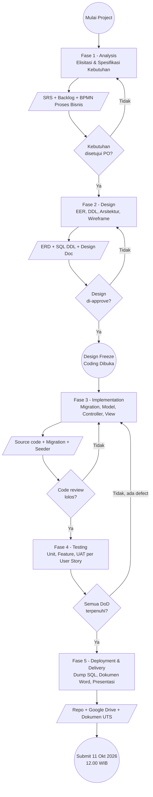
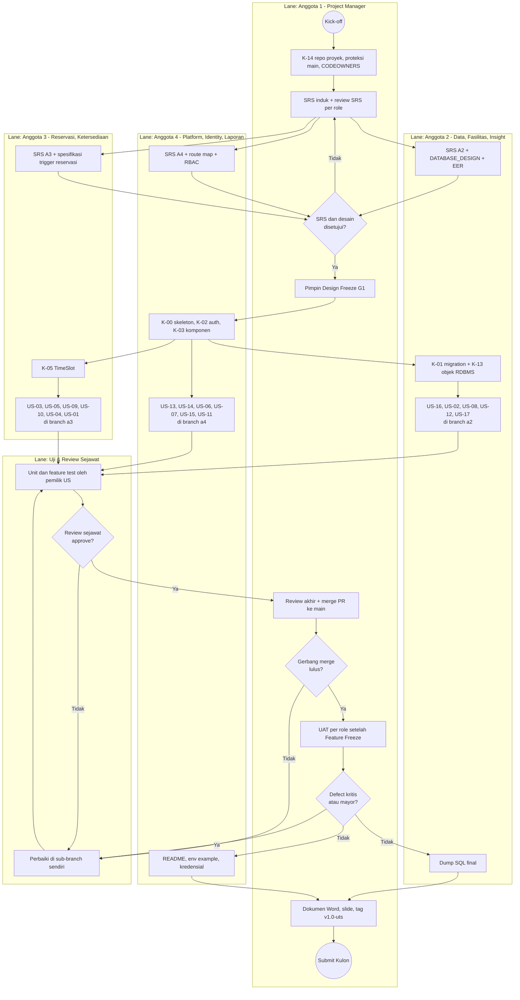
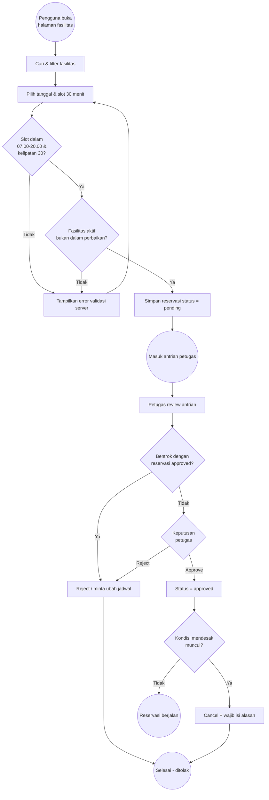
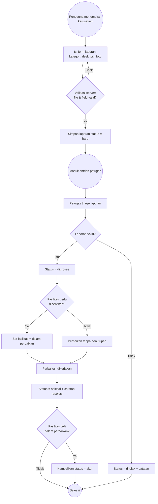

# PROJECT_WORKFLOW.md

**Proyek:** Sistem Reservasi & Pelaporan Fasilitas Kampus
**Mata Kuliah:** Pengembangan Platform Khusus (PPK) 2026 — Project Sebelum UTS
**Stack:** Laravel 13 (PHP ≥ 8.3) · MySQL Server ≥ 8.0.16 (InnoDB, utf8mb4) · MySQL Workbench (EER + Forward Engineering)
**Metodologi:** SDLC (Waterfall-inkremental) + pemodelan proses BPMN
**Deadline pengumpulan:** 11 Oktober 2026, 12.00 WIB (via Kulon)
**Tim:** 1 Project Manager + 3 Programmer (`Relationship.md` §1)
**Versi dokumen:** 2.0

---

## 1. Ringkasan Proyek

Aplikasi web terpusat untuk mengelola penggunaan fasilitas kampus (ruang kelas, aula, laboratorium, alat, lapangan). Sistem menangani **dua alur utama yang berjalan di satu basis data yang sama**:

1. **Alur Reservasi** — pengguna mengajukan pemakaian fasilitas pada slot waktu tertentu; petugas menyetujui/menolak/membatalkan.
2. **Alur Pelaporan Kerusakan** — pengguna melaporkan masalah fasilitas; petugas memproses hingga selesai dan dapat menandai fasilitas sebagai `dalam perbaikan`.

Kedua alur bertemu pada entitas `facilities`: status ketersediaan fasilitas dipengaruhi oleh laporan yang sedang ditangani, dan hal ini memblokir persetujuan reservasi baru.

### 1.1 Aktor & Hak Akses

| Aktor | Login | Kewenangan inti |
|---|---|---|
| **Pengunjung** | Tidak | Melihat daftar fasilitas + status ketersediaan per slot (tersedia/tidak tersedia). **Tanpa** detail pemohon/tujuan. Pencarian by tipe/lokasi/kapasitas. |
| **Pengguna** (mahasiswa/dosen/staf) | Ya | Semua hak Pengunjung + ajukan reservasi, batalkan reservasi sendiri, lihat riwayat & detail reservasi sendiri, lapor kerusakan, lihat status laporan sendiri. |
| **Petugas** | Ya (akun dibuat Admin) | Dashboard antrian, approve/reject/cancel reservasi, ubah status laporan + catatan resolusi, set fasilitas `dalam perbaikan` / kembalikan ke `aktif`. |
| **Admin** | Ya | CRUD master fasilitas, daftarkan akun petugas & pengguna, verifikasi/tolak akun registrasi mandiri, rekap lintas fasilitas + export CSV/Excel/PDF. |

### 1.2 Aturan Bisnis Wajib (Business Rules)

| ID | Aturan | Sumber |
|---|---|---|
| BR-01 | Jam operasional reservasi 07.00–20.00. | Dok. hal. 2 |
| BR-02 | Slot waktu tetap 30 menit (07.00–07.30, 07.30–08.00, …). | Dok. hal. 2 |
| BR-03 | `start_time` & `end_time` wajib di dalam jam operasional **dan** kelipatan slot 30 menit. Validasi **wajib di sisi server**, tidak boleh hanya di kalender/front-end. | Dok. hal. 2 |
| BR-04 | Sistem mencegah persetujuan reservasi yang **bentrok jadwal** pada fasilitas yang sama. | US-09 |
| BR-05 | Pembatalan mandiri oleh pengguna hanya sebelum batas waktu tertentu (nilai batas = *open question* OQ-02). | US-04 |
| BR-06 | Pembatalan reservasi yang sudah disetujui oleh petugas **wajib** mencantumkan alasan. | US-10 |
| BR-07 | Petugas **tidak pernah** melakukan registrasi mandiri — akun hanya dibuat Admin. | US-13 |
| BR-08 | Akun hasil registrasi mandiri harus diverifikasi Admin sebelum bisa login. | US-15 |
| BR-09 | Pengunjung tidak boleh melihat detail pemohon maupun tujuan penggunaan. | US-01 |
| BR-10 | Validasi data dilakukan di sisi server **dan** sisi client untuk form penting. | Ketentuan Umum 2 |

### 1.3 Daftar User Story (baseline traceability)

| ID | User Story | Aktor | Prioritas |
|---|---|---|---|
| US-01 | Melihat daftar fasilitas + status ketersediaan per slot, tanpa detail pemohon/tujuan | Pengunjung/Pengguna | Must |
| US-02 | Mencari fasilitas berdasarkan tipe/lokasi/kapasitas | Pengunjung/Pengguna | Must |
| US-03 | Mengajukan reservasi pada rentang waktu tertentu + tujuan penggunaan | Pengguna | Must |
| US-04 | Membatalkan reservasi sendiri sebelum batas waktu tertentu | Pengguna | Must |
| US-05 | Melihat riwayat & status reservasi sendiri, termasuk detail lengkap | Pengguna | Must |
| US-06 | Melaporkan kerusakan fasilitas (kategori, deskripsi, foto) | Pengguna | Must |
| US-07 | Melihat status laporan sendiri | Pengguna | Must |
| US-08 | Dashboard/antrian reservasi & laporan yang menunggu diproses | Petugas | Must |
| US-09 | Approve/reject reservasi manual + pencegahan bentrok jadwal | Petugas | Must |
| US-10 | Membatalkan reservasi yang sudah disetujui + alasan pembatalan | Petugas | Must |
| US-11 | Mengubah status laporan (baru/diproses/selesai/ditolak) + catatan resolusi | Petugas | Must |
| US-12 | Menandai fasilitas `dalam perbaikan` & mengembalikan ke `aktif` | Petugas | Must |
| US-13 | Mendaftarkan akun petugas secara langsung | Admin | Must |
| US-14 | Mendaftarkan akun pengguna secara langsung | Admin | Must |
| US-15 | Verifikasi/tolak akun hasil registrasi mandiri | Admin | Should |
| US-16 | Mengelola data fasilitas (tambah/edit/nonaktifkan) | Admin | Must |
| US-17 | Melihat & mengekspor (CSV/Excel/PDF) rekap okupansi + frekuensi kerusakan | Admin | Must |

---

## 2. BPMN — Level 0: Alur Fase End-to-End

Notasi: `(( ))` = event · `[ ]` = task · `{ }` = gateway.



---

## 3. BPMN — Level 1: Swimlane Detail

Lane mengikuti komposisi tim **1 Project Manager + 3 Programmer**. Pemetaan dari enam lane fungsional (PO, BA, DB Designer, Developer, QA, DevOps) ke empat orang ada di `Relationship.md` §1.3.



### 3.1 BPMN Proses Bisnis — Alur Reservasi (runtime)



### 3.2 BPMN Proses Bisnis — Alur Pelaporan Kerusakan (runtime)



---

## 4. Tabel Aktivitas per Fase

### Fase 1 — Analysis

| # | Aktivitas | Input | Output / Artefak | Tool |
|---|---|---|---|---|
| 1.1 | Ekstraksi user story & aktor | Project PPK 2026.pdf | `docs/01-analysis/user-stories.md` | Markdown |
| 1.2 | Perumusan business rules | Dokumen soal, diskusi tim | `docs/01-analysis/business-rules.md` | Markdown |
| 1.3 | Acceptance criteria (Given-When-Then) | US-01..US-17 | `docs/01-analysis/acceptance-criteria.md` | Markdown |
| 1.4 | Pemodelan BPMN proses bisnis | BR + user story | Diagram Mermaid di SRS | Mermaid |
| 1.5 | Definisi role & permission matrix | Daftar aktor | `docs/01-analysis/rbac-matrix.md` | Markdown |
| 1.6 | Pembagian tugas anggota tim | Backlog | `Relationship.md`, `Anggota1.md`–`Anggota4.md` | Markdown + Mermaid |
| 1.8 | Penyusunan SRS per role (1 PM + 3 Programmer) | User story, business rules | `docs/srs/SRS_Anggota1_PM.md` … `SRS_Anggota4_*.md` di branch `srs/*` | Markdown + Git |
| 1.7 | Inisialisasi traceability matrix | User story | `docs/TRACEABILITY.md` | Markdown |

### Fase 2 — Design

| # | Aktivitas | Input | Output / Artefak | Tool |
|---|---|---|---|---|
| 2.1 | Perancangan EER diagram | SRS, hint DB | `docs/02-design/eer-model.mwb` | MySQL Workbench |
| 2.2 | Normalisasi 3NF + kamus data | EER draft | `docs/02-design/data-dictionary.md` | Markdown |
| 2.3 | Forward Engineering ke DDL | `.mwb` | `database/schema/schema.sql` | Workbench FE |
| 2.4 | Desain arsitektur aplikasi | SRS | `docs/02-design/architecture.md` | Mermaid |
| 2.5 | Desain route & endpoint | RBAC matrix | `docs/02-design/route-map.md` | Markdown |
| 2.6 | Wireframe/mockup per halaman | User story | `docs/02-design/wireframes/` | Figma/Excalidraw |
| 2.7 | Desain state machine status | BR-04..BR-06 | `docs/02-design/state-machine.md` | Mermaid |

### Fase 3 — Implementation

| # | Aktivitas | Input | Output / Artefak | Tool |
|---|---|---|---|---|
| 3.1 | Scaffolding Laravel + auth | Design doc | Project skeleton | Composer, Laravel installer, starter kit Livewire + Laravel Fortify (OQ-17) |
| 3.2 | Migration sesuai DDL | `schema.sql` | `database/migrations/*` | Artisan |
| 3.3 | Model + relasi Eloquent | EER | `app/Models/*` | Artisan |
| 3.4 | Form Request validasi server | BR-01..BR-04, BR-10 | `app/Http/Requests/*` | Artisan |
| 3.5 | Policy & Gate per role | RBAC matrix | `app/Policies/*` | Artisan |
| 3.6 | Controller + service layer | Route map | `app/Http/Controllers/*`, `app/Services/*` | PHP |
| 3.7 | Blade views + validasi client | Wireframe | `resources/views/*` | Blade |
| 3.8 | Seeder demo 4 role | RBAC | `database/seeders/*` | Artisan |
| 3.9 | Fitur export rekap | US-17 | `app/Exports/*` | maatwebsite/excel, dompdf |

### Fase 4 — Testing

| # | Aktivitas | Input | Output / Artefak | Tool | Pelaksana |
|---|---|---|---|---|---|
| 4.1 | Unit test rule slot & jam operasional | BR-01..BR-03 | `tests/Unit/*` | PHPUnit/Pest | Anggota 3 |
| 4.2 | Unit test deteksi bentrok jadwal | BR-04 | `tests/Unit/*` | PHPUnit/Pest | Anggota 3 |
| 4.3 | Feature test per role & per FR | SRS, RBAC matrix | `tests/Feature/*` | PHPUnit/Pest (MySQL) | Pemilik US (A2, A3, A4) |
| 4.4 | Uji aturan database | `DATABASE_DESIGN.md` §6.2 | Hasil skrip uji | MySQL Workbench | Anggota 2 |
| 4.5 | Uji validasi client-side | BR-10 | Checklist manual | Browser | Pemilik US |
| 4.6 | Test plan & UAT per user story | Acceptance criteria SRS | `docs/04-testing/test-plan.md`, `uat-report.md` | Markdown | **PM** |
| 4.7 | Bug tracking | Hasil test & UAT | GitHub Issues (label US-XX + FR) | GitHub | PM (triase), pemilik US (perbaikan) |

### Fase 5 — Deployment & Delivery

| # | Aktivitas | Input | Output / Artefak | Tool | Pelaksana |
|---|---|---|---|---|---|
| 5.1 | Export dump database final (dengan trigger, procedure, event) | DB dev | `database/dump/final.sql` | Workbench / mysqldump | Anggota 2 |
| 5.2 | README setup & konfigurasi | Project | `README.md`, `.env.example` | Markdown | Anggota 4 |
| 5.3 | Daftar kredensial login per aktor | Seeder | `docs/05-delivery/credentials.md` | Markdown | Anggota 4 |
| 5.4 | Screenshot antar muka + penjelasan fitur | Aplikasi jalan | `docs/05-delivery/screenshots/` | — | Pemilik US, dikompilasi PM |
| 5.5 | Tag rilis & dokumen Word pengumpulan | Semua artefak | Tag `v1.0-uts`, `Laporan-UTS-PPK.docx` | Git, Word | **PM** |
| 5.6 | Upload Google Drive + submit Kulon | Dokumen | Link submission | Drive, Kulon | **PM** |
| 5.7 | Materi presentasi 10 menit | Semua | `docs/05-delivery/slides.pdf` | Slides | **PM** + semua |

---

## 5. Konvensi Implementasi Laravel

### 5.1 Struktur & Pemetaan ke Syarat Soal

Soal mewajibkan minimal pemisahan folder `/public`, `/app` (model/controller), `/views`, `/config`. Laravel sudah memenuhi ini secara native; pemetaannya:

| Syarat soal | Lokasi di Laravel |
|---|---|
| `/public` | `public/` |
| `/app` (model/controller) | `app/Models/`, `app/Http/Controllers/` |
| `/views` | `resources/views/` |
| `/config` | `config/`, `.env` |
| Pemisahan koneksi DB | `config/database.php` + `.env` |
| Pemisahan logika proses | `app/Services/`, `app/Http/Requests/`, `app/Policies/` |

### 5.2 Aturan Koding

- **PSR-12** wajib; jalankan Laravel Pint sebelum commit.
- **Controller tipis** — logika bisnis di `app/Services/`. Controller maksimal ±50 baris per method.
- **Validasi selalu lewat Form Request**, tidak pernah `$request->validate()` inline untuk form penting.
- **Otorisasi lewat Policy**, bukan `if ($user->role === 'admin')` yang tersebar.
- **Query lewat Eloquent**; raw SQL hanya untuk agregasi rekap (US-17), dan wajib parameter binding.
- **Enum PHP** untuk `role`, `reservation_status`, `report_status`, `facility_status`.
- **Naming:** tabel `snake_case` jamak, model `PascalCase` tunggal, route name `resource.action`, method controller RESTful (`index`, `create`, `store`, `show`, `edit`, `update`, `destroy`).
- **Timezone** aplikasi `Asia/Jakarta`; kolom waktu disimpan konsisten (lihat OQ-05).
- **Upload foto laporan** ke `storage/app/public/reports`, diakses via `php artisan storage:link`. Validasi mime + ukuran maksimum.
- **Slot 30 menit** diimplementasikan sebagai satu rule class `App\Rules\ValidReservationSlot` sehingga BR-01..BR-03 punya satu sumber kebenaran.
- **Pencegahan bentrok (BR-04)** dilakukan di dalam transaksi database dengan `lockForUpdate()` pada saat approve, bukan hanya pengecekan sebelum simpan. Penjaga terakhirnya UNIQUE `uq_reservation_slot` di MySQL (`DATABASE_DESIGN.md` §5.6).
- **Aturan yang wajib selalu benar juga ditegakkan di MySQL** (CHECK, trigger). Error database diterjemahkan ke pesan pengguna lewat `app/Support/DatabaseErrorTranslator.php` (`DATABASE_DESIGN.md` §13.4).

### 5.3 Kandidat Package

| Kebutuhan | Package |
|---|---|
| Auth scaffolding | Starter kit Livewire berbasis Laravel Fortify (Breeze tidak lagi tercantum di dokumentasi Laravel 13) — OQ-17 |
| Export Excel/CSV | `maatwebsite/excel` |
| Export PDF | `barryvdh/laravel-dompdf` |
| Code style | `laravel/pint` |
| Testing | `pestphp/pest` (opsional, default PHPUnit) |

---

## 6. Prosedur Desain Database (MySQL Workbench)

### 6.0 Prasyarat & Rancangan RDBMS

- MySQL Server **≥ 8.0.16** diasumsikan sudah terpasang di laptop semua anggota. Versi 8.0.16 adalah batas bawah karena CHECK constraint baru ditegakkan sejak versi itu.
- Rancangan lengkap ada di **`DATABASE_DESIGN.md`**: brainstorming mekanisme (§2), lapisan pertahanan (§3), DDL + CHECK (§5), aturan waktu reservasi di level DB (§6), trigger + katalog kode error (§7), view (§8), stored procedure (§9), event (§10), katalog query (§12), integrasi Laravel 13 (§13), standar koneksi K-12 (§14).
- Analisis *Hint Rancangan Database* soal terhadap user story: `Anggota2.md` §8.5.

### 6.1 Langkah Baku

1. Buat model baru di Workbench: **File → New Model** → simpan sebagai `docs/02-design/eer-model.mwb`.
2. Set default schema: nama `reservasi_fasilitas`, charset `utf8mb4`, collation `utf8mb4_unicode_ci`.
3. Tambahkan tabel di **EER Diagram**, bukan di catalog tree, agar relasi tergambar.
4. Semua tabel engine **InnoDB**; PK `BIGINT UNSIGNED AUTO_INCREMENT`.
5. Tarik relasi dengan **1:n identifying/non-identifying** sesuai kebutuhan; beri nama FK eksplisit `fk_<tabel>_<tabel_ref>`.
6. Tambahkan index pada kolom yang dipakai filter: `facilities.type`, `facilities.location`, `facilities.capacity`, `reservations.facility_id`, `reservations.start_time`, `reports.status`.
7. Validasi model: **Model → Validate All (MySQL)**.
8. Forward Engineering: **Database → Forward Engineer** → centang *Generate DROP statements*, *Export MySQL Table Objects* → simpan SQL ke `database/schema/schema.sql`.
9. Terjemahkan `schema.sql` ke Laravel migration secara manual (jangan generate otomatis) agar migration tetap readable dan reversible.
10. Setiap perubahan skema: ubah `.mwb` **lebih dulu**, lalu FE ulang, lalu buat migration baru. `.mwb` adalah sumber kebenaran desain.

### 6.2 Draft Entitas (akan difinalkan di Fase 2)

> **Digantikan oleh `DATABASE_DESIGN.md` §4–§5** (9 tabel, nilai enum English). Tabel di bawah dipertahankan sebagai riwayat.

| Entitas | Ringkasan kolom | Catatan |
|---|---|---|
| `users` | id, name, email, password, role, status_akun, timestamps | role: `pengguna`/`petugas`/`admin`; status_akun mendukung BR-08 |
| `facilities` | id, name, type, location, capacity, description, status, is_active, timestamps | status: `aktif`/`dalam_perbaikan`; is_active untuk nonaktifkan (US-16) |
| `reservations` | id, user_id, facility_id, start_time, end_time, purpose, status, processed_by, cancel_reason, timestamps | status: `pending`/`approved`/`rejected`/`cancelled` |
| `reports` | id, user_id, facility_id, category, description, photo_path, status, resolution_note, handled_by, timestamps | status: `baru`/`diproses`/`selesai`/`ditolak` |

Penambahan tabel/atribut diperbolehkan oleh soal (Ketentuan Khusus 1) — kandidat: `report_categories`, `facility_types`, `activity_logs`.

---

## 7. Git Workflow

### 7.1 Branching

```
main                         -> HANYA Project Manager yang merge (lewat PR); tidak ada push langsung
srs/anggota<N>-<peran>       -> SRS per role
pm/<topik>                   -> pekerjaan PM (test plan, traceability, dokumen)
a2/<ID>-<slug>               -> pekerjaan Anggota 2, mis. a2/US-17-rekap
a3/<ID>-<slug>               -> pekerjaan Anggota 3, mis. a3/US-09-approve
a4/<ID>-<slug>               -> pekerjaan Anggota 4, mis. a4/K-02-auth-fortify
a<N>/fix-<ID>-<slug>         -> perbaikan defect oleh pemilik modul
tag v<x>.<y>-<milestone>     -> dibuat PM: v0.1-fondasi ... v1.0-uts
```

Tidak ada branch `develop`: integrasi terjadi di `main` melalui gerbang PM (`Anggota1.md` §8.3). Aturan lengkap GIT-01..GIT-12, alur PR, dan proteksi GitHub ada di `Relationship.md` §10.

### 7.2 Konvensi Commit

Format: `<type>(US-XX): <deskripsi imperatif ringkas>`

Type: `feat`, `fix`, `docs`, `refactor`, `test`, `chore`, `db`.

Contoh:
```
feat(US-09): tambah pengecekan bentrok jadwal saat approve reservasi
db(US-03): migration tabel reservations dengan index start_time
test(US-04): feature test batas waktu pembatalan mandiri
```

### 7.3 Aturan Tim

- Repository GitHub bersama **wajib** (Ketentuan Umum 3), dibuat khusus di folder proyek — bukan di home directory.
- **Setiap anggota wajib punya commit** dengan akun GitHub masing-masing dan pesan yang jelas — ini dinilai.
- **Hanya Project Manager yang merge ke `main`.** Semua anggota, termasuk PM, bekerja di sub-branch dan membuka Pull Request.
- PR wajib: 1 approval review sejawat (rotasi A2 → A3 → A4 → A2), lalu review akhir PM; merge memakai *squash*.
- Sebelum membuka PR, gabungkan `main` terbaru ke branch sendiri; konflik diselesaikan di branch sendiri.
- `.env`, `vendor/`, `node_modules/`, dan `test-jebakan.md` **tidak pernah** di-commit; sediakan `.env.example`.
- File `.mwb`, `database/sql/*`, dan SRS ikut di-commit sebagai artefak desain.

---

## 8. Definition of Ready & Definition of Done

### 8.1 Definition of Ready (DoR) — sebelum user story dikerjakan

- [ ] User story punya ID (US-XX) dan tercatat di `docs/TRACEABILITY.md`.
- [ ] Kebutuhan tercakup FR di SRS pemilik yang sudah disetujui PM (K-15).
- [ ] Branch `a<N>/US-XX-…` dibuat dari `main` terbaru.
- [ ] Acceptance criteria tertulis dalam format Given-When-Then.
- [ ] Business rule terkait teridentifikasi (BR-XX).
- [ ] Entitas & kolom database yang dibutuhkan sudah ada di EER yang di-approve.
- [ ] Wireframe/mockup halaman tersedia (jika ada UI).
- [ ] Role yang berhak mengakses sudah ditetapkan di RBAC matrix.
- [ ] Tidak ada open question yang memblokir.

### 8.2 Definition of Done (DoD) — sebelum user story ditutup

- [ ] Kode mengikuti PSR-12 dan lolos Laravel Pint.
- [ ] Validasi server-side **dan** client-side terpasang untuk form penting.
- [ ] Otorisasi role terpasang lewat Policy dan sudah diuji untuk role yang **tidak** berhak.
- [ ] Minimal 1 feature test dan (jika ada rule) 1 unit test lulus, dijalankan di MySQL.
- [ ] Migration reversible (`migrate:rollback` berjalan bersih).
- [ ] Seeder menyediakan data demo untuk story tersebut.
- [ ] Screenshot fitur tersimpan di `docs/05-delivery/screenshots/`.
- [ ] Baris di `docs/TRACEABILITY.md` sudah terisi lengkap.
- [ ] PR merujuk US-XX dan FR-ID, di-review sejawat, lolos gerbang PM, dan di-merge PM ke `main` (squash).

---

## 9. Template Traceability Matrix

Disimpan di `docs/TRACEABILITY.md` dan diperbarui setiap akhir fase.

| US ID | Business Rule | Tabel/Kolom DB | Route | Controller@method | Form Request / Policy | View | Test | Status |
|---|---|---|---|---|---|---|---|---|
| US-01 | BR-09 | facilities, reservations | `GET /facilities` | `FacilityController@index` | — | `facilities.index` | `FacilityIndexTest` | ☐ |
| US-02 | — | facilities.type/location/capacity | `GET /facilities?filter` | `FacilityController@index` | `FacilitySearchRequest` | `facilities.index` | ☐ | ☐ |
| US-03 | BR-01..BR-04 | reservations | `POST /reservations` | `ReservationController@store` | `StoreReservationRequest` | `reservations.create` | ☐ | ☐ |
| US-04 | BR-05 | reservations.status | `PATCH /reservations/{id}/cancel` | `ReservationController@cancel` | `ReservationPolicy@cancel` | `reservations.show` | ☐ | ☐ |
| US-05 | — | reservations | `GET /reservations` | `ReservationController@index` | `ReservationPolicy@view` | `reservations.index` | ☐ | ☐ |
| US-06 | BR-10 | reports | `POST /reports` | `ReportController@store` | `StoreReportRequest` | `reports.create` | ☐ | ☐ |
| US-07 | — | reports.status | `GET /reports` | `ReportController@index` | `ReportPolicy@view` | `reports.index` | ☐ | ☐ |
| US-08 | — | reservations, reports | `GET /petugas/dashboard` | `Staff\DashboardController@index` | `role:petugas` | `staff.dashboard` | ☐ | ☐ |
| US-09 | BR-04 | reservations.status | `PATCH /petugas/reservations/{id}` | `Staff\ReservationController@decide` | `DecideReservationRequest` | `staff.reservations` | ☐ | ☐ |
| US-10 | BR-06 | reservations.cancel_reason | `PATCH /petugas/reservations/{id}/cancel` | `Staff\ReservationController@cancel` | `CancelReservationRequest` | `staff.reservations` | ☐ | ☐ |
| US-11 | — | reports.status, resolution_note | `PATCH /petugas/reports/{id}` | `Staff\ReportController@update` | `UpdateReportRequest` | `staff.reports` | ☐ | ☐ |
| US-12 | — | facilities.status | `PATCH /petugas/facilities/{id}/status` | `Staff\FacilityStatusController@update` | `FacilityStatusRequest` | `staff.facilities` | ☐ | ☐ |
| US-13 | BR-07 | users.role | `POST /admin/staff` | `Admin\StaffController@store` | `StoreStaffRequest` | `admin.staff` | ☐ | ☐ |
| US-14 | — | users | `POST /admin/users` | `Admin\UserController@store` | `StoreUserRequest` | `admin.users` | ☐ | ☐ |
| US-15 | BR-08 | users.status_akun | `PATCH /admin/users/{id}/verify` | `Admin\UserController@verify` | `UserPolicy@verify` | `admin.users` | ☐ | ☐ |
| US-16 | — | facilities | `resource /admin/facilities` | `Admin\FacilityController` | `FacilityRequest` | `admin.facilities` | ☐ | ☐ |
| US-17 | — | reservations, reports | `GET /admin/reports/export` | `Admin\RecapController@export` | `role:admin` | `admin.recap` | ☐ | ☐ |

Legenda status: ☐ belum · ◐ berjalan · ☑ selesai (DoD terpenuhi).

---

## 10. Open Questions — Perlu Jawaban Anda

Saya tidak akan menebak diam-diam. Berikut hal yang belum terjawab dari dokumen soal:

| ID | Pertanyaan | Dampak jika tidak dijawab |
|---|---|---|
| OQ-01 | Apakah satu reservasi boleh mencakup **beberapa slot berurutan** (mis. 09.00–11.00), atau tepat satu slot 30 menit saja? | Menentukan struktur tabel `reservations` dan algoritma deteksi bentrok. |
| OQ-02 | Berapa **batas waktu pembatalan mandiri** oleh pengguna (BR-05)? Mis. H-1, atau 2 jam sebelum mulai. | Memblokir implementasi US-04. |
| OQ-03 | Apakah **registrasi mandiri** (US-15) akan diimplementasikan? Soal menulis "jika diimplementasikan". | Menentukan ada/tidaknya kolom `status_akun` dan alur verifikasi admin. |
| OQ-04 | Apakah **satu fasilitas boleh punya lebih dari satu reservasi approved di slot yang sama** (mis. kapasitas dibagi)? Asumsi default saya: tidak boleh. | Mempengaruhi unique constraint. |
| OQ-05 | Apakah reservasi bisa lintas hari, dan bagaimana penanganan hari libur/akhir pekan? | Mempengaruhi validasi `start_time`/`end_time`. |
| OQ-06 | Apakah **notifikasi** (email/in-app) saat reservasi disetujui/ditolak termasuk scope? Tidak disebut di user story. | Menambah/mengurangi pekerjaan Fase 3. |
| OQ-07 | Format export mana yang **wajib** untuk US-17 — CSV, Excel, PDF, atau ketiganya? | Menentukan package yang dipasang. |
| OQ-08 | Berapa jumlah anggota tim (4 atau 5) dan siapa mengambil peran apa? | Diperlukan untuk `docs/01-analysis/team-assignment.md` dan dokumen pengumpulan. |
| OQ-09 | Apakah **satu foto** cukup untuk laporan kerusakan, atau multi-foto? | Menentukan perlu tidaknya tabel `report_photos`. |
| OQ-10 | Apakah pengunjung boleh melihat ketersediaan untuk **rentang tanggal berapa lama** ke depan? | Mempengaruhi query & performa halaman ketersediaan. |
| OQ-11 | Apakah ada mockup/desain UI yang sudah disepakati, atau saya rancang wireframe dari nol? | Mempengaruhi Fase 2 aktivitas 2.6. |
| OQ-12 | Apakah aplikasi perlu di-deploy ke hosting, atau cukup berjalan lokal + dump SQL? Soal hanya meminta source code + SQL di Google Drive. | Menentukan scope Fase 5. |

---

## 11. Changelog

| Versi | Tanggal | Perubahan | Oleh |
|---|---|---|---|
| 2.0 | 2026-09-16 | **Restrukturisasi tim menjadi 1 Project Manager + 3 Programmer.** BPMN Level 1 diganti swimlane PM, tiga programmer, dan review sejawat; aktivitas 1.8 penyusunan SRS per role; kolom pelaksana di Fase 4 & 5 (test oleh pemilik US, UAT & delivery oleh PM); Git workflow tanpa `develop` — hanya PM merge ke `main`, sub-branch `srs/`, `pm/`, `a2/`, `a3/`, `a4/`; DoR/DoD merujuk SRS & gerbang PM. | DevFlow |
| 1.4 | 2026-09-15 | Laravel dikunci ke versi 13 (PHP ≥ 8.3); Breeze diganti starter kit Livewire + Fortify (OQ-17); MySQL ≥ 8.0.16 diasumsikan terpasang (instalasi dihapus); §6.0 merujuk `DATABASE_DESIGN.md`; konvensi §5.2 menambahkan penegakan aturan di MySQL. `PROJECT_WORKFLOW.pdf` belum diperbarui. | DevFlow |
| 1.3 | 2026-09-15 | Versi DBMS ditetapkan MySQL Community Server ≥ 8.0 (bukan MariaDB); tambah §6.0 prasyarat DBMS yang merujuk kontrak K-12, analisis hint, dan katalog query. `PROJECT_WORKFLOW.pdf` belum diperbarui. | DevFlow |
| 1.2 | 2026-09-15 | Aktivitas 1.6 kini menunjuk ke `Relationship.md` dan `Anggota1.md`–`Anggota4.md` (pembagian 4 anggota). `PROJECT_WORKFLOW.pdf` belum diperbarui untuk versi ini. | DevFlow |
| 1.1 | 2026-09-09 | Arah keempat diagram Mermaid diseragamkan ke `TB` agar proporsional saat dicetak; diterbitkan ke `PROJECT_WORKFLOW.pdf` (13 halaman, A4). | DevFlow |
| 1.0 | 2026-09-09 | Dokumen awal: BPMN Level 0 & 1, BPMN proses reservasi & laporan, tabel aktivitas 5 fase, konvensi Laravel, prosedur MySQL Workbench, Git workflow, DoR/DoD, template traceability 17 user story, 12 open question. | DevFlow |
