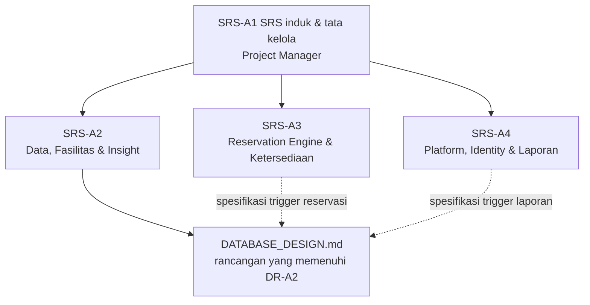
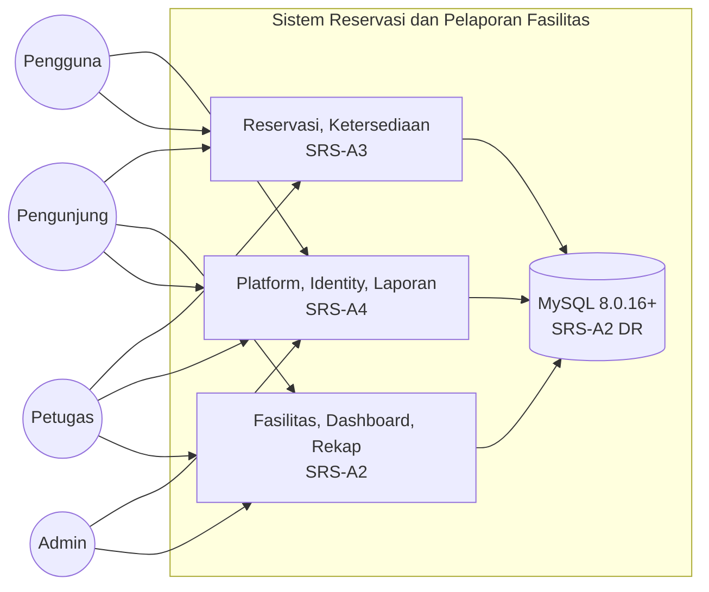
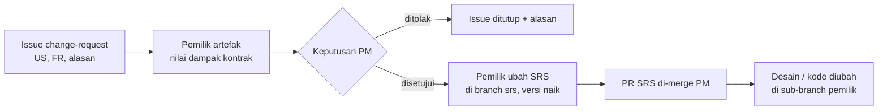

# SRS Anggota 1 — SRS Induk & Tata Kelola (Project Manager)

| Atribut | Nilai |
|---|---|
| **ID dokumen** | SRS-A1 (SRS induk) |
| **Sistem** | Sistem Reservasi & Pelaporan Fasilitas Kampus (PPK 2026) |
| **Pemilik** | Anggota 1 — Project Manager |
| **Penelaah** | Anggota 2, 3, 4 (satu programmer me-review PR branch ini) |
| **Branch** | `srs/anggota1-pm` |
| **Status** | DRAFT 1.0 — disahkan bersama tiga SRS programmer paling lambat 18 Sep 2026 (K-15) |
| **Acuan** | `Project PPK 2026.pdf` · `PROJECT_WORKFLOW.md` v2.0 · `Relationship.md` v2.0 · `DATABASE_DESIGN.md` v1.1 · `Anggota1.md` v2.0 |

---

## 1. Pendahuluan

### 1.1 Tujuan

SRS induk ini menetapkan **gambaran sistem secara utuh** dan kebutuhan yang tidak dimiliki satu modul saja: batasan dari soal, aturan bisnis global, kebutuhan non-fungsional lintas modul, tata kelola repositori, penerimaan (UAT), dan delivery. Kebutuhan fungsional rinci ada di tiga SRS programmer, dan dokumen ini berperan sebagai **indeksnya**.

### 1.2 Struktur dokumen SRS proyek

### 1.3 Referensi

`Project PPK 2026.pdf` (Ketentuan Umum, Ketentuan Khusus, Ketentuan Waktu Reservasi, Aktor, 17 User Story, Hint Rancangan Database) · Struktur SRS mengacu pada ISO/IEC/IEEE 29148 (pengganti IEEE 830), disederhanakan untuk proyek kuliah.

### 1.4 Konvensi ID

| Prefiks | Arti | Pemilik |
|---|---|---|
| `C-` | Batasan dari soal | PM |
| `BR-` | Aturan bisnis global | PM (penegakan oleh modul) |
| `NFR-G-` | Kebutuhan non-fungsional global | PM |
| `GOV-` | Kebutuhan tata kelola repositori & proses | PM |
| `UAT-` | Kebutuhan penerimaan | PM |
| `DLV-` | Kebutuhan delivery | PM |
| `FR-A2-`, `FR-A3-`, `FR-A4-` | Kebutuhan fungsional modul | Programmer pemilik |

---

## 2. Deskripsi Umum Sistem

### 2.1 Perspektif produk

Aplikasi web terpusat untuk mengelola penggunaan fasilitas kampus (ruang kelas, aula, laboratorium, alat, lapangan) dengan dua alur di satu basis data: **reservasi** dan **pelaporan kerusakan**. Kedua alur bertemu pada status fasilitas.

### 2.2 Kelas pengguna (dari soal)

| Aktor | Login | Kewenangan inti |
|---|---|---|
| Pengunjung | Tidak | Melihat daftar fasilitas & ketersediaan (tersedia/tidak), tanpa detail |
| Pengguna (mahasiswa/dosen/staf) | Ya | Mengajukan reservasi, melaporkan kerusakan |
| Petugas | Ya (dibuat admin) | Memproses reservasi & laporan, memperbarui status fasilitas |
| Admin | Ya | Data master fasilitas, rekap lintas fasilitas, mendaftarkan akun, verifikasi akun registrasi mandiri |

### 2.3 Lingkungan operasi

| Komponen | Ketentuan |
|---|---|
| Framework | Laravel 13 (PHP ≥ 8.3), starter kit Livewire + Laravel Fortify |
| Database | MySQL Server ≥ 8.0.16, InnoDB, `utf8mb4` — terpasang di laptop tiap anggota |
| Klien | Peramban desktop modern (Chrome, Firefox, Edge versi terbaru) |
| Penyebaran | Lokal (`php artisan serve`); source & SQL dikumpulkan lewat Google Drive |

### 2.4 Batasan dari soal

| ID | Batasan | Sumber |
|---|---|---|
| C-01 | Dikerjakan tim 4 orang; setiap anggota berkontribusi aktif | Ketentuan Umum 1 |
| C-02 | Wajib autentikasi: registrasi, login, logout | Ketentuan Umum 2 |
| C-03 | Kode dipisahkan minimal: koneksi DB, tampilan (HTML), logika proses | Ketentuan Umum 2 |
| C-04 | Validasi data di sisi server **dan** client untuk form penting | Ketentuan Umum 2 |
| C-05 | Tampilan mudah digunakan | Ketentuan Umum 2 |
| C-06 | Repository GitHub/GitLab bersama wajib; semua anggota commit dengan pesan jelas | Ketentuan Umum 3 |
| C-07 | Minimal folder `/public`, `/app` (model/controller), `/views`, `/config` | Ketentuan Umum 3 |
| C-08 | Jam operasional 07.00–20.00; slot tetap 30 menit; validasi waktu di server | Ketentuan Waktu Reservasi |
| C-09 | Pengumpulan maksimal 11 Okt 2026 pukul 12.00 WIB via Kulon, berupa satu file Word | Ketentuan Khusus 2–3 |
| C-10 | Presentasi 10 menit + tanya jawab 10–15 menit: latar belakang, fitur utama, demo, kendala | Ketentuan Khusus 4–7 |

### 2.5 Asumsi global

Default semua isu terbuka tercantum di §7. Asumsi yang memengaruhi lebih dari satu modul:
- Registrasi mandiri diimplementasikan (C-02), sehingga verifikasi akun US-15 berlaku.
- Reservasi dapat mencakup beberapa slot berurutan dalam satu hari.
- Semua aturan yang wajib selalu benar juga ditegakkan oleh MySQL.

---

## 3. Kebutuhan Sistem

### 3.1 Indeks kebutuhan fungsional

| US | Ringkasan | Pemilik | SRS | FR |
|---|---|---|---|---|
| US-01 | Grid ketersediaan per slot tanpa detail pemohon | Anggota 3 | SRS-A3 | FR-A3-08 |
| US-02 | Cari fasilitas tipe/lokasi/kapasitas | Anggota 2 | SRS-A2 | FR-A2-04 |
| US-03 | Ajukan reservasi dengan tujuan | Anggota 3 | SRS-A3 | FR-A3-01, 02 |
| US-04 | Batal reservasi sendiri sebelum batas | Anggota 3 | SRS-A3 | FR-A3-04 |
| US-05 | Riwayat & detail reservasi sendiri | Anggota 3 | SRS-A3 | FR-A3-03 |
| US-06 | Lapor kerusakan (kategori, deskripsi, foto) | Anggota 4 | SRS-A4 | FR-A4-08 |
| US-07 | Lihat status laporan sendiri | Anggota 4 | SRS-A4 | FR-A4-09 |
| US-08 | Dashboard antrian petugas | Anggota 2 | SRS-A2 | FR-A2-07, 08 |
| US-09 | Setujui/tolak; cegah bentrok | Anggota 3 | SRS-A3 | FR-A3-05, 06 |
| US-10 | Batalkan reservasi disetujui + alasan | Anggota 3 | SRS-A3 | FR-A3-07 |
| US-11 | Ubah status laporan + catatan resolusi | Anggota 4 | SRS-A4 | FR-A4-10 |
| US-12 | Fasilitas dalam perbaikan & kembali aktif | Anggota 2 | SRS-A2 | FR-A2-05, 06 |
| US-13 | Admin daftarkan petugas | Anggota 4 | SRS-A4 | FR-A4-05 |
| US-14 | Admin daftarkan pengguna | Anggota 4 | SRS-A4 | FR-A4-06 |
| US-15 | Admin verifikasi/tolak akun | Anggota 4 | SRS-A4 | FR-A4-07 |
| US-16 | Admin kelola fasilitas | Anggota 2 | SRS-A2 | FR-A2-01..03 |
| US-17 | Rekap okupansi & kerusakan + ekspor | Anggota 2 | SRS-A2 | FR-A2-09..11 |
| C-02 | Registrasi, login, logout | Anggota 4 | SRS-A4 | FR-A4-01..03 |
| Semua | Otorisasi role, layout, komponen UI | Anggota 4 | SRS-A4 | FR-A4-04, 11 |
| Semua | Lapisan data MySQL | Anggota 2 | SRS-A2 | DR-A2-01..08 |

### 3.2 Aturan bisnis global

| ID | Aturan | Penegakan aplikasi | Penegakan database |
|---|---|---|---|
| BR-01 | Jam operasional 07.00–20.00 | A3 (`ValidReservationSlot`) | CHECK `chk_res_open/close` |
| BR-02 | Slot tetap 30 menit | A3 (`TimeSlot`) | CHECK `chk_res_grid_*`, `time_slots` |
| BR-03 | Waktu valid divalidasi di server | A3 | CHECK + trigger RSV-02 |
| BR-04 | Tidak ada approve yang bentrok | A3 (`ReservationService`) | Trigger RSV-05 + UNIQUE `uq_reservation_slot` |
| BR-05 | Batal mandiri sebelum batas | A3 (Policy) | Trigger RSV-07 |
| BR-06 | Batal oleh petugas wajib beralasan | A3 (Form Request) | Trigger RSV-06 |
| BR-07 | Petugas tidak registrasi mandiri | A4 (`CreateNewUser`) | — |
| BR-08 | Akun registrasi mandiri diverifikasi sebelum login | A4 (Fortify) | — |
| BR-09 | Pengunjung tidak melihat pemohon/tujuan | A3, A2 (view) | `v_public_slot_occupancy` |
| BR-10 | Validasi server & client form penting | A4 (pola komponen), semua | CHECK |

### 3.3 Kebutuhan non-fungsional global

| ID | Kategori | Kebutuhan | Ukuran penerimaan |
|---|---|---|---|
| NFR-G-01 | Keamanan | Password di-hash; CSRF aktif; tidak ada kredensial di repositori | Review repo; `.env` tidak ter-commit |
| NFR-G-02 | Otorisasi | Setiap halaman terproteksi sesuai role; akses objek lewat Policy | Uji akses silang saat UAT tanpa temuan |
| NFR-G-03 | Integritas | Aturan BR-01..BR-06 tidak bisa dilewati, termasuk lewat Workbench | Skrip `DATABASE_DESIGN.md` §6.2 lulus |
| NFR-G-04 | Privasi | BR-09 berlaku di HTML, atribut, dan JSON | Review source halaman publik |
| NFR-G-05 | Usability | Teks antarmuka & pesan kesalahan dalam Bahasa Indonesia; tampilan konsisten | Penilaian UAT |
| NFR-G-06 | Kinerja | Halaman utama tiap role < 2 detik dengan data demo | Uji manual saat UAT |
| NFR-G-07 | Portabilitas | Aplikasi dapat dijalankan dari README di laptop bersih | Uji clone oleh PM |
| NFR-G-08 | Maintainability | PSR-12 (Laravel Pint); struktur folder memenuhi C-03 & C-07 | Pint bersih; review struktur |
| NFR-G-09 | Traceability | Setiap commit, PR, dan test merujuk US & FR | `docs/TRACEABILITY.md` lengkap |
| NFR-G-10 | Testability | Test dijalankan di MySQL; `php artisan test` lulus di `main` | Gerbang merge PM |

### 3.4 Kebutuhan tata kelola

| ID | Kebutuhan |
|---|---|
| GOV-01 | Repositori git proyek dibuat **khusus di folder proyek**, terpisah dari repositori home directory |
| GOV-02 | **Hanya Project Manager yang merge ke `main`**; tidak ada push langsung ke `main` oleh siapa pun |
| GOV-03 | Setiap anggota bekerja di sub-branch namespace-nya: `srs/`, `pm/`, `a2/`, `a3/`, `a4/` |
| GOV-04 | Setiap SRS dikerjakan di branch `srs/anggota<N>-<peran>` dan masuk `main` lewat PR |
| GOV-05 | PR wajib memakai template, merujuk US & FR, mendapat 1 approval sejawat (rotasi A2 → A3 → A4 → A2), lalu lolos gerbang PM |
| GOV-06 | Merge memakai *squash*; jendela merge 12.00 & 21.00 WIB; target ≤ 24 jam setelah approval sejawat |
| GOV-07 | Setiap anggota commit dengan akun GitHub sendiri, minimal 3 commit per minggu |
| GOV-08 | Tag milestone dibuat PM: `v0.1-fondasi`, `v0.2-sprint1`, `v0.3-feature-complete`, `v1.0-uts` |
| GOV-09 | Perubahan kebutuhan setelah G1 melalui Change Request yang diputuskan PM; versi SRS terkait dinaikkan |
| GOV-10 | Proteksi `main` (wajib PR, review Code Owner, blokir force push) diaktifkan bila tersedia; bila tidak, GOV-02 diawasi PM |
| GOV-11 | Asisten AI tiap anggota memakai CORE PROMPT v2.0 (`CLAUDE.md`) ditambah overlay perannya |

### 3.5 Kebutuhan penerimaan

| ID | Kebutuhan |
|---|---|
| UAT-01 | Test plan & template test case (K-11) tersedia sebelum 22 Sep |
| UAT-02 | UAT dilaksanakan 8 Okt untuk 17 US, per role (pengunjung, pengguna, petugas, admin) |
| UAT-03 | Skenario UAT diturunkan dari acceptance criteria SRS, bukan dari kode |
| UAT-04 | Minimal satu skenario lintas modul: laporan → perbaikan → approve ditolak → pembatalan terdampak |
| UAT-05 | Skrip uji aturan database dijalankan di Workbench |
| UAT-06 | Defect dicatat sebagai issue berlabel US-XX + FR, dengan tingkat kritis/mayor/minor |
| UAT-07 | Rilis `v1.0-uts` hanya bila tidak ada defect kritis & mayor terbuka dan 17 US berstatus selesai di traceability |

### 3.6 Kebutuhan delivery

| ID | Kebutuhan | Kontributor |
|---|---|---|
| DLV-01 | Dokumen Word memuat nama & NIM anggota | PM |
| DLV-02 | Dokumen Word memuat pembagian tugas (bersumber dari `Relationship.md` & SRS) | PM |
| DLV-03 | Link Google Drive berisi source code, SQL (dump lengkap dengan trigger, procedure, event), dan file pendukung | PM, A2 |
| DLV-04 | Informasi setting untuk menjalankan program | A4 (README), PM |
| DLV-05 | Informasi login untuk tiap aktor | A4 (`credentials.md`), PM |
| DLV-06 | Screenshot antarmuka + penjelasan singkat tiap fitur | Pemilik US, PM |
| DLV-07 | Materi presentasi 10 menit: latar belakang, fitur utama, demo, kendala | PM + semua |
| DLV-08 | Submit paling lambat 10 Okt malam (cadangan sebelum batas 11 Okt 12.00) | PM |
| DLV-09 | Dokumen & repositori bebas kata/instruksi di luar domain proyek, termasuk kata pemicu jebakan AI dari teks tersembunyi di PDF soal (tercatat di `test-jebakan.md`) | PM |

---

## 4. Verifikasi

| Kelompok | Metode | Bukti |
|---|---|---|
| C-01..C-10 | Checklist sebelum submit (`Anggota1.md` §8.5) | Checklist terisi |
| BR-01..BR-10 | Feature test modul + skrip uji database + UAT | Laporan test & UAT |
| NFR-G | Gerbang merge, review, UAT | Riwayat PR, laporan UAT |
| GOV | Audit riwayat `main` & PR oleh PM | Tidak ada commit langsung ke `main` |
| UAT | `docs/04-testing/uat-report.md` | Status 17 US |
| DLV | Uji clone, uji import dump, uji link Drive (incognito) | Checklist submit |

---

## 5. Matriks Traceability Induk

| US | Pemilik | FR | Skenario UAT | Test utama | Status |
|---|---|---|---|---|---|
| US-01 | A3 | FR-A3-08 | Pengunjung membuka grid | `AvailabilityGridTest` | ☐ |
| US-02 | A2 | FR-A2-04 | Pengunjung mencari | `SearchFacilityTest` | ☐ |
| US-03 | A3 | FR-A3-01, 02 | Pengguna mengajukan; jam 09.15 ditolak | `StoreReservationTest` | ☐ |
| US-04 | A3 | FR-A3-04 | Batal sebelum/sesudah batas | `CancelOwnReservationTest` | ☐ |
| US-05 | A3 | FR-A3-03 | Riwayat & akses silang | `ReservationHistoryTest` | ☐ |
| US-06 | A4 | FR-A4-08 | Lapor dengan foto | `StoreReportTest` | ☐ |
| US-07 | A4 | FR-A4-09 | Lihat status laporan | `ReportVisibilityTest` | ☐ |
| US-08 | A2 | FR-A2-07, 08 | Petugas cek antrian | `StaffDashboardTest` | ☐ |
| US-09 | A3 | FR-A3-05, 06 | Bentrok ditolak | `ApproveReservationTest` | ☐ |
| US-10 | A3 | FR-A3-07 | Batal tanpa/dengan alasan | `StaffCancelReservationTest` | ☐ |
| US-11 | A4 | FR-A4-10 | Tutup laporan tanpa catatan ditolak | `UpdateReportStatusTest` | ☐ |
| US-12 | A2 | FR-A2-05, 06 | Perbaikan → reservasi terdampak | `RepairStatusTest` | ☐ |
| US-13 | A4 | FR-A4-05 | Admin daftarkan petugas | `RegisterStaffTest` | ☐ |
| US-14 | A4 | FR-A4-06 | Admin daftarkan pengguna | `RegisterUserTest` | ☐ |
| US-15 | A4 | FR-A4-07 | Akun pending ditolak login → diverifikasi | `VerifyAccountTest` | ☐ |
| US-16 | A2 | FR-A2-01..03 | Admin kelola fasilitas | `ManageFacilityTest` | ☐ |
| US-17 | A2 | FR-A2-09..11 | Rekap & ekspor | `RecapTest`, `RecapExportTest` | ☐ |

Legenda: ☐ belum · ◐ berjalan · ☑ selesai (DoD & UAT lulus). Versi kerja matriks ini dipelihara PM di `docs/TRACEABILITY.md`.

---

## 6. Manajemen Perubahan Kebutuhan

---

## 7. Isu Terbuka

| ID | Isu | Default |
|---|---|---|
| OQ-01 | Reservasi satu slot atau multi-slot | Multi-slot dalam satu hari |
| OQ-02 | Batas pembatalan mandiri | 120 menit |
| OQ-07 | Format ekspor wajib | CSV wajib; Excel & PDF diupayakan |
| OQ-08 | Nama, NIM, username GitHub; siapa PM | Belum diisi |
| OQ-13 | Nilai enum | English di DB, label Indonesia |
| OQ-15 | Tool AI tiap anggota | — |
| OQ-17 | Starter kit | Livewire + Fortify |
| OQ-18 | Status `expired` + event | Usulan (prioritas C) |
| OQ-19 | ENUM vs tabel master | ENUM |
| OQ-20 | Pemilik boleh batal reservasi approved | Boleh |
| OQ-21 | Foto laporan wajib | Wajib, satu foto |
| OQ-22 | Data demo rekap masa lalu | Perlu keputusan sebelum 5 Okt |
| OQ-23 | Repo GitHub publik atau privat | Perlu keputusan hari ini |

---

## 8. Persetujuan

| Peran | Nama | Tanggal | Keputusan |
|---|---|---|---|
| Project Manager — Anggota 1 | | | Pemilik |
| Programmer — Anggota 2 | | | ☐ Setuju |
| Programmer — Anggota 3 | | | ☐ Setuju |
| Programmer — Anggota 4 | | | ☐ Setuju |

---

## 9. Changelog

| Versi | Tanggal | Perubahan | Oleh |
|---|---|---|---|
| 1.0 | 2026-09-16 | Draf awal SRS induk: struktur SRS proyek, deskripsi sistem, batasan C-01..C-10, indeks FR per US, aturan bisnis global beserta penegakannya, NFR-G-01..10, tata kelola GOV-01..11 (hanya PM merge ke `main`), penerimaan UAT-01..07, delivery DLV-01..09, matriks traceability induk, alur Change Request, isu terbuka. | DevFlow |
