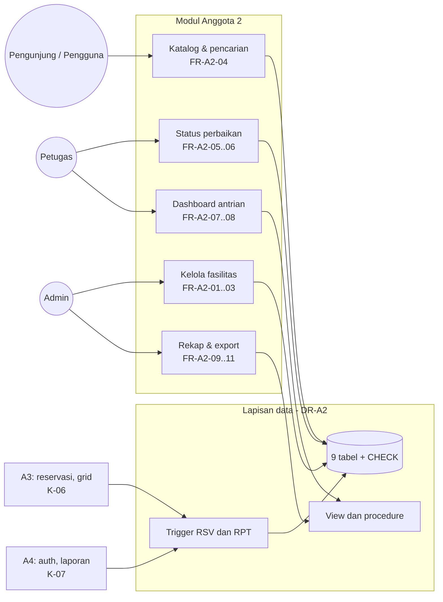
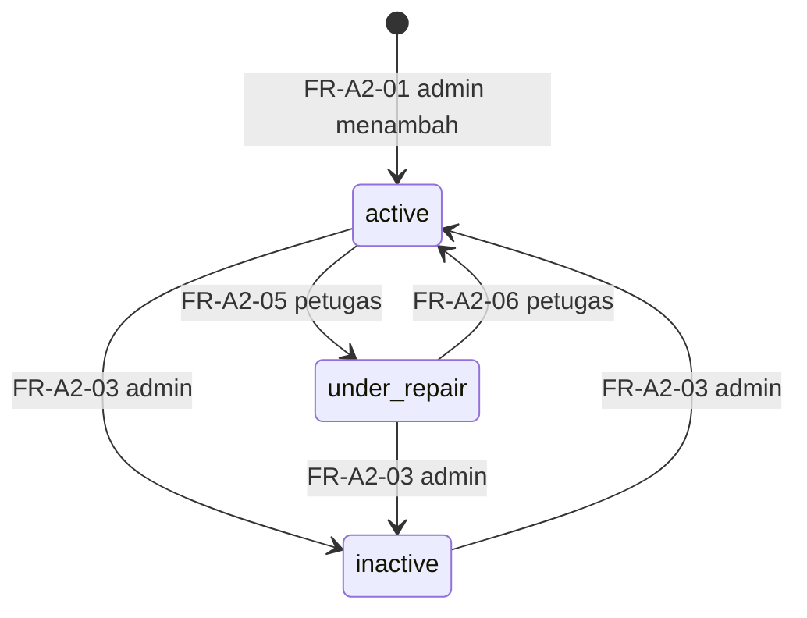

# SRS Anggota 2 — Data, Fasilitas & Insight

| Atribut | Nilai |
|---|---|
| **ID dokumen** | SRS-A2 |
| **Sistem** | Sistem Reservasi & Pelaporan Fasilitas Kampus (PPK 2026) |
| **Pemilik** | Anggota 2 — Programmer Data, Fasilitas & Insight |
| **Penyetuju** | Anggota 1 — Project Manager |
| **Branch** | `srs/anggota2-data-fasilitas-insight` |
| **Status** | DRAFT 1.0 — wajib disetujui PM paling lambat 18 Sep 2026 (K-15) |
| **Acuan** | `docs/srs/SRS_Anggota1_PM.md` (SRS induk) · `Relationship.md` v2.0 · `DATABASE_DESIGN.md` v1.1 · `Anggota2.md` v2.0 |

---

## 1. Pendahuluan

### 1.1 Tujuan

Dokumen ini menetapkan kebutuhan untuk **lapisan data MySQL, katalog fasilitas, dashboard antrian petugas, dan rekap admin**. Rancangan teknis database yang memenuhi kebutuhan data (DR) di sini ada di `DATABASE_DESIGN.md`.

### 1.2 Lingkup

| Termasuk | Tidak termasuk (pemilik lain) |
|---|---|
| Database MySQL: tabel, CHECK, trigger, view, procedure, event, dump | Logika approve/bentrok & grid ketersediaan (A3) |
| US-16 kelola data fasilitas | Autentikasi, role, akun (A4) |
| US-02 pencarian fasilitas | Pengajuan & status laporan (A4) |
| US-12 fasilitas dalam perbaikan | Test plan & UAT (PM) |
| US-08 dashboard antrian petugas | |
| US-17 rekap okupansi & kerusakan + export | |

### 1.3 Definisi

| Istilah | Arti |
|---|---|
| Okupansi | Slot terpakai reservasi `approved` ÷ (26 × jumlah hari periode) × 100% |
| Antrian | Reservasi `pending` + laporan `new`/`in_progress` |
| Reservasi terdampak | Reservasi `approved` mendatang pada fasilitas yang tidak lagi `active` |

### 1.4 Referensi

`Project PPK 2026.pdf` (Hint Rancangan Database, US-02, US-08, US-12, US-16, US-17) · `DATABASE_DESIGN.md` · `Anggota2.md` §8.1 (keputusan desain), §8.5 (analisis hint) · MySQL 8.0 Reference Manual · Laravel 13 docs.

### 1.5 Konvensi

`FR-A2-nn` · `DR-A2-nn` (data) · `NFR-A2-nn` · `IF-A2-nn`. Prioritas MoSCoW. Kriteria penerimaan *Given–When–Then*.

---

## 2. Deskripsi Umum

### 2.1 Perspektif produk

### 2.2 Kelas pengguna

| Kelas | Hak pada modul ini |
|---|---|
| Pengunjung & Pengguna | Melihat daftar & mencari fasilitas (tanpa `inactive`) |
| Petugas | Mengubah status fasilitas `active` ↔ `under_repair`; melihat dashboard antrian |
| Admin | Menambah, mengubah, menonaktifkan, mengaktifkan kembali fasilitas; melihat & mengekspor rekap |

### 2.3 Batasan

| ID | Batasan |
|---|---|
| C-A2-01 | MySQL ≥ 8.0.16 (CHECK constraint ditegakkan), InnoDB, `utf8mb4_unicode_ci` |
| C-A2-02 | MySQL Workbench adalah sumber kebenaran skema; migration diturunkan darinya |
| C-A2-03 | File SQL (source + dump) wajib dikumpulkan di Google Drive (soal) |
| C-A2-04 | Tidak ada `START TRANSACTION`/`COMMIT` di trigger atau procedure |

### 2.4 Asumsi & ketergantungan

| ID | Asumsi / ketergantungan | Sumber |
|---|---|---|
| AS-A2-01 | Tipe fasilitas & kategori laporan berupa ENUM | OQ-19 / D-1 |
| AS-A2-02 | Nonaktifkan fasilitas = ubah status, bukan hapus | D-2 |
| AS-A2-03 | Export: CSV wajib; Excel & PDF diupayakan | OQ-07 |
| AS-A2-04 | Nilai enum English di database, label Indonesia di tampilan | OQ-13 |
| DEP-A2-01 | K-00, K-02, K-03, K-07, K-09 dari A4 | `Relationship.md` §7 |
| DEP-A2-02 | K-05, K-06 dan spesifikasi trigger reservasi dari A3 | `Relationship.md` §7 |

---

## 3. Kebutuhan Spesifik

### 3.1 Ringkasan kebutuhan fungsional

| ID | US | Nama | Aktor | Prioritas |
|---|---|---|---|---|
| FR-A2-01 | US-16 | Menambah fasilitas | Admin | M |
| FR-A2-02 | US-16 | Mengubah data fasilitas | Admin | M |
| FR-A2-03 | US-16 | Menonaktifkan & mengaktifkan kembali fasilitas | Admin | M |
| FR-A2-04 | US-02 | Mencari & memfilter fasilitas | Pengunjung, Pengguna | M |
| FR-A2-05 | US-12 | Menandai fasilitas dalam perbaikan | Petugas | M |
| FR-A2-06 | US-12 | Mengembalikan fasilitas ke aktif & menampilkan reservasi terdampak | Petugas | M |
| FR-A2-07 | US-08 | Menampilkan dashboard antrian | Petugas | M |
| FR-A2-08 | US-08 | Menandai antrian mendesak / terlambat | Sistem | S |
| FR-A2-09 | US-17 | Rekap okupansi per fasilitas & lokasi | Admin | M |
| FR-A2-10 | US-17 | Rekap frekuensi kerusakan | Admin | M |
| FR-A2-11 | US-17 | Mengekspor rekap (CSV/Excel/PDF) | Admin | M (CSV) · S (Excel, PDF) |

### 3.2 Detail kebutuhan fungsional

#### FR-A2-01 — Menambah fasilitas (US-16)

| Field | Aturan |
|---|---|
| Nama | Wajib, ≤ 150 karakter, unik bersama lokasi |
| Tipe | Wajib: `ruang_kelas`, `aula`, `laboratorium`, `alat`, `lapangan` |
| Lokasi | Wajib, ≤ 150 karakter |
| Kapasitas | Wajib, bilangan bulat ≥ 1 |
| Deskripsi | Opsional |

- **AC-01.1** *Given* admin dan data valid, *when* menyimpan, *then* fasilitas tersimpan berstatus `active` dan tampil di katalog.
- **AC-01.2** *Given* kapasitas 0, *when* menyimpan, *then* ditolak di form dan oleh CHECK `chk_fac_capacity`.
- **AC-01.3** *Given* nama & lokasi sama dengan fasilitas yang ada, *when* menyimpan, *then* ditolak (duplikat).

#### FR-A2-02 — Mengubah data fasilitas (US-16)

- **AC-02.1** *Given* admin, *when* mengubah kapasitas & deskripsi, *then* perubahan tersimpan dan riwayat reservasi tetap utuh.
- **AC-02.2** *Given* petugas atau pengguna, *when* membuka halaman ubah, *then* 403.

#### FR-A2-03 — Menonaktifkan & mengaktifkan kembali (US-16)

- **AC-03.1** *Given* fasilitas `active`, *when* admin menonaktifkan, *then* status `inactive`, fasilitas hilang dari katalog publik, reservasi & laporan lamanya tetap ada.
- **AC-03.2** *Given* fasilitas `inactive`, *when* ada pengajuan reservasi baru, *then* ditolak (RSV-03).
- **AC-03.3** *Given* fasilitas `inactive`, *when* admin mengaktifkan kembali, *then* status `active`.

#### FR-A2-04 — Mencari & memfilter fasilitas (US-02)

| Aspek | Spesifikasi |
|---|---|
| Filter | Tipe (pilihan), lokasi (sebagian kata), kapasitas minimum (angka ≥ 1); semua opsional & bisa digabung |
| Hasil | Fasilitas `active` dan `under_repair` (berlabel "Dalam Perbaikan"); 12 per halaman; tautan ke grid ketersediaan (A3) |

- **AC-04.1** *Given* filter tipe `laboratorium` dan kapasitas ≥ 30, *when* dicari, *then* hanya laboratorium berkapasitas ≥ 30 yang tampil.
- **AC-04.2** *Given* kapasitas berisi huruf, *when* dicari, *then* filter ditolak dengan pesan, bukan error server.
- **AC-04.3** *Given* pengunjung tanpa login, *when* membuka katalog, *then* daftar tampil tanpa data pemohon apa pun.

#### FR-A2-05 — Menandai fasilitas dalam perbaikan (US-12)

- **AC-05.1** *Given* petugas & fasilitas `active`, *when* menandai "dalam perbaikan", *then* status `under_repair`, grid menampilkan seluruh slot "Dalam perbaikan", dan approve baru ditolak (RSV-03).
- **AC-05.2** *Given* ada laporan terbuka untuk fasilitas itu, *when* halaman status dibuka, *then* laporan terbuka tampil sebagai konteks (K-07).

#### FR-A2-06 — Mengembalikan ke aktif & reservasi terdampak (US-12)

- **AC-06.1** *Given* fasilitas `under_repair` punya reservasi `approved` mendatang, *when* petugas membuka halaman status, *then* daftar reservasi terdampak tampil (`v_affected_reservations`) dengan tautan pembatalan (A3, FR-A3-07).
- **AC-06.2** *Given* perbaikan selesai, *when* petugas mengembalikan ke `active`, *then* fasilitas dapat dipesan kembali.

#### FR-A2-07 — Dashboard antrian (US-08)

| Panel | Isi | Urutan |
|---|---|---|
| Reservasi menunggu | Fasilitas, pemohon, tanggal & jam | Waktu penggunaan terdekat |
| Laporan baru | Fasilitas, pelapor, kategori, umur laporan | Terlama |
| Laporan diproses | Fasilitas, petugas penangan, umur laporan | Terlama |
| Ringkasan | Jumlah per panel | — |

- **AC-07.1** *Given* 3 reservasi pending & 2 laporan baru, *when* petugas membuka dashboard, *then* kelima item tampil di panel yang benar dengan tautan ke halaman pemrosesan.
- **AC-07.2** *Given* pengguna biasa, *when* membuka dashboard, *then* 403.

#### FR-A2-08 — Penanda mendesak / terlambat (US-08)

- **AC-08.1** *Given* reservasi pending yang mulai < 24 jam lagi (`queue_urgent_reservation_hours`), *when* dashboard dibuka, *then* item ditandai "Mendesak" dan tampil paling atas.
- **AC-08.2** *Given* laporan `new` berumur > 48 jam (`queue_overdue_report_hours`), *when* dashboard dibuka, *then* item ditandai "Terlambat".

#### FR-A2-09 — Rekap okupansi (US-17)

| Aspek | Spesifikasi |
|---|---|
| Input | Periode (default bulan berjalan); tanggal akhir ≥ tanggal awal |
| Output | Per fasilitas: slot terpakai, slot tersedia, okupansi %, peringkat keseluruhan & per lokasi; agregat per lokasi |
| Sumber | `sp_recap_occupancy` |

- **AC-09.1** *Given* satu fasilitas dengan 13 slot terpakai dalam periode 1 hari, *when* rekap dibuka, *then* okupansi tampil 50,00%.
- **AC-09.2** *Given* fasilitas tanpa reservasi di periode itu, *when* rekap dibuka, *then* fasilitas tetap tampil dengan 0%.
- **AC-09.3** *Given* tanggal akhir sebelum tanggal awal, *when* rekap diminta, *then* ditolak dengan pesan (RCP-01).

#### FR-A2-10 — Rekap kerusakan (US-17)

- **AC-10.1** *Given* laporan dalam periode, *when* rekap dibuka, *then* tampil jumlah laporan per fasilitas & lokasi (tanpa `rejected`), jumlah selesai, pangsa %, peringkat, dan rata-rata jam penyelesaian.

#### FR-A2-11 — Ekspor rekap (US-17)

- **AC-11.1** *Given* rekap tampil, *when* admin mengekspor CSV, *then* file berisi kolom & baris **identik** dengan tabel di layar, dan nama file memuat jenis rekap & periode.
- **AC-11.2** *Given* non-admin, *when* membuka URL ekspor, *then* 403.

### 3.3 Detail aturan

#### 3.3.1 Status fasilitas

| Status | Katalog publik | Bisa dipesan / disetujui | Bisa dilaporkan |
|---|---|---|---|
| `active` | Tampil | Ya | Ya |
| `under_repair` | Tampil + label | Tidak (RSV-03) | Ya |
| `inactive` | Tidak tampil | Tidak (RSV-03) | Tidak (RPT-03) |

#### 3.3.2 Rumus rekap

| Metrik | Rumus |
|---|---|
| Slot tersedia | 26 × (tanggal akhir − tanggal awal + 1) |
| Okupansi % | slot terpakai ÷ slot tersedia × 100, dibulatkan 2 desimal |
| Frekuensi kerusakan | COUNT laporan status ≠ `rejected` dalam periode |
| Pangsa % | laporan fasilitas ÷ total laporan periode × 100 |
| Rata-rata penyelesaian | AVG jam `resolved_at − created_at` untuk laporan `resolved` |

### 3.4 Kebutuhan antarmuka

#### 3.4.1 Route

| ID | Method | URI | Nama route | Middleware | FR |
|---|---|---|---|---|---|
| IF-A2-01 | GET | `/facilities` | `facilities.index` | — | FR-A2-04 |
| IF-A2-02 | GET | `/admin/facilities` | `admin.facilities.index` | `auth`, `role:admin` | FR-A2-01..03 |
| IF-A2-03 | GET/POST | `/admin/facilities/create` · `/admin/facilities` | `admin.facilities.create` · `.store` | `auth`, `role:admin` | FR-A2-01 |
| IF-A2-04 | GET/PUT | `/admin/facilities/{facility}/edit` · `/admin/facilities/{facility}` | `admin.facilities.edit` · `.update` | `auth`, `role:admin` | FR-A2-02 |
| IF-A2-05 | PATCH | `/admin/facilities/{facility}/deactivate` · `/activate` | `admin.facilities.deactivate` · `.activate` | `auth`, `role:admin` | FR-A2-03 |
| IF-A2-06 | GET/PATCH | `/petugas/facilities/{facility}/status` | `staff.facilities.status.edit` · `.update` | `auth`, `role:petugas` | FR-A2-05, 06 |
| IF-A2-07 | GET | `/petugas/dashboard` | `staff.dashboard` | `auth`, `role:petugas` | FR-A2-07, 08 |
| IF-A2-08 | GET | `/admin/recap` | `admin.recap.index` | `auth`, `role:admin` | FR-A2-09, 10 |
| IF-A2-09 | GET | `/admin/recap/export` (`type`, `format`, periode) | `admin.recap.export` | `auth`, `role:admin` | FR-A2-11 |

#### 3.4.2 Kontrak yang disediakan

| Kontrak | Tanda tangan |
|---|---|
| K-01 | Migration tabel sesuai `DATABASE_DESIGN.md` §5 |
| K-04 | `Facility::active()` scope · `Facility::isBookable(): bool` · `FacilityFactory` state `underRepair()`, `inactive()` |
| K-08 | Enum `FacilityStatus {active, under_repair, inactive}` + `label()` |
| K-12 | Standar koneksi (`DATABASE_DESIGN.md` §14) |
| K-13 | Objek RDBMS + katalog kode error + `DatabaseErrorTranslator` |

### 3.5 Kebutuhan data

| ID | Kebutuhan | Dipenuhi oleh `DATABASE_DESIGN.md` |
|---|---|---|
| DR-A2-01 | Model data memenuhi seluruh US; atribut hint soal dipetakan (FK, bukan teks nama; waktu dua kolom) | §4, §5; `Anggota2.md` §8.5 |
| DR-A2-02 | Nilai enum & standar koneksi seragam di semua laptop | §5, §14 |
| DR-A2-03 | Migration reversible, urut sesuai FK | §13.2 |
| DR-A2-04 | BR-01..BR-03 dan integritas nilai ditegakkan CHECK | §5, §6 |
| DR-A2-05 | Transisi status, BR-04..BR-06, pelepasan/penguncian slot, dan log status ditegakkan trigger; bentrok kebal race condition lewat UNIQUE `uq_reservation_slot` | §5.6, §7 |
| DR-A2-06 | View & procedure untuk ketersediaan publik tanpa data pemohon, antrian, reservasi terdampak, dan rekap; katalog kode error | §8, §9, §7.1 |
| DR-A2-07 | Model `Facility` memenuhi kontrak K-04 | — |
| DR-A2-08 | Dump SQL memuat tabel, data demo, trigger, procedure, dan event | §13.7 |

### 3.6 Kebutuhan non-fungsional

| ID | Kategori | Kebutuhan | Ukuran penerimaan |
|---|---|---|---|
| NFR-A2-01 | Integritas | Data yang melanggar aturan tidak dapat disimpan dari jalur mana pun (aplikasi, seeder, Workbench) | Skrip `DATABASE_DESIGN.md` §6.2: semua statement ❌ ditolak |
| NFR-A2-02 | Kinerja | Query katalog, antrian, & rekap memakai index yang dirancang | `EXPLAIN` bukan `ALL`; halaman < 2 detik dengan data demo |
| NFR-A2-03 | Keamanan | Kelola fasilitas & rekap hanya admin; status perbaikan & dashboard hanya petugas | Feature test 403 lulus |
| NFR-A2-04 | Privasi | Katalog publik tidak memuat data pemohon (BR-09) | Review source HTML |
| NFR-A2-05 | Portabilitas | Dump dapat di-import ke database kosong di MySQL ≥ 8.0.16 | Uji import oleh PM |
| NFR-A2-06 | Maintainability | `.mwb`, `database/sql/*`, dan migration konsisten | `/cek-skema` tanpa selisih |
| NFR-A2-07 | Akurasi | Angka rekap sama antara layar, ekspor, dan `CALL` procedure | Uji silang manual |

---

## 4. Verifikasi

| Kebutuhan | Feature test | Uji database / manual | UAT (PM) |
|---|---|---|---|
| FR-A2-01..03 | `Facilities/ManageFacilityTest` | CHECK `chk_fac_*` | Admin kelola fasilitas |
| FR-A2-04 | `Facilities/SearchFacilityTest` | `EXPLAIN` Q-02 | Pengunjung mencari |
| FR-A2-05..06 | `Facilities/RepairStatusTest` | `v_affected_reservations` | Skenario lintas modul |
| FR-A2-07..08 | `Insight/StaffDashboardTest` | `SELECT * FROM v_staff_queue` | Petugas cek antrian |
| FR-A2-09..10 | `Insight/RecapTest` (angka dari factory) | `CALL sp_recap_*` | Admin rekap |
| FR-A2-11 | `Insight/RecapExportTest` | Buka file hasil ekspor | Admin ekspor |
| DR-A2-01..08 | Migration test | Skrip §6.2, uji import dump | Uji import PM |

---

## 5. Traceability

| US | FR / DR | Artefak utama | Kontrak |
|---|---|---|---|
| US-16 | FR-A2-01..03 | `Admin\FacilityController`, `FacilityRequest`, `FacilityPolicy` | K-01, K-04 |
| US-02 | FR-A2-04 | `FacilityController@index`, `facilities/index.blade.php` | K-04 |
| US-12 | FR-A2-05..06 | `Staff\FacilityStatusController`, `v_affected_reservations` | K-07, K-13 |
| US-08 | FR-A2-07..08 | `Staff\DashboardController`, `v_staff_queue` | K-06, K-07, K-13 |
| US-17 | FR-A2-09..11 | `Admin\RecapController`, `RecapService`, `app/Exports/*`, `sp_recap_*` | K-06, K-07, K-13 |
| Semua | DR-A2-01..08 | `DATABASE_DESIGN.md`, `database/sql/*`, migration, dump | K-01, K-08, K-12, K-13 |

---

## 6. Isu Terbuka

| ID | Isu | Default dalam SRS ini |
|---|---|---|
| OQ-07 | Format ekspor wajib | CSV wajib; Excel & PDF diupayakan |
| OQ-13 | Nilai enum | English di DB, label Indonesia |
| OQ-19 | ENUM vs tabel master | ENUM |
| OQ-22 | Data demo rekap perlu data masa lalu | Perlu keputusan sebelum 5 Okt |

---

## 7. Persetujuan

| Peran | Nama | Tanggal | Keputusan |
|---|---|---|---|
| Pemilik — Anggota 2 | | | |
| Project Manager — Anggota 1 | | | ☐ Disetujui ☐ Revisi |

---

## 8. Changelog

| Versi | Tanggal | Perubahan | Oleh |
|---|---|---|---|
| 1.0 | 2026-09-16 | Draf awal SRS Anggota 2: FR-A2-01..11 dengan acceptance criteria, status fasilitas, rumus rekap, route, kontrak K-01/K-04/K-08/K-12/K-13, DR-A2-01..08 yang dipetakan ke `DATABASE_DESIGN.md`, NFR, verifikasi, traceability. | DevFlow |
