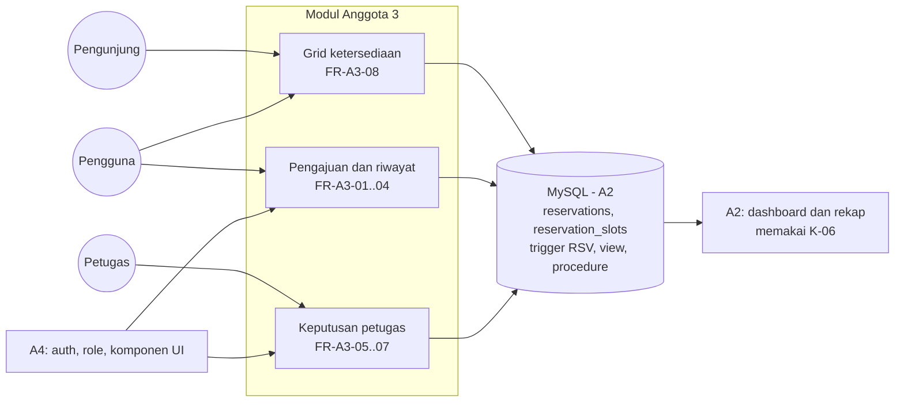
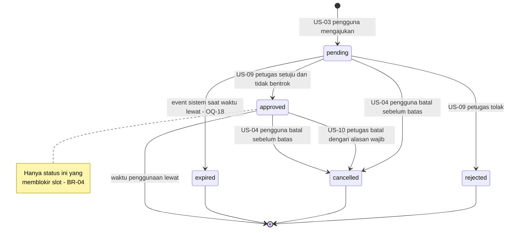

# SRS Anggota 3 — Reservation Engine & Ketersediaan

| Atribut | Nilai |
|---|---|
| **ID dokumen** | SRS-A3 |
| **Sistem** | Sistem Reservasi & Pelaporan Fasilitas Kampus (PPK 2026) |
| **Pemilik** | Anggota 3 — Programmer Reservation Engine & Ketersediaan |
| **Penyetuju** | Anggota 1 — Project Manager |
| **Branch** | `srs/anggota3-reservasi-ketersediaan` |
| **Status** | DRAFT 1.0 — wajib disetujui PM paling lambat 18 Sep 2026 (K-15) |
| **Acuan** | `docs/srs/SRS_Anggota1_PM.md` (SRS induk) · `Relationship.md` v2.0 · `DATABASE_DESIGN.md` v1.1 · `Anggota3.md` v2.0 |

---

## 1. Pendahuluan

### 1.1 Tujuan

Dokumen ini menetapkan kebutuhan perangkat lunak untuk **modul reservasi dan ketersediaan fasilitas**. Setiap kebutuhan punya ID unik, pemilik tunggal, acuan user story, dan kriteria penerimaan, sehingga bisa ditelusuri sampai ke kode dan test.

### 1.2 Lingkup

| Termasuk | Tidak termasuk (pemilik lain) |
|---|---|
| US-01 grid ketersediaan per slot | Data master fasilitas & pencarian (A2 — US-16, US-02) |
| US-03 pengajuan reservasi + validasi slot | Status fasilitas dalam perbaikan (A2 — US-12) |
| US-04 pembatalan mandiri | Dashboard antrian & rekap (A2 — US-08, US-17) |
| US-05 riwayat & detail reservasi | Autentikasi, role, komponen UI (A4) |
| US-09 persetujuan/penolakan anti-bentrok | Skema database & trigger (A2 — dibangun dari spesifikasi dokumen ini) |
| US-10 pembatalan oleh petugas | Laporan kerusakan (A4) |
| Kedaluwarsa reservasi pending (bila OQ-18 disetujui) | |

### 1.3 Definisi

| Istilah | Arti |
|---|---|
| Slot | Blok tetap 30 menit dalam jam operasional 07.00–20.00 (26 slot per hari) |
| Bentrok | Dua reservasi `approved` pada fasilitas sama yang rentang waktunya beririsan |
| Bookable | Fasilitas berstatus `active` |
| Pemohon | Pengguna yang mengajukan reservasi |

Istilah lain: `Relationship.md` §14.

### 1.4 Referensi

`Project PPK 2026.pdf` (Ketentuan Waktu Reservasi, US-01, US-03, US-04, US-05, US-09, US-10) · `PROJECT_WORKFLOW.md` §1.2 (BR-01..BR-10) · `DATABASE_DESIGN.md` §5–§11 · Laravel 13 docs (validation, database transactions, authorization).

### 1.5 Konvensi

- `FR-A3-nn` kebutuhan fungsional · `NFR-A3-nn` non-fungsional · `IF-A3-nn` antarmuka · `DR-A3-nn` data.
- Prioritas MoSCoW: **M** (Must) · **S** (Should) · **C** (Could).
- Kriteria penerimaan ditulis dalam format *Given–When–Then*.

---

## 2. Deskripsi Umum

### 2.1 Perspektif produk



### 2.2 Fungsi ringkas

Melihat slot tersedia tanpa login → mengajukan reservasi pada slot valid → melihat & membatalkan reservasi sendiri → petugas menyetujui (dengan jaminan tidak bentrok), menolak, atau membatalkan dengan alasan.

### 2.3 Kelas pengguna

| Kelas | Login | Hak pada modul ini |
|---|---|---|
| Pengunjung | Tidak | Melihat grid ketersediaan (status saja) |
| Pengguna | Ya (`active`) | Grid; ajukan; lihat & batalkan reservasi **miliknya** |
| Petugas | Ya | Melihat seluruh reservasi; setujui, tolak, batalkan dengan alasan |
| Admin | Ya | Tidak ada aksi khusus di modul ini |

### 2.4 Batasan

| ID | Batasan |
|---|---|
| C-A3-01 | Laravel 13, PHP ≥ 8.3, MySQL ≥ 8.0.16 |
| C-A3-02 | Jam operasional 07.00–20.00, slot 30 menit, **validasi wajib di sisi server** (soal) |
| C-A3-03 | Aturan juga ditegakkan database (CHECK, trigger, UNIQUE) sesuai `DATABASE_DESIGN.md` |
| C-A3-04 | Batas transaksi dipegang Laravel; tidak ada `START TRANSACTION` di trigger/procedure |

### 2.5 Asumsi & ketergantungan

| ID | Asumsi / ketergantungan | Sumber |
|---|---|---|
| AS-A3-01 | Satu reservasi boleh mencakup beberapa slot berurutan dalam satu hari | OQ-01 (default) |
| AS-A3-02 | Batas pembatalan mandiri 120 menit sebelum `start_time`, disimpan di `system_settings` | OQ-02 (default) |
| AS-A3-03 | Pemilik boleh membatalkan reservasi `pending` maupun `approved` sebelum batas | OQ-20 (default) |
| AS-A3-04 | Reservasi `pending` tidak memblokir slot; bentrok dicegah saat approve | Keputusan desain |
| DEP-A3-01 | K-00, K-02, K-03, K-09 dari A4 | `Relationship.md` §7 |
| DEP-A3-02 | K-01, K-04, K-12, K-13 dari A2 | `Relationship.md` §7 |

---

## 3. Kebutuhan Spesifik

### 3.1 Ringkasan kebutuhan fungsional

| ID | US | Nama | Aktor | Prioritas | BR |
|---|---|---|---|---|---|
| FR-A3-01 | US-03 | Mengajukan reservasi | Pengguna | M | BR-01..03 |
| FR-A3-02 | US-03 | Memvalidasi slot reservasi | Sistem | M | BR-01..03 |
| FR-A3-03 | US-05 | Melihat riwayat & detail reservasi | Pengguna | M | BR-09 |
| FR-A3-04 | US-04 | Membatalkan reservasi sendiri | Pengguna | M | BR-05 |
| FR-A3-05 | US-09 | Menyetujui reservasi tanpa bentrok | Petugas | M | BR-04 |
| FR-A3-06 | US-09 | Menolak reservasi | Petugas | M | — |
| FR-A3-07 | US-10 | Membatalkan reservasi yang disetujui | Petugas | M | BR-06 |
| FR-A3-08 | US-01 | Menampilkan grid ketersediaan | Pengunjung, Pengguna | M | BR-01, BR-02, BR-09 |
| FR-A3-09 | — | Mengedaluwarsakan reservasi pending yang lewat | Sistem | C (OQ-18) | — |

### 3.2 Detail kebutuhan fungsional

#### FR-A3-01 — Mengajukan reservasi (US-03)

| Aspek | Spesifikasi |
|---|---|
| Pemicu | Pengguna memilih fasilitas, tanggal, jam mulai, jam selesai, dan mengisi tujuan |
| Input | `facility_id`, `start_time`, `end_time`, `purpose` (1–255 karakter) |
| Proses | Validasi FR-A3-02 → simpan status `pending` dengan `user_id` pengguna login |
| Output | Reservasi tersimpan; pengguna diarahkan ke detail dengan pesan sukses |
| Gagal | Kembali ke form dengan pesan per field dalam Bahasa Indonesia |

Kriteria penerimaan:
- **AC-01.1** *Given* pengguna `active` dan fasilitas `active`, *when* mengajukan besok 09.00–10.30 dengan tujuan terisi, *then* reservasi tersimpan berstatus `pending` dan tercatat di log status.
- **AC-01.2** *Given* pengguna belum login, *when* membuka form pengajuan, *then* diarahkan ke halaman login.
- **AC-01.3** *Given* tujuan kosong, *when* mengajukan, *then* ditolak dengan pesan "Tujuan penggunaan wajib diisi".

#### FR-A3-02 — Memvalidasi slot reservasi (US-03)

Sistem menolak pengajuan yang melanggar salah satu syarat V-1..V-8 (§3.3.1), **di sisi server**, termasuk request yang dikirim langsung tanpa melalui form.

- **AC-02.1** *Given* request langsung dengan `start_time` 09.15, *when* dikirim ke endpoint penyimpanan, *then* ditolak server dengan pesan kelipatan 30 menit.
- **AC-02.2** *Given* `start_time` 06.30 atau `end_time` 20.30, *when* diajukan, *then* ditolak (jam operasional).
- **AC-02.3** *Given* fasilitas `under_repair`, *when* diajukan, *then* ditolak ("Fasilitas tidak dapat dipesan").
- **AC-02.4** *Given* validasi Laravel dilewati (INSERT langsung di Workbench) dengan jam 09.15, *when* dieksekusi, *then* MySQL menolak dengan CHECK `chk_res_grid_start`.

#### FR-A3-03 — Melihat riwayat & detail reservasi (US-05)

| Aspek | Spesifikasi |
|---|---|
| Output daftar | Reservasi milik pengguna, terbaru dulu: fasilitas, tanggal, jam, status (label Indonesia) |
| Output detail | Seluruh kolom reservasi + riwayat perubahan status + alasan pembatalan bila ada |
| Otorisasi | Hanya pemilik; akses reservasi orang lain → 403 |

- **AC-03.1** *Given* pengguna A punya 3 reservasi, *when* membuka riwayat, *then* tampil 3 reservasi miliknya saja.
- **AC-03.2** *Given* pengguna A, *when* membuka URL detail reservasi milik pengguna B, *then* respons 403.

#### FR-A3-04 — Membatalkan reservasi sendiri (US-04)

| Aspek | Spesifikasi |
|---|---|
| Syarat | Status `pending` atau `approved`; waktu sekarang ≤ `start_time` − batas (`system_settings.cancel_deadline_minutes`) |
| Proses | Status `cancelled`, `cancelled_by` = pemilik; bila sebelumnya `approved`, slot dilepas (trigger) |

- **AC-04.1** *Given* reservasi approved besok 09.00 dan batas 120 menit, *when* pemilik membatalkan hari ini, *then* status `cancelled` dan slot kembali tersedia di grid.
- **AC-04.2** *Given* sisa waktu kurang dari batas, *when* pemilik membatalkan, *then* ditolak ("Batas waktu pembatalan mandiri sudah lewat").
- **AC-04.3** *Given* pengguna bukan pemilik, *when* membatalkan, *then* 403.

#### FR-A3-05 — Menyetujui reservasi tanpa bentrok (US-09)

| Aspek | Spesifikasi |
|---|---|
| Syarat | Status masih `pending`; fasilitas `active`; waktu mulai belum lewat; tidak ada reservasi `approved` yang beririsan (§3.3.2) |
| Proses | Transaksi + penguncian (§3.3.3); status `approved`, `processed_by`, `processed_at`; slot terkunci di `reservation_slots` |
| Gagal bentrok | Pesan menyebut reservasi yang menghalangi (tanggal & jam, tanpa data pribadi pemohon lain) |

- **AC-05.1** *Given* dua reservasi pending 09.00–10.00 dan 09.30–10.30 pada fasilitas sama, *when* petugas menyetujui yang pertama lalu yang kedua, *then* yang pertama `approved`, yang kedua ditolak karena bentrok.
- **AC-05.2** *Given* reservasi 09.00–10.00 approved, *when* petugas menyetujui 10.00–11.00, *then* berhasil (batas bersentuhan bukan bentrok).
- **AC-05.3** *Given* dua transaksi approve bersamaan untuk slot beririsan, *when* keduanya commit, *then* tepat satu berhasil dan yang lain gagal (UNIQUE `uq_reservation_slot`).
- **AC-05.4** *Given* fasilitas diubah menjadi `under_repair`, *when* petugas menyetujui reservasi pending di fasilitas itu, *then* ditolak.

#### FR-A3-06 — Menolak reservasi (US-09)

- **AC-06.1** *Given* reservasi `pending`, *when* petugas menolak, *then* status `rejected` dengan `processed_by` & `processed_at` terisi.
- **AC-06.2** *Given* reservasi sudah `rejected`, *when* ada upaya mengubahnya menjadi `approved`, *then* ditolak (transisi tidak sah).

#### FR-A3-07 — Membatalkan reservasi yang disetujui (US-10)

| Aspek | Spesifikasi |
|---|---|
| Syarat | Status `approved`; alasan wajib diisi (≥ 1 karakter bermakna) |
| Sumber daftar | Termasuk daftar reservasi terdampak fasilitas nonaktif/perbaikan (`v_affected_reservations`, disediakan A2) |
| Proses | Status `cancelled`, `cancelled_by` = petugas, `cancel_reason`; slot dilepas |

- **AC-07.1** *Given* reservasi approved, *when* petugas membatalkan tanpa alasan, *then* ditolak ("Petugas wajib mengisi alasan pembatalan").
- **AC-07.2** *Given* alasan terisi, *when* dibatalkan, *then* status `cancelled`, alasan tampil di detail pemohon, slot kembali tersedia.

#### FR-A3-08 — Menampilkan grid ketersediaan (US-01)

| Aspek | Spesifikasi |
|---|---|
| Input | Fasilitas, tanggal (default hari ini) |
| Output | 26 slot dengan status: `tersedia`, `tidak_tersedia`, `dalam_perbaikan`, `lewat` |
| Sumber | `sp_facility_day_grid` / `v_public_slot_occupancy` |
| Privasi | **Tidak ada** nama pemohon, tujuan, atau ID reservasi di HTML, atribut, maupun JSON |

- **AC-08.1** *Given* reservasi approved 09.00–10.00, *when* pengunjung membuka grid tanggal itu, *then* slot 09.00 dan 09.30 berstatus "Tidak tersedia", slot lain "Tersedia".
- **AC-08.2** *Given* halaman grid terbuka, *when* source HTML diperiksa, *then* tidak ditemukan nama pemohon maupun tujuan.
- **AC-08.3** *Given* fasilitas `under_repair`, *when* grid dibuka, *then* seluruh slot "Dalam perbaikan".
- **AC-08.4** *Given* reservasi hanya `pending`, *when* grid dibuka, *then* slotnya tetap "Tersedia".

#### FR-A3-09 — Mengedaluwarsakan reservasi pending (bila OQ-18 disetujui)

- **AC-09.1** *Given* reservasi `pending` dengan `start_time` sudah lewat, *when* `sp_expire_pending_reservations` dijalankan, *then* status menjadi `expired` dan log mencatat perubahan oleh sistem.

### 3.3 Detail aturan

#### 3.3.1 Aturan slot (FR-A3-02)

Sebuah pengajuan **valid** jika dan hanya jika semua syarat terpenuhi:

| # | Syarat | Contoh valid | Contoh ditolak |
|---|---|---|---|
| V-1 | `start_time` tepat di menit `:00` atau `:30`, detik `00` | 09.30 | 09.15, 09.30:10 |
| V-2 | `end_time` tepat di menit `:00` atau `:30`, detik `00` | 11.00 | 10.45 |
| V-3 | `start_time` ≥ 07.00 | 07.00 | 06.30 |
| V-4 | `end_time` ≤ 20.00 | 20.00 | 20.30 |
| V-5 | `end_time` > `start_time` (durasi ≥ 1 slot) | 09.00–09.30 | 09.00–09.00 |
| V-6 | `start_time` dan `end_time` di **tanggal yang sama** | 10 Okt 09.00–10.00 | 10 Okt 19.00–11 Okt 07.30 |
| V-7 | `start_time` belum lewat dari waktu sekarang | besok 09.00 | kemarin 09.00 |
| V-8 | Fasilitas `isBookable()` (K-04) | fasilitas aktif | fasilitas dalam perbaikan |

V-6 dan V-7 adalah **asumsi** turunan dari BR-01 (jam operasional harian) — konfirmasi di OQ-05. Jika OQ-01 memutuskan "hanya satu slot", tambahkan V-9: durasi tepat 30 menit.

**Kenapa di server?** Soal menegaskan validasi "dilakukan di sisi server, bukan hanya di tampilan kalender". Dosen bisa menguji dengan mengirim request langsung (mis. lewat DevTools atau Postman) memakai jam 09.15. Request itu **harus** ditolak.

#### 3.3.2 Algoritma bentrok (FR-A3-05)

Dua rentang waktu **bentrok** jika saling beririsan:

```
bentrok  ⇔  existing.start_time < new.end_time
         AND existing.end_time  > new.start_time
```

dengan filter: `facility_id` sama **dan** `existing.status = approved` **dan** `existing.id ≠ new.id`.

Tabel kasus tepi (wajib menjadi unit test):

| Kasus | Existing (approved) | Baru | Bentrok? | Alasan |
|---|---|---|---|---|
| T-1 identik | 09.00–10.00 | 09.00–10.00 | **Ya** | Sama persis |
| T-2 menempel setelah | 09.00–10.00 | 10.00–11.00 | **Tidak** | Batas bersentuhan bukan irisan |
| T-3 menempel sebelum | 09.00–10.00 | 08.00–09.00 | **Tidak** | Idem |
| T-4 irisan sebagian | 09.00–10.00 | 09.30–10.30 | **Ya** | |
| T-5 dibungkus | 09.00–11.00 | 09.30–10.00 | **Ya** | |
| T-6 membungkus | 09.30–10.00 | 09.00–11.00 | **Ya** | |
| T-7 fasilitas beda | Aula 09.00–10.00 | Lab 09.00–10.00 | **Tidak** | Filter fasilitas |
| T-8 existing pending | 09.00–10.00 *pending* | 09.00–10.00 | **Tidak** | Hanya approved yang memblokir |
| T-9 existing dibatalkan | 09.00–10.00 *cancelled* | 09.00–10.00 | **Tidak** | |
| T-10 approve diri sendiri | reservasi yang sama | — | **Tidak** | Filter `id ≠` |

Perhatikan T-2/T-3: operator **`<` dan `>` ketat**, bukan `<=`/`>=`. Salah operator = slot 10.00 tidak bisa dipesan setelah reservasi 09.00–10.00.

#### 3.3.3 Konkurensi saat approve (FR-A3-05)

**Masalah:** dua petugas membuka antrian bersamaan dan menyetujui dua reservasi bentrok dalam selisih milidetik. Keduanya lolos pengecekan karena belum ada yang tersimpan.

**Spesifikasi solusi** (sesuai `PROJECT_WORKFLOW.md` §5.2):
1. Buka transaksi database.
2. Kunci baris reservasi yang **approved** di fasilitas yang sama pada rentang tanggal tersebut (`lockForUpdate`), serta baris reservasi yang akan disetujui.
3. Jalankan cek bentrok §8.2 **di dalam** transaksi.
4. Cek ulang `isBookable()` fasilitas (bisa saja baru di-set dalam perbaikan).
5. Cek status reservasi masih `pending` (bisa saja sudah diproses petugas lain).
6. Jika aman → set `approved`, `processed_by`, `processed_at`. Commit.
7. Jika bentrok → rollback, tampilkan pesan yang menyebut reservasi mana yang bentrok.
8. **Penjaga terakhir di MySQL:** kalaupun langkah 1–7 lolos di dua transaksi sekaligus, trigger AFTER UPDATE mengisi `reservation_slots`, dan UNIQUE `uq_reservation_slot` membuat transaksi kedua gagal (1062) sehingga seluruh approve-nya dibatalkan (`DATABASE_DESIGN.md` §11.1).

#### 3.3.4 Siklus hidup reservasi



| Transisi | Aktor | Syarat | Kolom yang diisi |
|---|---|---|---|
| → `pending` | Pengguna | V-1..V-8 lolos | `user_id`, `facility_id`, waktu, `purpose` |
| `pending` → `approved` | Petugas | §8.3 lolos | `processed_by`, `processed_at` |
| `pending` → `rejected` | Petugas | — | `processed_by`, `processed_at` |
| `pending`/`approved` → `cancelled` (mandiri) | Pemilik reservasi | Sebelum batas OQ-02; Policy: hanya milik sendiri | `cancel_reason` opsional |
| `approved` → `cancelled` (petugas) | Petugas | **`cancel_reason` wajib** (BR-06) | `processed_by`, `cancel_reason` |

Perlu dikonfirmasi: apakah pengguna boleh membatalkan reservasi yang **sudah approved** (US-04 tidak membatasi status)? Default di atas: boleh, selama sebelum batas waktu.

#### 3.3.5 Privasi (FR-A3-03, FR-A3-08)

| Siapa | Reservasi miliknya | Reservasi orang lain |
|---|---|---|
| Pengunjung | — | Hanya status slot (via US-01 Anggota 2) |
| Pengguna | Detail lengkap (US-05) | Tidak bisa diakses; akses URL langsung → 403 via `ReservationPolicy` |
| Petugas | — | Detail lengkap untuk memproses |

### 3.4 Kebutuhan antarmuka

#### 3.4.1 Route (mengikuti K-10)

| ID | Method | URI | Nama route | Middleware | FR |
|---|---|---|---|---|---|
| IF-A3-01 | GET | `/facilities/{facility}/availability` | `availability.show` | — | FR-A3-08 |
| IF-A3-02 | GET | `/reservations` | `reservations.index` | `auth`, `role:pengguna` | FR-A3-03 |
| IF-A3-03 | GET | `/reservations/create` | `reservations.create` | `auth`, `role:pengguna` | FR-A3-01 |
| IF-A3-04 | POST | `/reservations` | `reservations.store` | `auth`, `role:pengguna` | FR-A3-01, 02 |
| IF-A3-05 | GET | `/reservations/{reservation}` | `reservations.show` | `auth`, `role:pengguna` + Policy | FR-A3-03 |
| IF-A3-06 | PATCH | `/reservations/{reservation}/cancel` | `reservations.cancel` | `auth`, `role:pengguna` + Policy | FR-A3-04 |
| IF-A3-07 | GET | `/petugas/reservations` | `staff.reservations.index` | `auth`, `role:petugas` | FR-A3-05..07 |
| IF-A3-08 | PATCH | `/petugas/reservations/{reservation}/approve` | `staff.reservations.approve` | `auth`, `role:petugas` | FR-A3-05 |
| IF-A3-09 | PATCH | `/petugas/reservations/{reservation}/reject` | `staff.reservations.reject` | `auth`, `role:petugas` | FR-A3-06 |
| IF-A3-10 | PATCH | `/petugas/reservations/{reservation}/cancel` | `staff.reservations.cancel` | `auth`, `role:petugas` | FR-A3-07 |

#### 3.4.2 Kontrak yang disediakan

| Kontrak | Tanda tangan |
|---|---|
| K-05 | `App\Support\TimeSlot` — daftar 26 slot untuk satu tanggal; cek apakah waktu tepat di batas slot; tanpa DB |
| K-06 | `Reservation::pending()` · `Reservation::approvedOverlapping($facility, $start, $end, ?$ignoreId)` · `ReservationFactory` state `pending()`, `approved()`, `rejected()`, `cancelled()` |

#### 3.4.3 Objek database & kode error yang ditangani

`reservations`, `reservation_slots`, `reservation_status_logs`, `time_slots`, `system_settings` · trigger `trg_reservations_*` · `v_public_slot_occupancy`, `v_affected_reservations` · `sp_facility_day_grid`, `sp_expire_pending_reservations`. Kode error RSV-01..RSV-10, 3819 `chk_res_*`, 1062 `uq_reservation_slot` diterjemahkan lewat `DatabaseErrorTranslator` (`DATABASE_DESIGN.md` §7.1, §13.4).

### 3.5 Kebutuhan data

| ID | Kebutuhan |
|---|---|
| DR-A3-01 | Reservasi menyimpan `start_time`/`end_time` bertipe `DATETIME` (jam dinding WIB) |
| DR-A3-02 | Setiap perubahan status tercatat di `reservation_status_logs` beserta pelakunya |
| DR-A3-03 | Slot reservasi `approved` tersimpan di `reservation_slots` dengan UNIQUE `(facility_id, slot_date, time_slot_id)` |
| DR-A3-04 | Jadwal, fasilitas, dan pemilik reservasi tidak boleh diubah setelah dibuat (RSV-08) |

### 3.6 Kebutuhan non-fungsional

| ID | Kategori | Kebutuhan | Ukuran penerimaan |
|---|---|---|---|
| NFR-A3-01 | Keamanan | Validasi slot di server + database; otorisasi lewat Policy | AC-02.1, AC-02.4, AC-03.2 lulus |
| NFR-A3-02 | Integritas | Tidak mungkin ada dua reservasi `approved` beririsan, termasuk saat konkuren | AC-05.3 lulus |
| NFR-A3-03 | Privasi | Grid tidak membocorkan data pemohon (BR-09) | AC-08.2 lulus |
| NFR-A3-04 | Kinerja | Grid satu fasilitas per tanggal memakai satu panggilan procedure; query bentrok memakai index `idx_res_conflict` | `EXPLAIN` bukan `ALL`; halaman < 2 detik dengan data demo |
| NFR-A3-05 | Usability | Pesan kesalahan Bahasa Indonesia yang spesifik; kalender/time input berkelipatan 30 menit | Review UAT |
| NFR-A3-06 | Testability | Kasus T-1..T-10 sebagai unit test; feature test berjalan di MySQL | `php artisan test` lulus |
| NFR-A3-07 | Maintainability | Transisi status hanya lewat `ReservationService`; batas pembatalan satu sumber (`system_settings`) | Review PR |

---

## 4. Verifikasi

| FR | Unit test | Feature test | Uji database (Workbench) | UAT (PM) |
|---|---|---|---|---|
| FR-A3-01 | — | `Reservations/StoreReservationTest` | — | Pengguna mengajukan |
| FR-A3-02 | `TimeSlotTest`, `ValidReservationSlotTest` | `StoreReservationTest` (request langsung) | `DATABASE_DESIGN.md` §6.2 | Ubah jam lewat DevTools |
| FR-A3-03 | — | `ReservationHistoryTest` | — | Riwayat & akses silang |
| FR-A3-04 | — | `CancelOwnReservationTest` | — | Batal sebelum/sesudah batas |
| FR-A3-05 | `ReservationConflictTest` (T-1..T-10) | `ApproveReservationTest` | Dua tab transaksi (1062) | Bentrok ditolak |
| FR-A3-06 | — | `RejectReservationTest` | — | Tolak |
| FR-A3-07 | — | `StaffCancelReservationTest` | — | Batal tanpa/dengan alasan |
| FR-A3-08 | — | `AvailabilityGridTest` (cek HTML tanpa data pemohon) | `CALL sp_facility_day_grid` | Pengunjung membuka grid |
| FR-A3-09 | — | `ExpirePendingTest` (`CALL` procedure) | — | — |

---

## 5. Traceability

| US | FR | Artefak utama | Kontrak |
|---|---|---|---|
| US-01 | FR-A3-08 | `AvailabilityController`, `facilities/availability.blade.php`, `sp_facility_day_grid` | K-05, K-13 |
| US-03 | FR-A3-01, 02 | `ReservationController@store`, `StoreReservationRequest`, `ValidReservationSlot`, `ReservationService` | K-04, K-05, K-13 |
| US-04 | FR-A3-04 | `ReservationController@cancel`, `ReservationPolicy` | K-13 |
| US-05 | FR-A3-03 | `ReservationController@index/show` | — |
| US-09 | FR-A3-05, 06 | `Staff\ReservationController@approve/reject`, `ReservationService` | K-04, K-06, K-13 |
| US-10 | FR-A3-07 | `Staff\ReservationController@cancel`, `CancelReservationRequest` | K-13 |

---

## 6. Isu Terbuka

| ID | Isu | Default dalam SRS ini |
|---|---|---|
| OQ-01 | Satu slot atau rentang multi-slot? | Rentang multi-slot (AS-A3-01) |
| OQ-02 | Batas pembatalan mandiri? | 120 menit (AS-A3-02) |
| OQ-05 | Reservasi lintas hari / akhir pekan? | Satu hari; akhir pekan diperbolehkan |
| OQ-18 | Status `expired`? | FR-A3-09 prioritas C |
| OQ-20 | Pemilik boleh membatalkan reservasi `approved`? | Boleh (AS-A3-03) |

---

## 7. Persetujuan

| Peran | Nama | Tanggal | Keputusan |
|---|---|---|---|
| Pemilik — Anggota 3 | | | |
| Project Manager — Anggota 1 | | | ☐ Disetujui ☐ Revisi |

---

## 8. Changelog

| Versi | Tanggal | Perubahan | Oleh |
|---|---|---|---|
| 1.0 | 2026-09-16 | Draf awal SRS Anggota 3: FR-A3-01..09 dengan acceptance criteria, aturan slot V-1..V-8, kasus bentrok T-1..T-10, konkurensi, siklus hidup, privasi, route, kontrak K-05/K-06, NFR, verifikasi, traceability. | DevFlow |
