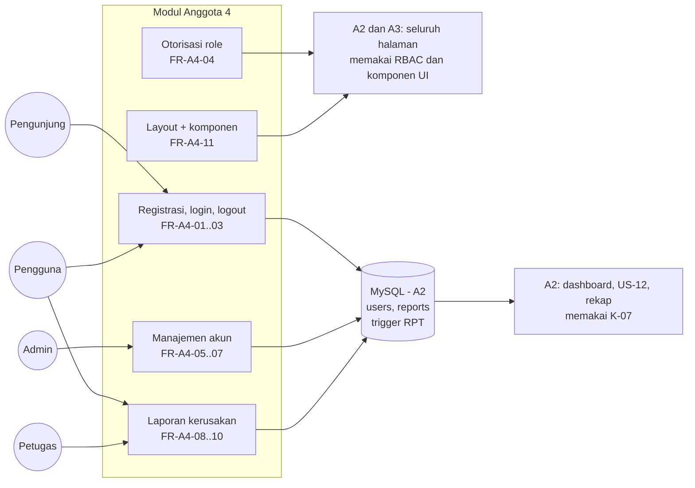
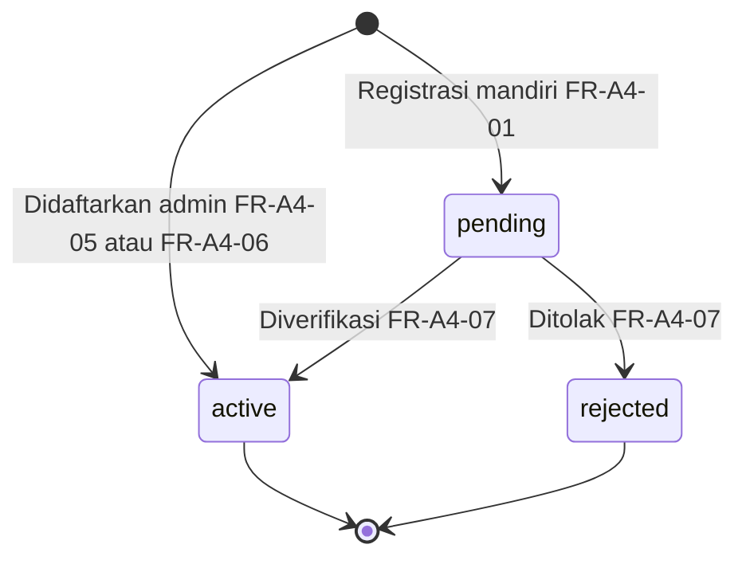
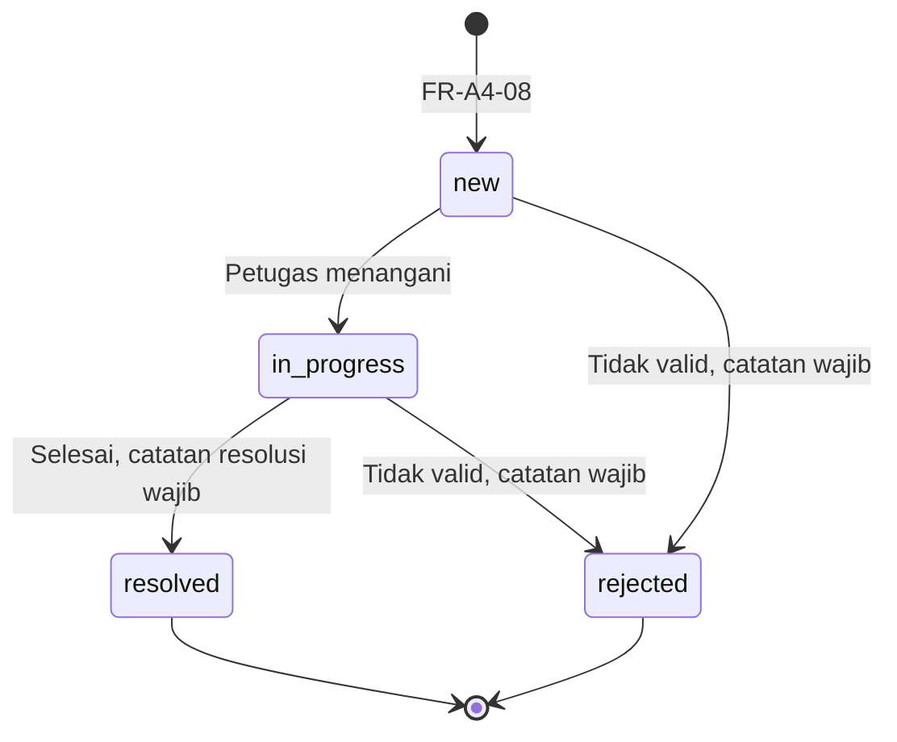

# SRS Anggota 4 — Platform, Identity & Laporan

| Atribut | Nilai |
|---|---|
| **ID dokumen** | SRS-A4 |
| **Sistem** | Sistem Reservasi & Pelaporan Fasilitas Kampus (PPK 2026) |
| **Pemilik** | Anggota 4 — Programmer Platform, Identity & Laporan |
| **Penyetuju** | Anggota 1 — Project Manager |
| **Branch** | `srs/anggota4-platform-identity-laporan` |
| **Status** | DRAFT 1.1 — wajib disetujui PM paling lambat 18 Sep 2026 (K-15) |
| **Acuan** | `docs/srs/SRS_Anggota1_PM.md` (SRS induk) · `Relationship.md` v2.0 · `DATABASE_DESIGN.md` v1.1 · `Anggota4.md` v2.0 |

---

## 1. Pendahuluan

### 1.1 Tujuan

Dokumen ini menetapkan kebutuhan untuk **fondasi aplikasi, autentikasi & otorisasi, manajemen akun, dan modul laporan kerusakan**.

### 1.2 Lingkup

| Termasuk | Tidak termasuk (pemilik lain) |
|---|---|
| Skeleton Laravel 13, layout, komponen UI, pola validasi client | Skema & objek database (A2) |
| Registrasi mandiri, login, logout (Ketentuan Umum 2) | Fasilitas, dashboard, rekap (A2) |
| Otorisasi berbasis role (middleware & Policy) | Reservasi & grid ketersediaan (A3) |
| US-13 daftarkan petugas · US-14 daftarkan pengguna · US-15 verifikasi akun | Status fasilitas dalam perbaikan (A2 — US-12) |
| US-06 lapor kerusakan · US-07 status laporan · US-11 proses laporan | |
| README, `.env.example`, kredensial per aktor | |

### 1.3 Definisi

| Istilah | Arti |
|---|---|
| Akun `pending` | Akun hasil registrasi mandiri yang belum diverifikasi admin |
| Laporan terbuka | Laporan berstatus `new` atau `in_progress` |
| Catatan resolusi | Penjelasan petugas saat laporan ditutup (`resolved`/`rejected`) |

### 1.4 Referensi

`Project PPK 2026.pdf` (Ketentuan Umum 2, aktor, US-06, US-07, US-11, US-13..15) · `PROJECT_WORKFLOW.md` §1.2 · `DATABASE_DESIGN.md` §5.1, §5.8, §7.3, §13.1 · Laravel 13 docs (Fortify, Blade, authorization, filesystem, validation).

### 1.5 Konvensi

`FR-A4-nn` · `NFR-A4-nn` · `IF-A4-nn` · `DR-A4-nn`. Prioritas MoSCoW. Kriteria penerimaan *Given–When–Then*.

---

## 2. Deskripsi Umum

### 2.1 Perspektif produk

### 2.2 Kelas pengguna

| Kelas | Hak pada modul ini |
|---|---|
| Pengunjung | Registrasi, login |
| Pengguna (`active`) | Logout; lapor kerusakan; melihat laporan **miliknya** |
| Petugas | Melihat & memproses seluruh laporan |
| Admin | Mendaftarkan petugas & pengguna; memverifikasi/menolak akun `pending` |

### 2.3 Batasan

| ID | Batasan |
|---|---|
| C-A4-01 | Laravel 13, PHP ≥ 8.3, Blade standar tanpa starter kit, Laravel Fortify headless (OQ-17 diputuskan); CSS/JS polos di `public/` |
| C-A4-02 | Pemisahan folder minimal `/public`, `/app`, `/views`, `/config` (soal) |
| C-A4-03 | Validasi server **dan** client untuk form penting (BR-10) |
| C-A4-04 | Transisi status laporan juga ditegakkan trigger MySQL (`DATABASE_DESIGN.md` §7.3) |

### 2.4 Asumsi & ketergantungan

| ID | Asumsi / ketergantungan | Sumber |
|---|---|---|
| AS-A4-01 | Registrasi mandiri diimplementasikan karena diwajibkan Ketentuan Umum 2 → US-15 berlaku | OQ-03 |
| AS-A4-02 | Foto laporan wajib, satu foto per laporan | OQ-21, OQ-09 |
| AS-A4-03 | Laporan yang sudah ditutup tidak dapat dibuka kembali | Keputusan desain |
| DEP-A4-01 | K-01, K-04, K-08, K-12, K-13 dari A2 | `Relationship.md` §7 |
| DEP-A4-02 | K-11, K-14, K-15 dari PM | `Relationship.md` §7 |

---

## 3. Kebutuhan Spesifik

### 3.1 Ringkasan kebutuhan fungsional

| ID | US | Nama | Aktor | Prioritas | BR |
|---|---|---|---|---|---|
| FR-A4-01 | (Ketentuan Umum 2) | Registrasi mandiri | Pengunjung | M | BR-07, BR-08 |
| FR-A4-02 | (Ketentuan Umum 2) | Login | Semua akun | M | BR-08 |
| FR-A4-03 | (Ketentuan Umum 2) | Logout | Semua akun | M | — |
| FR-A4-04 | Semua US | Otorisasi berbasis role | Sistem | M | BR-09 |
| FR-A4-05 | US-13 | Mendaftarkan akun petugas | Admin | M | BR-07 |
| FR-A4-06 | US-14 | Mendaftarkan akun pengguna | Admin | M | — |
| FR-A4-07 | US-15 | Memverifikasi / menolak akun | Admin | M | BR-08 |
| FR-A4-08 | US-06 | Melaporkan kerusakan | Pengguna | M | BR-10 |
| FR-A4-09 | US-07 | Melihat status laporan sendiri | Pengguna | M | — |
| FR-A4-10 | US-11 | Memproses status laporan | Petugas | M | — |
| FR-A4-11 | Semua US | Layout, komponen UI, validasi client | Sistem | M | BR-10 |

### 3.2 Detail kebutuhan fungsional

#### FR-A4-01 — Registrasi mandiri

| Aspek | Spesifikasi |
|---|---|
| Input | Nama, email unik, password + konfirmasi |
| Proses | `CreateNewUser` membuat akun dengan **role `pengguna`** dan **`account_status = pending`**; input `role` dari request diabaikan |
| Output | Pesan "Akun menunggu verifikasi admin"; pengguna tidak otomatis masuk |

- **AC-01.1** *Given* formulir valid, *when* mendaftar, *then* akun tersimpan dengan role `pengguna` dan status `pending`.
- **AC-01.2** *Given* request yang disisipi `role=petugas`, *when* mendaftar, *then* akun tetap `pengguna` (BR-07).
- **AC-01.3** *Given* email sudah terdaftar, *when* mendaftar, *then* ditolak dengan pesan email sudah dipakai.

#### FR-A4-02 — Login

- **AC-02.1** *Given* akun `active` dengan kredensial benar, *when* login, *then* masuk dan diarahkan ke beranda sesuai role.
- **AC-02.2** *Given* akun `pending`, *when* login dengan kredensial benar, *then* ditolak dengan pesan "Akun Anda masih menunggu verifikasi admin" (BR-08, ditegakkan di `Fortify::authenticateUsing`).
- **AC-02.3** *Given* akun `rejected`, *when* login, *then* ditolak dengan pesan akun ditolak.
- **AC-02.4** *Given* percobaan login gagal berulang, *when* melewati batas, *then* dibatasi (rate limiting Fortify).

#### FR-A4-03 — Logout

- **AC-03.1** *Given* pengguna login, *when* logout, *then* sesi berakhir dan halaman terproteksi tidak bisa diakses lagi.

#### FR-A4-04 — Otorisasi berbasis role

| Aspek | Spesifikasi |
|---|---|
| Area | Publik · `role:pengguna` · `/petugas` (`role:petugas`) · `/admin` (`role:admin`) |
| Objek | Policy untuk akses objek (mis. laporan milik sendiri) |
| Navigasi | Menu hanya menampilkan tautan sesuai role |

- **AC-04.1** *Given* pengguna biasa, *when* membuka URL `/admin/...` atau `/petugas/...`, *then* respons 403.
- **AC-04.2** *Given* pengunjung tanpa login, *when* membuka halaman terproteksi, *then* diarahkan ke login.

#### FR-A4-05 — Mendaftarkan akun petugas (US-13)

- **AC-05.1** *Given* admin, *when* mendaftarkan petugas dengan data valid, *then* akun tersimpan role `petugas`, status `active`, dan bisa langsung login.
- **AC-05.2** *Given* petugas atau pengguna, *when* mengakses form pendaftaran petugas, *then* 403.

#### FR-A4-06 — Mendaftarkan akun pengguna (US-14)

- **AC-06.1** *Given* admin, *when* mendaftarkan pengguna, *then* akun role `pengguna` status `active` tanpa melalui verifikasi.

#### FR-A4-07 — Memverifikasi / menolak akun (US-15)

| Aspek | Spesifikasi |
|---|---|
| Daftar | Akun `pending`, terlama dulu |
| Aksi | Verifikasi → `active`; Tolak → `rejected` |

- **AC-07.1** *Given* akun `pending`, *when* admin memverifikasi, *then* status `active` dan pemilik akun bisa login.
- **AC-07.2** *Given* akun `pending`, *when* admin menolak, *then* status `rejected` dan login tetap ditolak.

#### FR-A4-08 — Melaporkan kerusakan (US-06)

| Aspek | Spesifikasi |
|---|---|
| Input | Fasilitas, kategori (`kerusakan_fisik`, `kelistrikan`, `peralatan`, `kebersihan`, `keamanan`, `lainnya`), deskripsi, foto |
| Proses | Laporan status `new`, `user_id` pelapor; foto disimpan sesuai §3.3.3 |
| Syarat | Fasilitas tidak `inactive` (RPT-03) |

- **AC-08.1** *Given* data lengkap dengan foto JPG ≤ batas ukuran, *when* dikirim, *then* laporan `new` tersimpan dan foto dapat dilihat pelapor.
- **AC-08.2** *Given* file `.php` yang diganti nama menjadi `.jpg`, *when* diunggah, *then* ditolak server.
- **AC-08.3** *Given* foto tidak dilampirkan, *when* dikirim, *then* ditolak di client dan server.

#### FR-A4-09 — Melihat status laporan sendiri (US-07)

- **AC-09.1** *Given* pengguna punya laporan, *when* membuka "Laporan saya", *then* tampil laporan miliknya beserta status, catatan resolusi (bila ada), dan riwayat status.
- **AC-09.2** *Given* pengguna A, *when* membuka laporan atau foto milik pengguna B, *then* 403.

#### FR-A4-10 — Memproses status laporan (US-11)

| Aspek | Spesifikasi |
|---|---|
| Transisi sah | `new` → `in_progress` / `rejected` · `in_progress` → `resolved` / `rejected` |
| Wajib | `handled_by` = petugas; `resolution_note` saat `resolved`/`rejected` |

- **AC-10.1** *Given* laporan `new`, *when* petugas mengubah ke `in_progress`, *then* tersimpan dengan `handled_by` petugas tersebut.
- **AC-10.2** *Given* laporan `in_progress`, *when* ditutup `resolved` tanpa catatan, *then* ditolak (Form Request & CHECK `chk_rep_resolution`).
- **AC-10.3** *Given* laporan `resolved`, *when* ada upaya mengubah ke `in_progress`, *then* ditolak (RPT-01).

#### FR-A4-11 — Layout, komponen UI, validasi client

- **AC-11.1** *Given* halaman modul A2/A3/A4, *when* ditampilkan, *then* memakai layout & komponen `x-*` bersama.
- **AC-11.2** *Given* form penting (registrasi, reservasi, laporan), *when* field wajib kosong, *then* dicegah di browser dan tetap divalidasi server.

### 3.3 Detail aturan

#### 3.3.1 Siklus hidup akun

#### 3.3.2 Siklus hidup laporan

#### 3.3.3 Aturan unggah foto

| Aturan | Alasan |
|---|---|
| Server: harus gambar (jpg, jpeg, png, webp), ukuran maksimum 2 MB | Mencegah file berbahaya |
| Client: `accept="image/*"` + cek ukuran sebelum kirim | BR-10, kenyamanan |
| Nama file dibuat ulang oleh sistem | Mencegah path traversal & tabrakan nama |
| Disimpan di `storage/app/public/reports`, diakses lewat `storage:link` | Konvensi proyek |
| Foto hanya bisa dilihat pelapor, petugas, admin | Privasi |

### 3.4 Kebutuhan antarmuka

#### 3.4.1 Route

| ID | Method | URI | Nama route | Middleware | FR |
|---|---|---|---|---|---|
| IF-A4-01 | GET/POST | `/register` | Fortify | `guest` | FR-A4-01 |
| IF-A4-02 | GET/POST | `/login` | Fortify | `guest` | FR-A4-02 |
| IF-A4-03 | POST | `/logout` | Fortify | `auth` | FR-A4-03 |
| IF-A4-04 | GET | `/admin/staff/create` · POST `/admin/staff` | `admin.staff.create` · `admin.staff.store` | `auth`, `role:admin` | FR-A4-05 |
| IF-A4-05 | GET | `/admin/users` · POST `/admin/users` | `admin.users.index` · `admin.users.store` | `auth`, `role:admin` | FR-A4-06, 07 |
| IF-A4-06 | PATCH | `/admin/users/{user}/verify` · `/admin/users/{user}/reject` | `admin.users.verify` · `admin.users.reject` | `auth`, `role:admin` | FR-A4-07 |
| IF-A4-07 | GET/POST | `/reports/create` · `/reports` | `reports.create` · `reports.store` | `auth`, `role:pengguna` | FR-A4-08 |
| IF-A4-08 | GET | `/reports` · `/reports/{report}` | `reports.index` · `reports.show` | `auth`, `role:pengguna` + Policy | FR-A4-09 |
| IF-A4-09 | GET | `/petugas/reports` · `/petugas/reports/{report}` | `staff.reports.index` · `staff.reports.show` | `auth`, `role:petugas` | FR-A4-10 |
| IF-A4-10 | PATCH | `/petugas/reports/{report}/status` | `staff.reports.status` | `auth`, `role:petugas` | FR-A4-10 |

#### 3.4.2 Kontrak yang disediakan

| Kontrak | Tanda tangan |
|---|---|
| K-00 | Skeleton Laravel 13, `routes/web.php` hanya `require routes/modules/*.php`, Laravel Pint |
| K-02 | Enum `Role {admin, petugas, pengguna}`; middleware alias `role` |
| K-03 | Komponen `x-input`, `x-button`, `x-alert`, `x-status-badge`, `x-table`; layout per role |
| K-07 | `Report::open()` (status `new`/`in_progress`); relasi `Facility::reports()` via PR ke A2; `ReportFactory` state `new()`, `inProgress()`, `resolved()`, `rejected()` |
| K-09 | `UserFactory` state `admin()`, `petugas()`, `pengguna()`, `pending()` |
| K-10 | Prefix `/admin` (`admin.*`), `/petugas` (`staff.*`), publik (`facilities.*`, `availability.*`) |

#### 3.4.3 Objek database & kode error yang ditangani

`users`, `reports`, `report_status_logs` · trigger `trg_reports_*` · kode RPT-01..RPT-04, 3819 `chk_rep_*`/`chk_users_name`, 1062 `uq_users_email`, diterjemahkan lewat `DatabaseErrorTranslator`.

### 3.5 Kebutuhan data

| ID | Kebutuhan |
|---|---|
| DR-A4-01 | Password disimpan dalam bentuk hash |
| DR-A4-02 | Email unik (UNIQUE `uq_users_email`) |
| DR-A4-03 | Setiap perubahan status laporan tercatat di `report_status_logs` beserta petugasnya |
| DR-A4-04 | Laporan menyimpan `photo_path`, bukan file biner |

### 3.6 Kebutuhan non-fungsional

| ID | Kategori | Kebutuhan | Ukuran penerimaan |
|---|---|---|---|
| NFR-A4-01 | Keamanan | Role ditetapkan server; CSRF aktif; rate limiting login; unggah file tervalidasi | AC-01.2, AC-02.4, AC-08.2 lulus |
| NFR-A4-02 | Otorisasi | Setiap route terproteksi middleware; akses objek lewat Policy | AC-04.1, AC-09.2 lulus; `/audit-akses` bersih |
| NFR-A4-03 | Privasi | Foto & laporan hanya untuk pelapor, petugas, admin | AC-09.2 lulus |
| NFR-A4-04 | Usability | Pesan Bahasa Indonesia; tampilan konsisten lewat komponen bersama | Review UAT |
| NFR-A4-05 | Portabilitas | Setup ulang dari README berhasil di laptop bersih | Uji clone oleh PM |
| NFR-A4-06 | Testability | Feature test auth, akses role, akun, laporan di MySQL | `php artisan test` lulus |
| NFR-A4-07 | Maintainability | Controller tipis; logika status laporan satu tempat | Review PR |

---

## 4. Verifikasi

| FR | Feature test | Uji manual / UAT (PM) |
|---|---|---|
| FR-A4-01 | `Auth/RegistrationTest` (role disisipkan) | Registrasi akun baru |
| FR-A4-02 | `Auth/LoginStatusTest` (pending, rejected, active) | Login akun pending ditolak |
| FR-A4-03 | `Auth/LogoutTest` | Logout |
| FR-A4-04 | `Auth/RoleAccessTest` (semua prefix × role) | Ketik URL area lain |
| FR-A4-05 | `Admin/RegisterStaffTest` | Admin daftarkan petugas |
| FR-A4-06 | `Admin/RegisterUserTest` | Admin daftarkan pengguna |
| FR-A4-07 | `Admin/VerifyAccountTest` | Verifikasi & tolak |
| FR-A4-08 | `Reports/StoreReportTest` (file palsu) | Lapor dengan foto |
| FR-A4-09 | `Reports/ReportVisibilityTest` | Akses laporan orang lain |
| FR-A4-10 | `Reports/UpdateReportStatusTest` (transisi, catatan) | Tutup tanpa catatan |
| FR-A4-11 | `UI/ComponentRenderTest` | Konsistensi tampilan |

---

## 5. Traceability

| US | FR | Artefak utama | Kontrak |
|---|---|---|---|
| (Ketentuan Umum 2) | FR-A4-01..03 | `app/Actions/Fortify/CreateNewUser.php`, `FortifyServiceProvider` | K-02 |
| Semua | FR-A4-04, 11 | `EnsureRole`, Policy, `layouts/*`, `components/*` | K-00, K-03, K-10 |
| US-13 | FR-A4-05 | `Admin\StaffController`, `StoreStaffRequest` | K-02 |
| US-14 | FR-A4-06 | `Admin\UserController@store`, `StoreUserRequest` | K-02 |
| US-15 | FR-A4-07 | `Admin\UserController@verify/reject`, `UserPolicy` | K-02 |
| US-06 | FR-A4-08 | `ReportController@store`, `StoreReportRequest` | K-04, K-07 |
| US-07 | FR-A4-09 | `ReportController@index/show`, `ReportPolicy` | — |
| US-11 | FR-A4-10 | `Staff\ReportController@status`, `UpdateReportRequest` | K-13 |

---

## 6. Isu Terbuka

| ID | Isu | Default dalam SRS ini |
|---|---|---|
| OQ-03 | Registrasi mandiri? | Ya (AS-A4-01) |
| OQ-09 / OQ-21 | Jumlah & kewajiban foto | Satu, wajib (AS-A4-02) |
| OQ-17 | Starter kit | **Diputuskan:** tanpa starter kit — Blade + Fortify |
| — | Verifikasi email (Fortify) | Tidak diaktifkan; verifikasi dilakukan admin (US-15) |

---

## 7. Persetujuan

| Peran | Nama | Tanggal | Keputusan |
|---|---|---|---|
| Pemilik — Anggota 4 | | | |
| Project Manager — Anggota 1 | | | ☐ Disetujui ☐ Revisi |

---

## 8. Changelog

| Versi | Tanggal | Perubahan | Oleh |
|---|---|---|---|
| 1.1 | 2026-09-16 | OQ-17 diputuskan: Laravel 13 standar + Blade tanpa starter kit, Laravel Fortify headless, CSS/JS polos di `public/`. | DevFlow |
| 1.0 | 2026-09-16 | Draf awal SRS Anggota 4: FR-A4-01..11 dengan acceptance criteria, siklus hidup akun & laporan, aturan unggah foto, route, kontrak K-00/K-02/K-03/K-07/K-09/K-10, NFR, verifikasi, traceability. | DevFlow |
