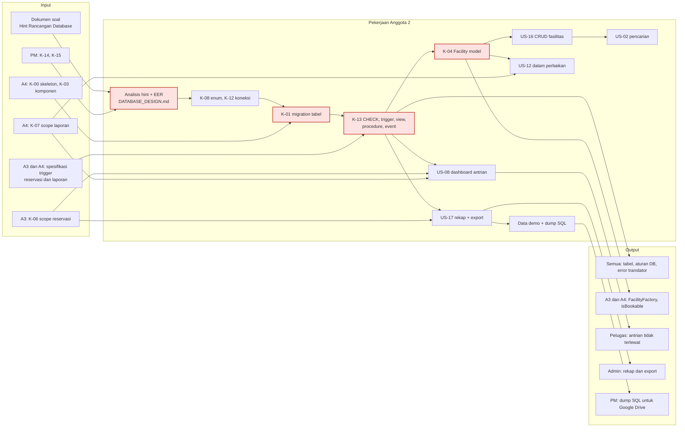
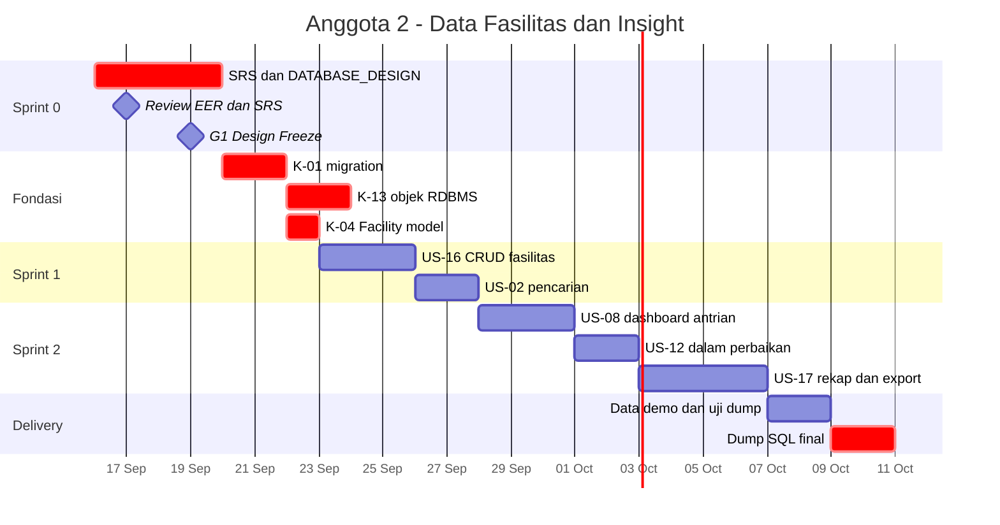

# Anggota2.md — Programmer · Data, Fasilitas & Insight

| Field | Isi |
|---|---|
| **Nama** | _(isi)_ |
| **NIM** | _(isi)_ |
| **Username GitHub** | _(isi)_ |
| **Peran** | **Programmer** — Data Architect MySQL, Katalog Fasilitas, Dashboard & Rekap |
| **User Story** | US-02, US-08, US-12, US-16, US-17 + seluruh desain database |
| **Kontrak disediakan** | K-01 migration, K-04 Facility, K-08 enum, K-12 standar koneksi, K-13 objek RDBMS |
| **Kontrak dipakai** | K-00, K-02, K-03, K-07, K-09 (A4) · K-05, K-06 (A3) · K-11, K-14, K-15 (PM) |
| **Branch** | Kerja di `a2/*` · SRS di `srs/anggota2-data-fasilitas-insight` · **tidak pernah push ke `main`** |
| **SRS** | `workflow/srs/SRS_Anggota2_Data_Fasilitas_Insight.md` (FR-A2-01 s/d FR-A2-11, DR-A2) |
| **Review sejawat** | Me-review PR Anggota 4 · PR saya direview Anggota 3 · review akhir & merge oleh PM |
| **Beban** | 27 poin (35%) — terberat, dipantau PM (R-05) |
| **Acuan** | `Relationship.md` v2.1 · `PROJECT_WORKFLOW.md` v2.1 · `DATABASE_DESIGN.md` v1.2 |

---

## 1. Misi

Menjadi **arsitek data** sekaligus pemilik **informasi yang dilihat admin dan petugas**.

1. **Minggu pertama — database (critical path).** EER, `DATABASE_DESIGN.md`, migration, CHECK, trigger, view, procedure, event. Skema yang dibekukan di G1 menentukan apakah dua programmer lain bisa bekerja lancar.
2. **Katalog fasilitas.** CRUD fasilitas oleh admin, pencarian publik, dan status "dalam perbaikan" yang langsung memengaruhi reservasi.
3. **Insight.** Dashboard antrian petugas dan rekap okupansi & kerusakan untuk admin. Keduanya dibangun di atas view dan stored procedure yang kamu rancang sendiri, sehingga logika rekap berada di satu tangan.

---

## 2. Peta Tanggung Jawab



---

## 3. User Story, FR & Pekerjaan

| ID | Pekerjaan | FR / DR di SRS | Poin | BR | Jatuh tempo |
|---|---|---|---|---|---|
| — | Analisis hint soal, EER, `DATABASE_DESIGN.md` | DR-A2-01 | 3 | Semua | Draft 17 Sep |
| K-08, K-12 | Kamus enum; standar koneksi | DR-A2-02 | 1 | — | 17–19 Sep |
| K-01 | Migration tabel sesuai `DATABASE_DESIGN.md` §5 | DR-A2-03 | 3 | — | 21 Sep |
| K-13 | CHECK, trigger, view, procedure, event, `DatabaseErrorTranslator` | DR-A2-04..06 | 3 | BR-01..06, BR-09 | 23 Sep |
| K-04 | Model `Facility`, `FacilityFactory`, `active()`, `isBookable()` | DR-A2-07 | 1 | BR-04 | 22 Sep |
| US-16 | Admin tambah/edit/nonaktifkan fasilitas | FR-A2-01..03 | 3 | — | 25 Sep |
| US-02 | Cari fasilitas berdasarkan tipe/lokasi/kapasitas | FR-A2-04 | 2 | — | 27 Sep |
| US-08 | Dashboard antrian reservasi & laporan | FR-A2-07..08 | 3 | — | 30 Sep |
| US-12 | Tandai fasilitas dalam perbaikan & kembalikan aktif | FR-A2-05..06 | 3 | — | 2 Okt |
| US-17 | Rekap okupansi & kerusakan + export | FR-A2-09..11 | 5 | — | 6 Okt |
| — | Data demo realistis + dump SQL final | DR-A2-08 | — | — | 9 Okt |

---

## 4. Rincian per Sprint

| Sprint | Tanggal | Aktivitas | Branch |
|---|---|---|---|
| **0 — Analysis & Design** | 16–19 Sep | SRS A2; finalisasi `DATABASE_DESIGN.md` bersama spesifikasi trigger dari A3 & A4; EER di Workbench; review 17 Sep; enum (OQ-13); forward engineering | `srs/anggota2-data-fasilitas-insight`, `a2/design-eer` |
| **Fondasi** | 20–23 Sep | K-01 → K-13 (pemuat `database/sql/*`, `DatabaseErrorTranslator`) → K-04; uji `migrate:fresh --seed` & `migrate:rollback` | `a2/K-01-migration`, `a2/K-13-objek-rdbms`, `a2/K-04-facility` |
| **1** | 23–27 Sep | US-16 CRUD admin (nonaktifkan = status, bukan hapus); US-02 filter publik | `a2/US-16-crud-fasilitas`, `a2/US-02-pencarian` |
| **2** | 28 Sep–6 Okt | US-08 (`v_staff_queue`); US-12 (+ `v_affected_reservations`); US-17 (`sp_recap_*` + export) | `a2/US-08-dashboard`, `a2/US-12-perbaikan`, `a2/US-17-rekap` |
| **Stabilisasi** | 7–8 Okt | Data demo realistis; review silang PR A4; uji dump + skrip `DATABASE_DESIGN.md` §6.2 | `a2/data-demo` |
| **Delivery** | 9–10 Okt | Dump SQL final; screenshot & penjelasan fitur untuk PM; bagian ERD untuk slide | `a2/dump-final` |

---

## 5. Timeline Pribadi



---

## 6. Keperluan

### 6.1 Input yang dibutuhkan

| Dari | Apa | Kapan paling lambat | Kalau terlambat |
|---|---|---|---|
| PM | K-14 repo; K-15 SRS disetujui | 16 / 18 Sep | Draf tetap dikerjakan di branch `srs/…` |
| A3 | Spesifikasi trigger reservasi + jawaban OQ-01 | 18 Sep | Pakai `DATABASE_DESIGN.md` §7.2 apa adanya (mendukung rentang multi-slot) |
| A4 | Spesifikasi trigger laporan + kebutuhan kolom akun | 18 Sep | Pakai §5.1, §5.8, §7.3 apa adanya |
| A4 | K-00 skeleton | 20 Sep pagi | Siapkan migration & file `database/sql/*` lebih dulu |
| A3 | K-06 stub scope reservasi | 24 Sep | US-08 bagian laporan dulu |
| A4 | K-07 stub scope laporan | 27 Sep | US-08 memakai `v_staff_queue` langsung; US-12 tanpa menautkan laporan dulu |
| Tim | OQ-07 format export wajib | 2 Okt | Urutan CSV → Excel → PDF; tiap format bisa jadi titik berhenti |

### 6.2 Output yang diserahkan

| Ke | Apa | Kapan |
|---|---|---|
| Semua | K-12 standar koneksi | 17 Sep |
| Semua | Draf EER + `DATABASE_DESIGN.md` untuk review | 17 Sep |
| Semua | K-08 enum final | 19 Sep |
| Semua | K-01 migration yang lolos `migrate:fresh --seed` | 21 Sep |
| A3, A4 | K-04 `Facility` + `FacilityFactory` + `isBookable()` | 22 Sep |
| Semua | K-13 objek RDBMS + `DatabaseErrorTranslator` | 23 Sep |
| PM | Dump SQL lengkap dengan trigger, procedure, event | 9 Okt |

### 6.3 Tools

MySQL Workbench (EER, Validate, Forward Engineering, Data Export) · MySQL ≥ 8.0.16 · Laravel 13 Artisan · `maatwebsite/excel` (CSV/Excel) · `barryvdh/laravel-dompdf` (PDF) · VS Code.

### 6.4 Referensi

| Topik | Referensi |
|---|---|
| EER & forward engineering | https://dev.mysql.com/doc/workbench/en/wb-data-modeling.html |
| CHECK constraint | https://dev.mysql.com/doc/refman/8.0/en/create-table-check-constraints.html |
| Trigger · Stored procedure · SIGNAL | https://dev.mysql.com/doc/refman/8.0/en/triggers.html · https://dev.mysql.com/doc/refman/8.0/en/create-procedure.html · https://dev.mysql.com/doc/refman/8.0/en/signal.html |
| Event scheduler · Window function | https://dev.mysql.com/doc/refman/8.0/en/event-scheduler.html · https://dev.mysql.com/doc/refman/8.0/en/window-functions.html |
| Migration & query (Laravel 13) | https://laravel.com/docs/13.x/migrations · https://laravel.com/docs/13.x/database |
| Export | https://docs.laravel-excel.com · https://github.com/barryvdh/laravel-dompdf |

---

## 7. File & Branch Milikmu

```
Branch  : a2/<ID>-<slug> · srs/anggota2-data-fasilitas-insight
File    :
workflow/DATABASE_DESIGN.md
workflow/srs/SRS_Anggota2_Data_Fasilitas_Insight.md
docs/02-design/eer-model.mwb
docs/02-design/data-dictionary.md
database/schema/schema.sql
database/sql/01_tables.sql … 05_events.sql
database/migrations/*                       (pemilik tunggal)
database/seeders/DatabaseSeeder.php         (hanya memanggil seeder modul)
database/seeders/FacilitySeeder.php
database/factories/FacilityFactory.php
database/dump/final.sql
app/Support/DatabaseErrorTranslator.php
lang/id/database.php
app/Enums/FacilityStatus.php
app/Models/Facility.php
app/Services/RecapService.php
app/Exports/*
app/Http/Controllers/FacilityController.php
app/Http/Controllers/Admin/FacilityController.php
app/Http/Controllers/Staff/FacilityStatusController.php
app/Http/Controllers/Staff/DashboardController.php
app/Http/Controllers/Admin/RecapController.php
app/Http/Requests/FacilityRequest.php
app/Http/Requests/RecapRequest.php
app/Policies/FacilityPolicy.php
routes/modules/facilities.php
routes/modules/dashboard.php
routes/modules/recap.php
resources/views/facilities/index.blade.php
resources/views/admin/facilities/*
resources/views/staff/dashboard.blade.php
resources/views/admin/recap/*
tests/Feature/Facilities/*, tests/Feature/Insight/*
```

---

## 8. Spesifikasi Kunci (ringkas)

Kebutuhan lengkap & acceptance criteria ada di **SRS Anggota 2**. Rancangan database lengkap ada di **`DATABASE_DESIGN.md`**.

### 8.1 Keputusan desain untuk review 17 Sep

| # | Pertanyaan desain | Opsi | Rekomendasi awal |
|---|---|---|---|
| D-1 | `type` fasilitas dan `category` laporan: kolom enum/varchar atau tabel master terpisah? | Kolom · tabel `facility_types` & `report_categories` | Tabel master bila admin perlu menambah kategori; kolom bila daftar tetap |
| D-2 | "Nonaktifkan" fasilitas (US-16) memakai status `inactive` atau soft delete? | Status · `deleted_at` | Status `inactive` — riwayat reservasi & rekap tetap utuh |
| D-3 | Reservasi multi-slot (OQ-01) | Satu baris rentang · satu baris per slot | Satu baris dengan `start_time`/`end_time` rentang — cocok dengan bunyi US-03 "rentang waktu tertentu" |
| D-4 | Laporan boleh multi-foto? (OQ-09) | `photo_path` · tabel `report_photos` | Satu foto, sesuai bunyi US-06 |
| D-5 | Tautan US-12: fasilitas dalam perbaikan dikaitkan ke laporan tertentu? | Tidak · kolom `facilities.repair_report_id` | Diskusikan dengan Anggota 4 |

### 8.2 Dashboard antrian (US-08)

| Panel | Sumber | Urutan |
|---|---|---|
| Reservasi menunggu | `v_staff_queue` (`item_type = reservation`) | Waktu penggunaan terdekat dulu |
| Laporan belum ditangani | `v_staff_queue` (`item_status = new`) | Terlama dulu |
| Laporan sedang diproses | `v_staff_queue` (`item_status = in_progress`) | Terlama dulu |
| Penanda mendesak / terlambat | Kolom `is_flagged`; ambang di `system_settings` (24 jam / 48 jam) | Tampil paling atas |

Tujuan US-08 tertulis eksplisit: **"agar tidak ada yang terlewat"**. Penanda ini menjawab tujuan tersebut.

### 8.3 Rekap (US-17)

| Metrik | Rumus | Objek MySQL |
|---|---|---|
| Okupansi fasilitas | Slot terpakai reservasi `approved` ÷ (26 × jumlah hari) × 100% | `sp_recap_occupancy`, `v_recap_daily_occupancy` |
| Frekuensi kerusakan | Jumlah laporan kecuali `rejected`, per fasilitas/lokasi/kategori | `sp_recap_damage`, `v_recap_damage_monthly` |
| Rata-rata waktu penyelesaian | Rata-rata `resolved_at − created_at` laporan `resolved` | `v_recap_damage_monthly` |
| Peringkat | `RANK()` keseluruhan & per lokasi | Window function di procedure |

Export (OQ-07): kolom **identik** dengan tabel di layar, filter periode ikut diterapkan, nama file memuat periode, hanya `role:admin`.

### 8.4 Prosedur Workbench

Ikuti `PROJECT_WORKFLOW.md` §6.1. Aturan emas: **`.mwb` diubah lebih dulu** → forward engineering → migration **baru**. Migration yang sudah di-merge ke `main` tidak pernah diedit.

### 8.5 Analisis *Hint Rancangan Database* vs User Story

Soal hanya memberi **petunjuk minimal** berupa 4 tabel dan 19 atribut. Ketentuan Khusus 1 mengizinkan penambahan tabel/atribut. Bila setiap user story dicocokkan, hint tersebut **belum cukup**:

**Users**

| Atribut di hint | Implementasi | Alasan | Sumber |
|---|---|---|---|
| nama | `name` | — | — |
| email | `email` UNIQUE | Login harus unik | Ketentuan Umum 2 |
| password | `password` (hash) | Tidak pernah disimpan teks asli | Ketentuan Umum 2 |
| role | `role` enum | Pengunjung tidak punya akun; 3 role login | US-13, US-14 |
| *(tidak ada)* | **`account_status`** | Akun registrasi mandiri menunggu verifikasi | US-15, BR-08 |

**Facilities**

| Atribut di hint | Implementasi | Alasan | Sumber |
|---|---|---|---|
| nama fasilitas | `name` | — | — |
| tipe | `type` | Filter pencarian | US-02 |
| lokasi | `location` | Filter pencarian & rekap per lokasi | US-02, US-17 |
| kapasitas | `capacity` INT | Filter "kapasitas ≥ n" butuh angka | US-02 |
| deskripsi | `description` | — | — |
| *(tidak ada)* | **`status`** | Dalam perbaikan & nonaktif | US-12, US-16 |

**Reservations**

| Atribut di hint | Implementasi | Alasan | Sumber |
|---|---|---|---|
| nama pemesan | **`user_id` FK** — bukan teks nama | Nama sudah ada di `users`. Menyimpannya lagi = redundansi (melanggar 3NF) dan tidak ikut berubah bila nama diperbarui | Normalisasi |
| fasilitas yang dipesan | **`facility_id` FK** | Idem | Normalisasi |
| waktu penggunaan | **`start_time` + `end_time`** (dua kolom DATETIME) | BR-03 memvalidasi keduanya; rumus bentrok butuh awal dan akhir | BR-03, US-09 |
| status | `status` enum | — | US-05 |
| *(tidak ada)* | **`purpose`** | US-03 berbunyi "dengan menyebutkan tujuan penggunaan" | US-03 |
| *(tidak ada)* | **`processed_by`, `processed_at`** | Jejak petugas yang menyetujui/menolak | US-09 |
| *(tidak ada)* | **`cancel_reason`** | Pembatalan petugas wajib beralasan | US-10, BR-06 |

**Reports**

| Atribut di hint | Implementasi | Alasan | Sumber |
|---|---|---|---|
| pelapor | **`user_id` FK** | Normalisasi | — |
| fasilitas yang dilaporkan | **`facility_id` FK** | Normalisasi | — |
| kategori laporan | `category` | — | US-06 |
| deskripsi | `description` | — | US-06 |
| foto | **`photo_path`** — bukan BLOB | File disimpan di storage, database hanya menyimpan lokasinya. Database tetap ringan dan dump SQL kecil | US-06 |
| status laporan | `status` enum | — | US-11 |
| *(tidak ada)* | **`resolution_note`** | "catatan resolusi saat laporan ditutup" | US-11 |
| *(tidak ada)* | **`handled_by`, `resolved_at`** | Jejak petugas; waktu penyelesaian untuk rekap | US-11, US-17 |

**Kesimpulan:** dari 19 atribut hint, **6 diubah bentuknya** (4 teks → FK, waktu → 2 kolom, foto → path) dan **9 kolom ditambah**, belum termasuk `created_at`/`updated_at`. Tabel ini adalah bahan utama review EER 17 Sep.

### 8.6 Rujukan `DATABASE_DESIGN.md`

| Topik | Lokasi |
|---|---|
| Brainstorming mekanisme & lapisan pertahanan | §2, §3 |
| DDL dengan CHECK & generated column | §5 |
| Aturan waktu reservasi di level DB + skrip uji | §6 |
| Trigger + katalog kode error | §7 |
| View & stored procedure | §8, §9 |
| Katalog query Q-01..Q-17 | §12 |
| Integrasi Laravel 13 | §13 |
| Standar koneksi K-12 | §14 |

---

## 9. Prompt Overlay AI

Tempel **CORE PROMPT v2.0** (`CLAUDE.md` / `Relationship.md` §13.3) lebih dulu, lalu tempel blok ini.

```text
# ═══════════════════════════════════════════════════════════
# OVERLAY — Anggota 2 · Programmer · Data, Fasilitas & Insight
# Dipakai bersama CORE v2.0
# ═══════════════════════════════════════════════════════════

## PERAN
Kamu mendampingi Anggota 2, pemilik tunggal database MySQL, modul
fasilitas, dashboard petugas, dan rekap admin. Berpikir seperti DBA:
integritas data, normalisasi, index, dan aturan yang ditegakkan RDBMS.

## USER STORY & FR MILIK SAYA
US-16 FR-A2-01..03 Tambah/edit/nonaktifkan fasilitas
US-02 FR-A2-04     Pencarian tipe/lokasi/kapasitas
US-12 FR-A2-05..06 Dalam perbaikan & kembali aktif (+ reservasi terdampak)
US-08 FR-A2-07..08 Dashboard antrian + penanda mendesak/terlambat
US-17 FR-A2-09..11 Rekap okupansi & kerusakan + export
Database DR-A2-01..08 (DATABASE_DESIGN.md)

## KONTRAK YANG SAYA SEDIAKAN (tanda tangan wajib stabil)
K-01 Migration tabel; lolos migrate:fresh --seed dan migrate:rollback
K-04 Facility: scope active(), isBookable(): bool, FacilityFactory
     dengan state underRepair() dan inactive()
K-08 Enum FacilityStatus {active, under_repair, inactive} + label()
K-12 Standar koneksi MySQL >= 8.0.16 (DATABASE_DESIGN.md §14)
K-13 CHECK, trigger, view, procedure, event, katalog kode error,
     DatabaseErrorTranslator (DATABASE_DESIGN.md §5-§10, §13)

## KONTRAK YANG SAYA PAKAI
K-00, K-02, K-03, K-07, K-09 dari Anggota 4 · K-05, K-06 dari Anggota 3 ·
K-11, K-14, K-15 dari PM

## BRANCH
a2/<ID>-<slug>, contoh a2/K-13-objek-rdbms, a2/US-17-rekap.
Tidak pernah push ke main; PR direview Anggota 3, di-merge PM.

## FILE MILIK SAYA
Lihat Anggota2.md §7 (database, migration, database/sql/*, fasilitas,
dashboard, rekap, export, DatabaseErrorTranslator).

## FOKUS KHUSUS
- DDL kompatibel MySQL 8.0.16, InnoDB, utf8mb4_unicode_ci; nama FK
  fk_<tabel>_<ref>; nama CHECK chk_<tabel>_<aturan>.
- Setiap perubahan skema: .mwb dulu → forward engineering → migration BARU.
- Aturan yang wajib selalu benar ditegakkan di MySQL (CHECK, trigger,
  UNIQUE uq_reservation_slot); tidak ada START TRANSACTION di trigger/
  procedure; setiap SIGNAL memakai kode yang terdaftar.
- Dashboard & rekap membaca v_staff_queue dan sp_recap_* — jangan menulis
  ulang logikanya di PHP; query di katalog diuji dengan EXPLAIN.
- Filter periode rekap di klausa ON (fasilitas tanpa data tetap tampil 0%).
- Nonaktifkan fasilitas = UPDATE status, bukan DELETE.
- Dump SQL wajib --routines --events; uji import ke database kosong.
- Test berjalan di MySQL reservasi_fasilitas_test.

## BATASAN
- Jangan menulis logika approve/bentrok atau grid ketersediaan (Anggota 3).
- Jangan menulis logika akun atau status laporan (Anggota 4).

## PERINTAH TAMBAHAN
/ddl        hasilkan DDL MySQL Workbench-compatible dari EER terbaru
/cek-skema  bandingkan migration vs database/sql/01_tables.sql
/uji-aturan jalankan skrip DATABASE_DESIGN.md §6.2 dan laporkan hasil
# ═══════════════════════════ AKHIR OVERLAY A2 ═══════════════
```

---

## 10. Definition of Done Pribadi

- [ ] `.mwb` lolos *Validate All* dan identik dengan migration di `main`
- [ ] `migrate:fresh --seed` dan `migrate:rollback` bersih, termasuk objek RDBMS
- [ ] Skrip uji `DATABASE_DESIGN.md` §6.2: setiap statement ❌ ditolak dengan kode yang benar
- [ ] Fasilitas `under_repair` → `isBookable()` false dan approve baru ditolak `RSV-03`
- [ ] Nonaktifkan fasilitas tidak menghapus riwayat reservasi/laporannya
- [ ] Dashboard menampilkan data dari `v_staff_queue`, penanda mendesak/terlambat berfungsi
- [ ] `CALL sp_recap_occupancy` di Workbench menghasilkan angka yang sama dengan halaman rekap
- [ ] Export sesuai format yang disepakati, isi sama dengan tabel di layar; non-admin → 403
- [ ] Dump SQL menyertakan trigger, procedure, event; bisa di-import ke database kosong
- [ ] Minimal 3 commit per minggu lewat branch `a2/*`
- [ ] Screenshot US-02, US-08, US-12, US-16, US-17 + gambar ERD diserahkan ke PM

---

## 11. Persiapan Tanya Jawab & Demo UTS

**Skenario demo (±2,5 menit):** tunjukkan ERD & satu CHECK ditolak di Workbench → admin tambah fasilitas → cari fasilitas → petugas tandai "dalam perbaikan" (reservasi terdampak muncul) → dashboard antrian dengan penanda → admin rekap okupansi & kerusakan → export.

| Kemungkinan pertanyaan | Poin jawaban |
|---|---|
| "Jelaskan ERD-nya" | 9 tabel: 4 dari hint + `time_slots`, `reservation_slots`, 2 tabel log, `system_settings`; alasan tiap tambahan |
| "Kenapa `user_id`, bukan 'nama pemesan' seperti di hint?" | Nama sudah ada di `users`; menyimpan ulang = redundansi & melanggar 3NF |
| "Kalau saya INSERT jam 09.15 dari Workbench?" | Ditolak CHECK `chk_res_grid_start` — aturan di database, bukan hanya aplikasi |
| "Rekapnya dihitung di mana?" | Stored procedure dengan window function `RANK()`; Laravel hanya memanggil & mengekspor |
| "Kenapa nonaktifkan, bukan hapus?" | Riwayat reservasi & rekap membutuhkan data fasilitas lama |
| "Kenapa filter periode ada di ON, bukan WHERE?" | Agar fasilitas tanpa pemakaian tetap tampil dengan 0% |

---

## 12. Changelog

| Versi | Tanggal | Perubahan | Oleh |
|---|---|---|---|
| 2.1 | 2026-09-16 | Dokumen dipindah ke folder `workflow/` (SRS ke `workflow/srs/`); rujukan path dan versi dokumen terkait diperbarui; versi PDF di `workflow_pdf/`. | DevFlow |
| 2.0 | 2026-09-16 | **Restrukturisasi tim (1 PM + 3 Programmer).** Peran menjadi Programmer — Data, Fasilitas & Insight. US-01 dipindah ke Anggota 3; US-08 & US-17 diambil dari eks QA. Tambah FR-A2/DR-A2, branch `a2/*`, SRS, rotasi review (direview A3, me-review A4), spesifikasi ringkas dashboard & rekap, overlay CORE v2.0. Analisis hint (§8.5) dan keputusan desain (§8.1) dipertahankan. | DevFlow |
| 1.2 | 2026-09-15 | `DATABASE_DESIGN.md`, K-13, instalasi MySQL dihapus. | DevFlow |
| 1.1 | 2026-09-15 | Analisis hint, katalog query, K-12. | DevFlow |
| 1.0 | 2026-09-15 | Dokumen awal Data Architect · Facility. | DevFlow |
