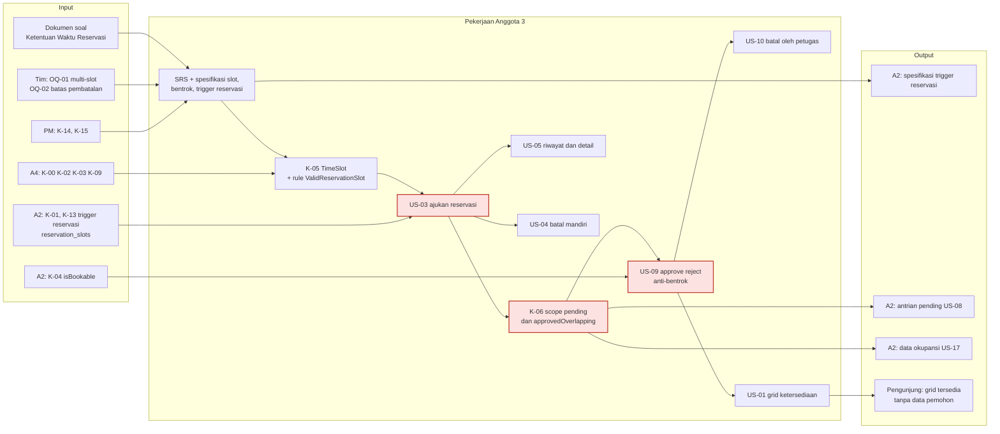
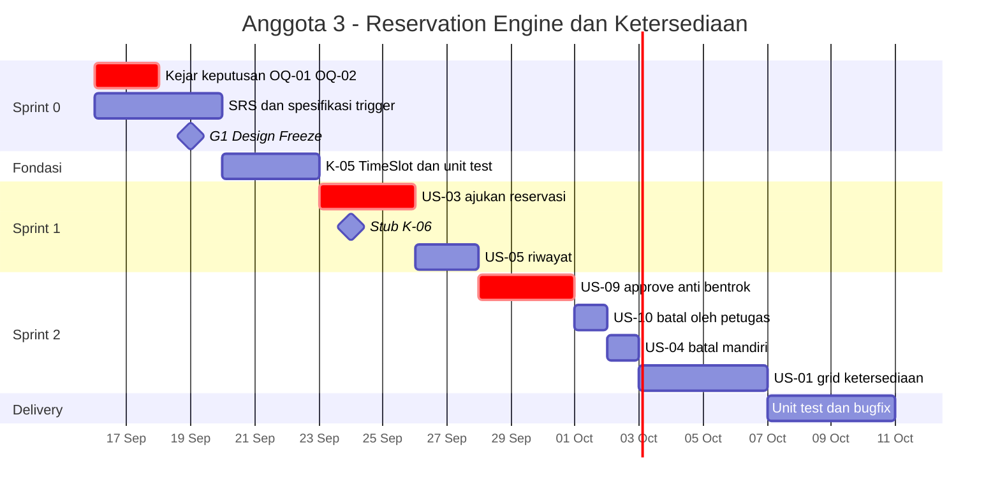
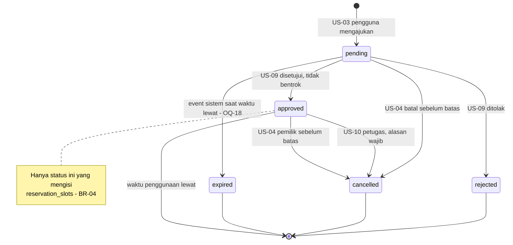

# Anggota3.md — Programmer · Reservation Engine & Ketersediaan

| Field | Isi |
|---|---|
| **Nama** | _(isi)_ |
| **NIM** | _(isi)_ |
| **Username GitHub** | _(isi)_ |
| **Peran** | **Programmer** — Reservation Engine, Aturan Slot & Anti-Bentrok, Grid Ketersediaan |
| **User Story** | US-01, US-03, US-04, US-05, US-09, US-10 |
| **Kontrak disediakan** | K-05 TimeSlot, K-06 scope reservasi |
| **Kontrak dipakai** | K-00, K-02, K-03, K-09 (A4) · K-01, K-04, K-12, K-13 (A2) · K-11, K-14, K-15 (PM) |
| **Branch** | Kerja di `a3/*` · SRS di `srs/anggota3-reservasi-ketersediaan` · **tidak pernah push ke `main`** |
| **SRS** | `workflow/srs/SRS_Anggota3_Reservasi_Ketersediaan.md` (FR-A3-01 s/d FR-A3-09) |
| **Review sejawat** | Me-review PR Anggota 2 · PR saya direview Anggota 4 · review akhir & merge oleh PM |
| **Beban** | 26 poin (33%) |
| **Acuan** | `Relationship.md` v2.1 · `PROJECT_WORKFLOW.md` v2.1 · `DATABASE_DESIGN.md` v1.2 |

---

## 1. Misi

Memegang **jantung sistem**: seluruh siklus reservasi, dari melihat slot kosong sampai persetujuan dan pembatalan.

- **Aturan paling ketat ada di sini.** Jam operasional, slot 30 menit yang wajib divalidasi di server, dan pencegahan bentrok. Dosen hampir pasti mengujinya saat demo.
- **Grid ketersediaan (US-01) kini milikmu.** Grid dibaca dari slot reservasi `approved` (`reservation_slots`), jadi paling tepat dipegang pemilik logika approve.
- **US-03 dan US-09 ada di critical path.** Scope reservasimu (K-06) dipakai Anggota 2 untuk dashboard antrian dan rekap okupansi.
- **Pekerjaan pertama tidak butuh database.** `TimeSlot` (K-05) murni logika dan bisa langsung diuji begitu skeleton tersedia.

---

## 2. Peta Tanggung Jawab



---

## 3. User Story, FR & Pekerjaan

| ID | Pekerjaan | FR di SRS | Poin | BR | Jatuh tempo |
|---|---|---|---|---|---|
| — | SRS; spesifikasi slot, bentrok, state machine, trigger reservasi & kode RSV-xx | — | 2 | BR-01..06 | 18 Sep |
| K-05 | `TimeSlot` + rule `ValidReservationSlot` + unit test | FR-A3-02 | 3 | BR-01..03 | 22 Sep |
| US-03 | Pengguna mengajukan reservasi rentang waktu + tujuan | FR-A3-01, FR-A3-02 | 5 | BR-01..03 | 25 Sep |
| K-06 | Scope `pending()`, `approvedOverlapping()` + `ReservationFactory` | — | — | BR-04 | Stub 24 Sep · final 26 Sep |
| US-05 | Riwayat & detail reservasi milik sendiri | FR-A3-03 | 2 | BR-09 | 27 Sep |
| US-09 | Petugas setujui/tolak; cegah bentrok | FR-A3-05, FR-A3-06 | 5 | **BR-04** | 30 Sep |
| US-10 | Petugas batalkan reservasi approved + alasan | FR-A3-07 | 2 | BR-06 | 1 Okt |
| US-04 | Pengguna batalkan reservasi sendiri sebelum batas | FR-A3-04 | 2 | BR-05 | 2 Okt |
| US-01 | Grid ketersediaan per slot tanpa detail pemohon | FR-A3-08 | 5 | BR-01, BR-02, BR-09 | 6 Okt |
| OQ-18 | Kedaluwarsa reservasi pending (event) — bila disetujui | FR-A3-09 | — | — | 6 Okt |

---

## 4. Rincian per Sprint

| Sprint | Tanggal | Aktivitas | Branch |
|---|---|---|---|
| **0 — Analysis & Design** | 16–19 Sep | Dorong keputusan OQ-01 & OQ-02; SRS A3 (FR, acceptance criteria, kasus tepi); spesifikasi trigger reservasi untuk A2 (`DATABASE_DESIGN.md` §7.2); wireframe form reservasi, antrian petugas, grid | `srs/anggota3-reservasi-ketersediaan` |
| **Fondasi** | 20–22 Sep | K-05 `TimeSlot` + unit test tanpa DB | `a3/K-05-timeslot` |
| **1** | 23–27 Sep | US-03 (Form Request + Service); PR stub K-06 24 Sep; US-05 | `a3/US-03-ajukan-reservasi`, `a3/K-06-scope`, `a3/US-05-riwayat` |
| **2** | 28 Sep–6 Okt | US-09 (transaksi + lock + trigger); US-10; US-04; US-01 grid (`sp_facility_day_grid`) | `a3/US-09-approve`, `a3/US-10-batal-petugas`, `a3/US-04-batal-mandiri`, `a3/US-01-grid` |
| **Stabilisasi** | 7–8 Okt | Lengkapi unit test kasus tepi; uji dua transaksi di Workbench; review silang PR A2; bugfix UAT | `a3/fix-…` |
| **Delivery** | 9–10 Okt | Screenshot & penjelasan fitur untuk PM; latih skenario demo | — |

---

## 5. Timeline Pribadi



---

## 6. Keperluan

### 6.1 Input yang dibutuhkan

| Dari | Apa | Kapan paling lambat | Kalau terlambat |
|---|---|---|---|
| Tim / dosen | **OQ-01** satu slot atau rentang multi-slot | 17 Sep | DDL & trigger sudah mendukung rentang multi-slot |
| Tim / dosen | **OQ-02** batas pembatalan mandiri | 1 Okt | Nilai di `system_settings.cancel_deadline_minutes` (default 120) |
| PM | K-14 repo; K-15 SRS disetujui | 16 / 18 Sep | Draf di branch `srs/…` |
| A4 | K-00 skeleton | 20 Sep | K-05 ditulis sebagai kelas PHP murni lebih dulu |
| A4 | K-02 role, K-03 komponen, K-09 UserFactory | 22 Sep | Mulai dari Service & Form Request, UI menyusul |
| A2 | K-01 + K-13 (tabel reservasi, `reservation_slots`, trigger) + K-04 `isBookable()` | 22–23 Sep | US-03 tertahan → **eskalasi ke PM di standup** |

### 6.2 Output yang diserahkan

| Ke | Apa | Kapan |
|---|---|---|
| A2 | Spesifikasi trigger reservasi + kode RSV-xx | 18 Sep |
| A2 | K-05 `TimeSlot` (juga dipakai data demo) | 22 Sep |
| A2 | K-06 stub scope + `ReservationFactory` | 24 Sep |
| A2 | K-06 final | 26 Sep |
| PM | Skenario uji bentrok untuk UAT | 5 Okt |

### 6.3 Tools

Laravel 13 Artisan · PHPUnit/Pest · Tinker · MySQL Workbench (`EXPLAIN`, uji dua transaksi di dua tab) · dua browser untuk uji approve bersamaan.

### 6.4 Referensi

| Topik | Referensi |
|---|---|
| Form Request & custom Rule | https://laravel.com/docs/13.x/validation |
| Transaksi & locking | https://laravel.com/docs/13.x/database#database-transactions · https://laravel.com/docs/13.x/queries#pessimistic-locking |
| Query scope | https://laravel.com/docs/13.x/eloquent#query-scopes |
| Policy | https://laravel.com/docs/13.x/authorization |
| Carbon | https://carbon.nesbot.com/docs/ |

---

## 7. File & Branch Milikmu

```
Branch  : a3/<ID>-<slug> · srs/anggota3-reservasi-ketersediaan
File    :
workflow/srs/SRS_Anggota3_Reservasi_Ketersediaan.md
docs/02-design/state-machine.md               (reservasi)
config/reservation.php                        (jam operasional; batas pembatalan di system_settings)
app/Support/TimeSlot.php
app/Rules/ValidReservationSlot.php
app/Services/ReservationService.php
app/Enums/ReservationStatus.php
app/Models/Reservation.php
app/Http/Controllers/ReservationController.php
app/Http/Controllers/AvailabilityController.php
app/Http/Controllers/Staff/ReservationController.php
app/Http/Requests/StoreReservationRequest.php
app/Http/Requests/DecideReservationRequest.php
app/Http/Requests/CancelReservationRequest.php
app/Policies/ReservationPolicy.php
routes/modules/reservations.php               (termasuk route ketersediaan publik)
resources/views/facilities/availability.blade.php
resources/views/reservations/*
resources/views/staff/reservations/*
database/factories/ReservationFactory.php
database/seeders/ReservationSeeder.php
tests/Unit/TimeSlotTest.php
tests/Unit/ReservationConflictTest.php
tests/Feature/Reservations/*
```

---

## 8. Spesifikasi Kunci (ringkas)

Kebutuhan lengkap ada di **SRS Anggota 3**: aturan slot V-1..V-8, kasus tepi bentrok T-1..T-10, race condition, dan matriks privasi.

### 8.1 State machine reservasi



### 8.2 Pembagian aturan: Laravel vs MySQL

| Aturan | Laravel — milikmu | MySQL — `DATABASE_DESIGN.md` (A2) |
|---|---|---|
| Grid & jam operasional | Rule `ValidReservationSlot` | CHECK `chk_res_*` |
| Belum lewat | Rule `ValidReservationSlot` | Trigger `RSV-02` |
| Fasilitas bookable | `ReservationService` → `isBookable()` | Trigger `RSV-03` |
| Bentrok (BR-04) | `DB::transaction(..., attempts: 3)` + `lockForUpdate` + `approvedOverlapping()` | Trigger `RSV-05` + UNIQUE `uq_reservation_slot` |
| Transisi status | `ReservationService` | Trigger `RSV-04` |
| Alasan batal petugas (BR-06) | `CancelReservationRequest` | Trigger `RSV-06` |
| Batas batal mandiri (BR-05) | Policy/Service membaca `system_settings` | Trigger `RSV-07` |
| Siapa boleh membatalkan | `ReservationPolicy` (utama) | Trigger `RSV-10` (jaring pengaman) |
| Privasi grid (BR-09) | Controller hanya mengirim status slot | `v_public_slot_occupancy`, `sp_facility_day_grid` |

Aturan praktis: tangkap error 1644/3819/1062 lewat `DatabaseErrorTranslator`. Factory hanya membuat `pending`; state lain lewat `UPDATE`. Test di MySQL.

---

## 9. Prompt Overlay AI

Tempel **CORE PROMPT v2.0** (`CLAUDE.md` / `Relationship.md` §13.3) lebih dulu, lalu tempel blok ini.

```text
# ═══════════════════════════════════════════════════════════
# OVERLAY — Anggota 3 · Programmer · Reservation Engine & Ketersediaan
# Dipakai bersama CORE v2.0
# ═══════════════════════════════════════════════════════════

## PERAN
Kamu mendampingi Anggota 3, pemilik modul reservasi dan grid
ketersediaan. Berpikir seperti engineer yang paranoid terhadap data
waktu dan konkurensi: setiap aturan waktu divalidasi di server, setiap
kasus tepi diuji.

## USER STORY & FR MILIK SAYA
US-03 FR-A3-01..02 Ajukan reservasi + validasi slot (BR-01..03)
US-05 FR-A3-03     Riwayat & detail milik sendiri
US-04 FR-A3-04     Batal mandiri sebelum batas (BR-05)
US-09 FR-A3-05..06 Setujui/tolak, cegah bentrok (BR-04)
US-10 FR-A3-07     Batal oleh petugas, alasan wajib (BR-06)
US-01 FR-A3-08     Grid ketersediaan tanpa data pemohon (BR-09)
OQ-18 FR-A3-09     Kedaluwarsa reservasi pending (bila disetujui)

## KONTRAK YANG SAYA SEDIAKAN (tanda tangan wajib stabil)
K-05 App\Support\TimeSlot: 26 slot 07:00-20:00, cek batas slot, tanpa DB
K-06 App\Models\Reservation:
     - scope pending()
     - scope approvedOverlapping(facility, start, end, ?ignoreId)
       memakai start_time < end AND end_time > start, status approved
     - ReservationFactory state pending(), approved(), rejected(),
       cancelled() — selain pending dibuat lewat UPDATE agar lolos trigger

## KONTRAK YANG SAYA PAKAI
K-00, K-02, K-03, K-09 dari Anggota 4 · K-01, K-04, K-12, K-13 dari
Anggota 2 · K-11, K-14, K-15 dari PM

## BRANCH
a3/<ID>-<slug>, contoh a3/US-09-approve, a3/fix-US-09-pesan-bentrok.
Tidak pernah push ke main; PR direview Anggota 4, di-merge PM.

## FILE MILIK SAYA
Lihat Anggota3.md §7 (TimeSlot, Rule, ReservationService, Reservation,
controller reservasi & ketersediaan, view, factory, test).

## FOKUS KHUSUS
- Validasi slot V-1..V-8 (SRS A3) WAJIB di server lewat
  ValidReservationSlot; kalender hanya pelengkap.
- Operator overlap KETAT (< dan >): batas bersentuhan bukan bentrok.
- Approve di DB::transaction(..., attempts: 3) + lockForUpdate; cek ulang
  bentrok, isBookable(), dan status pending di dalam transaksi. Penjaga
  terakhir: trigger + UNIQUE uq_reservation_slot (1062).
- Semua transisi status lewat ReservationService.
- Grid US-01: kirim ke view HANYA status slot (sp_facility_day_grid /
  v_public_slot_occupancy); jangan kirim nama pemohon/tujuan (BR-09).
- Batas pembatalan dibaca dari system_settings (satu sumber dengan RSV-07).
- Tangkap error 1644/3819/1062 lewat DatabaseErrorTranslator.
- Kasus tepi T-1..T-10 wajib punya unit test; test di MySQL.
- Pesan error Bahasa Indonesia dan spesifik.

## BATASAN
- Jangan membuat migration / database/sql (Anggota 2) → Change Request.
- Jangan mengubah model Facility, dashboard, atau rekap (Anggota 2).

## PERINTAH TAMBAHAN
/kasus-tepi  daftar kasus uji tambahan untuk aturan yang sedang dikerjakan
/uji-bentrok simulasikan tabel T-1..T-10 terhadap implementasi
# ═══════════════════════════ AKHIR OVERLAY A3 ═══════════════
```

---

## 10. Definition of Done Pribadi

- [ ] Request langsung (bukan lewat form) jam 09.15, 06.30, atau selesai 20.30 ditolak server
- [ ] Kasus T-1..T-10 punya unit test dan lulus
- [ ] Approve reservasi bentrok ditolak dengan pesan yang menyebut reservasi penghalang
- [ ] Uji dua tab Workbench: transaksi kedua gagal 1062 `uq_reservation_slot`
- [ ] Approve untuk fasilitas `under_repair` ditolak
- [ ] Pembatalan petugas tanpa alasan ditolak (BR-06)
- [ ] Pengguna A tidak bisa membuka/membatalkan reservasi pengguna B lewat URL langsung
- [ ] Source HTML grid ketersediaan tidak memuat nama pemohon/tujuan
- [ ] K-06 dipakai Anggota 2 tanpa perlu mengubah kodemu
- [ ] Minimal 3 commit per minggu lewat branch `a3/*`
- [ ] Screenshot US-01, US-03, US-04, US-05, US-09 (termasuk pesan bentrok), US-10 diserahkan ke PM

---

## 11. Persiapan Tanya Jawab & Demo UTS

**Skenario demo (±3 menit):**
1. Pengunjung membuka grid ketersediaan Aula besok.
2. Pengguna A mengajukan 09.00–10.00; pengguna B mengajukan 09.30–10.30.
3. Petugas menyetujui A (berhasil), lalu B (**ditolak: bentrok**). Grid kini menunjukkan 09.00–10.00 tidak tersedia.
4. Petugas membatalkan A tanpa alasan (ditolak), lalu dengan alasan (berhasil); slot kembali tersedia.
5. (Efek RDBMS) Di Workbench, `INSERT` jam 09.15 → **ditolak CHECK `chk_res_grid_start`**.

| Kemungkinan pertanyaan | Poin jawaban |
|---|---|
| "Kalau saya ubah jam lewat inspect element?" | Validasi di server (Form Request + Rule) dan di MySQL (CHECK) |
| "Bagaimana sistem tahu bentrok?" | `start < end AND end > start`, hanya reservasi approved di fasilitas yang sama |
| "Kenapa 09.00–10.00 dan 10.00–11.00 tidak bentrok?" | Operator ketat; batas bersentuhan bukan irisan |
| "Kalau dua petugas approve bersamaan?" | Transaksi + lock; penjaga akhir UNIQUE `uq_reservation_slot` membuat transaksi kedua gagal |
| "Bagaimana grid tidak membocorkan pemohon?" | Data grid berasal dari view yang tidak punya kolom pemohon/tujuan |
| "Kenapa pending tidak memblokir slot?" | Bentrok dicegah saat approve; banyak pengajuan boleh antre, petugas yang memilih |

---

## 12. Changelog

| Versi | Tanggal | Perubahan | Oleh |
|---|---|---|---|
| 2.1 | 2026-09-16 | Dokumen dipindah ke folder `workflow/` (SRS ke `workflow/srs/`); rujukan path dan versi dokumen terkait diperbarui; versi PDF di `workflow_pdf/`. | DevFlow |
| 2.0 | 2026-09-16 | **Restrukturisasi tim (1 PM + 3 Programmer).** Peran menjadi Programmer — Reservation Engine & Ketersediaan; US-01 grid ketersediaan diambil dari Anggota 2. Spesifikasi rinci (V-1..V-8, T-1..T-10, race condition, privasi) dipindah ke SRS Anggota 3. Tambah FR-A3, branch `a3/*`, rotasi review (direview A4, me-review A2), overlay CORE v2.0. | DevFlow |
| 1.2 | 2026-09-15 | Pembagian aturan Laravel vs MySQL, status `expired`, `system_settings`. | DevFlow |
| 1.1 | 2026-09-15 | K-12 standar DBMS. | DevFlow |
| 1.0 | 2026-09-15 | Dokumen awal Reservation Engine. | DevFlow |
