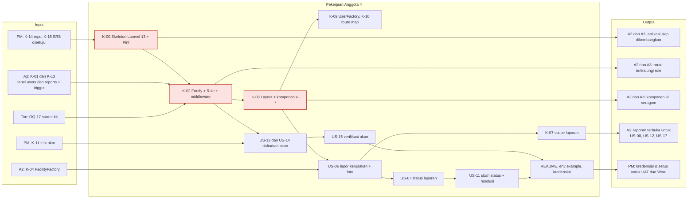
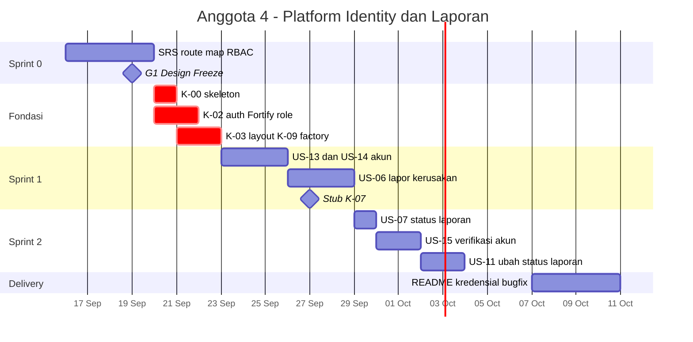
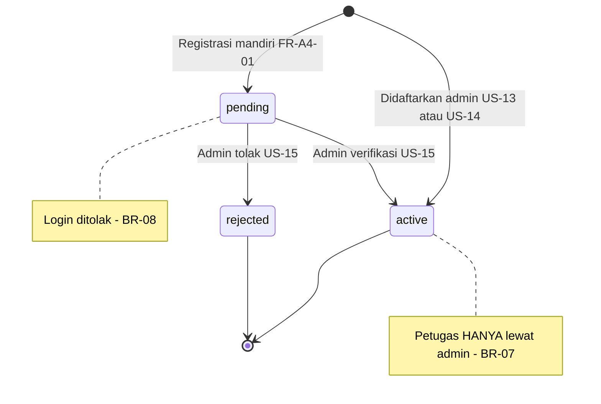
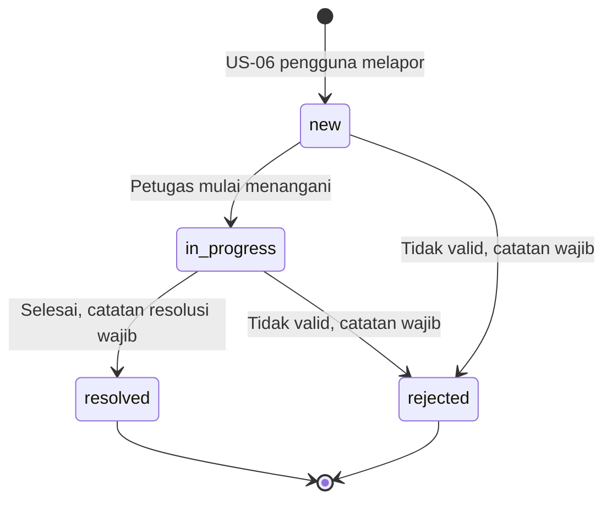

# Anggota4.md — Programmer · Platform, Identity & Laporan

| Field | Isi |
|---|---|
| **Nama** | _(isi)_ |
| **NIM** | _(isi)_ |
| **Username GitHub** | _(isi)_ |
| **Peran** | **Programmer** — Platform Laravel 13, Identity & Access, Laporan Kerusakan |
| **User Story** | US-06, US-07, US-11, US-13, US-14, US-15 + fondasi aplikasi |
| **Kontrak disediakan** | K-00 skeleton, K-02 auth & role, K-03 komponen UI, K-07 scope laporan, K-09 UserFactory, K-10 konvensi route |
| **Kontrak dipakai** | K-01, K-04, K-08, K-12, K-13 (A2) · K-11, K-14, K-15 (PM) |
| **Branch** | Kerja di `a4/*` · SRS di `srs/anggota4-platform-identity-laporan` · **tidak pernah push ke `main`** |
| **SRS** | `workflow/srs/SRS_Anggota4_Platform_Identity_Laporan.md` (FR-A4-01 s/d FR-A4-11) |
| **Review sejawat** | Me-review PR Anggota 3 · PR saya direview Anggota 2 · review akhir & merge oleh PM |
| **Beban** | 25 poin (32%) |
| **Acuan** | `Relationship.md` v2.1 · `PROJECT_WORKFLOW.md` v2.1 · `DATABASE_DESIGN.md` v1.2 |

---

## 1. Misi

Memegang **pondasi aplikasi, pintu masuk pengguna, dan alur laporan kerusakan**.

1. **Minggu pertama — fondasi (critical path).** Skeleton Laravel 13, autentikasi Fortify, middleware role, layout & komponen UI bersama. Kedua programmer lain membangun di atas pekerjaanmu.
2. **Identity & Access.** Registrasi mandiri, login yang menolak akun belum diverifikasi, pendaftaran akun petugas & pengguna oleh admin, verifikasi akun.
3. **Laporan kerusakan.** Alur kedua sistem: pengguna melapor dengan foto, melihat status; petugas memproses sampai selesai. Scope laporanmu (K-07) dipakai Anggota 2 untuk dashboard, status perbaikan, dan rekap.

---

## 2. Peta Tanggung Jawab



---

## 3. User Story, FR & Pekerjaan

| ID | Pekerjaan | FR di SRS | Poin | BR | Jatuh tempo |
|---|---|---|---|---|---|
| K-00 | Skeleton Laravel 13, struktur `routes/modules/*`, Pint | FR-A4-11 | 2 | — | 20 Sep |
| K-02 | Starter kit + Fortify: registrasi, login, logout; enum `Role`; middleware `role:` | FR-A4-01..04 | 3 | BR-07, BR-08 | 21 Sep |
| K-03 | Layout, navigasi per role, komponen `x-*`, pola validasi client | FR-A4-11 | 3 | BR-10 | 22 Sep |
| K-09, K-10 | `UserFactory` per role; route map & RBAC matrix | FR-A4-04 | 2 | — | 22 Sep / 19 Sep |
| US-13 | Admin mendaftarkan akun petugas | FR-A4-05 | 2 | BR-07 | 24 Sep |
| US-14 | Admin mendaftarkan akun pengguna | FR-A4-06 | 2 | — | 25 Sep |
| US-06 | Pengguna melapor kerusakan (kategori, deskripsi, foto) + stub K-07 | FR-A4-08 | 3 | BR-10 | 28 Sep (stub K-07 27 Sep) |
| US-07 | Pengguna melihat status laporannya | FR-A4-09 | 2 | — | 29 Sep |
| US-15 | Admin verifikasi/tolak akun registrasi mandiri | FR-A4-07 | 3 | BR-08 | 1 Okt |
| US-11 | Petugas ubah status laporan + catatan resolusi | FR-A4-10 | 3 | — | 3 Okt |
| — | README, `.env.example`, `docs/05-delivery/credentials.md` | — | — | — | 8 Okt |

---

## 4. Rincian per Sprint

| Sprint | Tanggal | Aktivitas | Branch |
|---|---|---|---|
| **0 — Analysis & Design** | 16–19 Sep | SRS A4; putuskan starter kit (OQ-17); route map & RBAC matrix (K-10); spesifikasi trigger laporan & kode RPT-xx untuk A2 (`DATABASE_DESIGN.md` §7.3); wireframe akun & laporan | `srs/anggota4-platform-identity-laporan` |
| **Fondasi** | 20–22 Sep | K-00 pagi 20 Sep → K-02 → K-03 → K-09. Setiap kontrak = PR terpisah agar cepat di-merge PM | `a4/K-00-skeleton`, `a4/K-02-auth-fortify`, `a4/K-03-komponen-ui` |
| **1** | 23–28 Sep | US-13, US-14; US-06 dengan stub K-07 pada 27 Sep | `a4/US-13-daftar-petugas`, `a4/US-06-lapor-kerusakan` |
| **2** | 29 Sep–3 Okt | US-07, US-15, US-11; K-07 final | `a4/US-15-verifikasi-akun`, `a4/US-11-status-laporan` |
| **Stabilisasi** | 7–8 Okt | README, `.env.example`, kredensial per aktor; review silang PR A3; bugfix UAT | `a4/docs-readme`, `a4/fix-…` |
| **Delivery** | 9–10 Okt | Screenshot fitur + penjelasan untuk PM | — |

---

## 5. Timeline Pribadi



---

## 6. Keperluan

### 6.1 Input yang dibutuhkan

| Dari | Apa | Kapan paling lambat | Kalau terlambat |
|---|---|---|---|
| PM | K-14 repo & aturan branch; K-15 SRS disetujui | 16 / 18 Sep | Siapkan kode skeleton lokal, PR setelah repo siap |
| Tim | OQ-17 keputusan starter kit | 18 Sep | Pakai Livewire starter kit (default) |
| A2 | K-01 & K-13: tabel `users`, `reports`, trigger laporan | 21–23 Sep | Pakai migration users bawaan Laravel 13 + kolom dari `DATABASE_DESIGN.md` §5.1; test trigger menyusul |
| A2 | K-04 `FacilityFactory` | 22 Sep | Form & Form Request US-06 dikerjakan dulu |
| PM | K-11 test plan | 22 Sep | Tulis feature test akses per role dulu |

### 6.2 Output yang diserahkan

| Ke | Apa | Kapan |
|---|---|---|
| A2 | Spesifikasi trigger laporan + kode RPT-xx | 18 Sep |
| A2, A3 | K-00 skeleton di `main` | 20 Sep |
| A2, A3 | K-02 middleware `role:admin`, `role:petugas`, `role:pengguna` | 21 Sep |
| A2, A3 | K-03 komponen `x-input`, `x-button`, `x-alert`, `x-status-badge`, `x-table` | 22 Sep |
| A2, A3 | K-09 `User::factory()->petugas()` dll | 22 Sep |
| A2 | K-07 stub `Report::open()` + `ReportFactory` | 27 Sep |
| PM | README, `.env.example`, kredensial per aktor | 8 Okt |

### 6.3 Tools

Git + GitHub · Composer · Laravel installer · PHP ≥ 8.3 · MySQL ≥ 8.0.16 + Workbench (setelan K-12) · Laravel 13 · starter kit Livewire + Laravel Fortify · Laravel Pint · VS Code · browser DevTools.

### 6.4 Referensi

| Topik | Referensi |
|---|---|
| Starter kit & Fortify (Laravel 13) | https://laravel.com/docs/13.x/starter-kits · https://laravel.com/docs/13.x/fortify |
| Middleware & Policy | https://laravel.com/docs/13.x/middleware · https://laravel.com/docs/13.x/authorization |
| Blade components | https://laravel.com/docs/13.x/blade#components |
| Upload & storage | https://laravel.com/docs/13.x/filesystem · https://laravel.com/docs/13.x/validation |
| Factory states | https://laravel.com/docs/13.x/eloquent-factories |

---

## 7. File & Branch Milikmu

```
Branch  : a4/<ID>-<slug> · srs/anggota4-platform-identity-laporan
File    :
workflow/srs/SRS_Anggota4_Platform_Identity_Laporan.md
docs/02-design/route-map.md
docs/02-design/rbac-matrix.md
README.md
.env.example
.gitignore
docs/05-delivery/credentials.md
routes/web.php                              (hanya require modul)
routes/modules/auth.php
routes/modules/admin-users.php
routes/modules/reports.php
config/fortify.php
config/database.php                         (isi koneksi mengikuti K-12 dari A2)
app/Actions/Fortify/*
app/Providers/FortifyServiceProvider.php
app/Http/Middleware/EnsureRole.php
app/Enums/Role.php
app/Enums/AccountStatus.php
app/Enums/ReportStatus.php
app/Models/User.php
app/Models/Report.php
app/Http/Controllers/Admin/UserController.php
app/Http/Controllers/Admin/StaffController.php
app/Http/Controllers/ReportController.php
app/Http/Controllers/Staff/ReportController.php
app/Http/Requests/StoreUserRequest.php
app/Http/Requests/StoreStaffRequest.php
app/Http/Requests/StoreReportRequest.php
app/Http/Requests/UpdateReportRequest.php
app/Policies/UserPolicy.php
app/Policies/ReportPolicy.php
resources/views/layouts/*
resources/views/components/*
resources/views/admin/users/*
resources/views/reports/*
resources/views/staff/reports/*
database/factories/UserFactory.php
database/factories/ReportFactory.php
database/seeders/UserSeeder.php
database/seeders/ReportSeeder.php
tests/Feature/Auth/*, tests/Feature/Reports/*
```

---

## 8. Spesifikasi Kunci (ringkas)

Kebutuhan lengkap beserta acceptance criteria ada di **SRS Anggota 4**. Ringkasan di bawah untuk orientasi.

### 8.1 Siklus hidup akun (FR-A4-01, FR-A4-05..07)



| Aturan | Tempat di Laravel 13 |
|---|---|
| BR-07 registrasi mandiri selalu `pengguna` + `pending` | `app/Actions/Fortify/CreateNewUser.php` |
| BR-08 akun non-`active` tidak bisa login | `Fortify::authenticateUsing` di `FortifyServiceProvider` (lempar `ValidationException` agar pesan jelas) |
| Hanya admin mendaftarkan petugas | Middleware `role:admin` + `UserPolicy` |
| Fitur Fortify yang tidak dipakai (mis. 2FA) | Dihapus dari `config/fortify.php` |

### 8.2 Siklus hidup laporan (FR-A4-08..10)



Transisi ini **juga ditegakkan MySQL** lewat `trg_reports_bu` dan CHECK `chk_rep_resolution` (`DATABASE_DESIGN.md` §5.8, §7.3). Laravel memberi pesan yang ramah; kode error `RPT-xx` diterjemahkan lewat `DatabaseErrorTranslator`.

### 8.3 Upload foto aman (FR-A4-08)

Validasi mime & ukuran di server, `accept="image/*"` di client, nama file dibuat ulang oleh sistem, disimpan di `storage/app/public/reports`, dan foto hanya bisa dilihat pelapor, petugas, dan admin.

---

## 9. Prompt Overlay AI

Tempel **CORE PROMPT v2.0** (`CLAUDE.md` / `Relationship.md` §13.3) lebih dulu, lalu tempel blok ini.

```text
# ═══════════════════════════════════════════════════════════
# OVERLAY — Anggota 4 · Programmer · Platform, Identity & Laporan
# Dipakai bersama CORE v2.0
# ═══════════════════════════════════════════════════════════

## PERAN
Kamu mendampingi Anggota 4, programmer pemilik fondasi Laravel 13,
autentikasi & otorisasi, manajemen akun, dan modul laporan kerusakan.

## USER STORY & FR MILIK SAYA
Fondasi FR-A4-01..04, FR-A4-11 (registrasi, login, logout, role, komponen)
US-13 FR-A4-05 Admin daftarkan petugas (BR-07)
US-14 FR-A4-06 Admin daftarkan pengguna
US-15 FR-A4-07 Verifikasi/tolak akun registrasi (BR-08)
US-06 FR-A4-08 Lapor kerusakan + foto (BR-10)
US-07 FR-A4-09 Status laporan saya
US-11 FR-A4-10 Ubah status laporan + catatan resolusi

## KONTRAK YANG SAYA SEDIAKAN (tanda tangan wajib stabil)
K-00 Skeleton Laravel 13, routes/modules/*.php, Laravel Pint
K-02 Starter kit Livewire + Fortify; enum Role {admin, petugas, pengguna};
     middleware alias "role" (role:admin / role:petugas / role:pengguna)
K-03 Layout + komponen x-input, x-button, x-alert, x-status-badge, x-table
K-07 Report::open() (status new|in_progress), relasi Facility::reports()
     via PR ke Anggota 2, ReportFactory state new/inProgress/resolved/rejected
     (selain new dibuat lewat UPDATE agar lolos trigger)
K-09 UserFactory state admin(), petugas(), pengguna(), pending()
K-10 Prefix /admin (admin.*), /petugas (staff.*), publik (facilities.*)

## KONTRAK YANG SAYA PAKAI
K-01, K-04, K-08, K-12, K-13 dari Anggota 2 · K-11, K-14, K-15 dari PM

## BRANCH
a4/<ID>-<slug>, contoh a4/K-02-auth-fortify, a4/US-06-lapor-kerusakan.
Tidak pernah push ke main; PR direview Anggota 2, di-merge PM.

## FILE MILIK SAYA
Lihat Anggota4.md §7 (auth, Fortify, role, layout/komponen, akun, laporan,
README, .env.example, credentials.md).

## FOKUS KHUSUS
- Registrasi mandiri SELALU role pengguna + account_status pending;
  abaikan input role dari request (CreateNewUser).
- Akun non-active ditolak di Fortify::authenticateUsing, bukan hanya di UI.
- Komponen K-03 generik; jangan memasukkan logika modul lain.
- Upload foto: validasi mime & ukuran di server, nama file dibuat sistem.
- Status laporan hanya berpindah sesuai state machine; resolution_note
  wajib saat resolved/rejected; tangkap RPT-xx lewat DatabaseErrorTranslator.
- Kontrak fondasi (K-00, K-02, K-03) dikirim sebagai PR kecil terpisah agar
  cepat di-merge PM — dua programmer lain menunggu.
- Test berjalan di MySQL reservasi_fasilitas_test.

## BATASAN
- Jangan membuat migration (milik Anggota 2); butuh kolom → Change Request.
- Jangan mengubah modul fasilitas, reservasi, dashboard, atau rekap.

## PERINTAH TAMBAHAN
/audit-akses  periksa semua route: middleware & Policy sudah benar?
# ═══════════════════════════ AKHIR OVERLAY A4 ═══════════════
```

---

## 10. Definition of Done Pribadi

- [ ] K-00, K-02, K-03 di-merge PM paling lambat 22 Sep
- [ ] Anggota 2 & 3 bisa clone → `composer install` → `migrate:fresh --seed` → jalan
- [ ] Feature test: tiap role hanya mengakses area miliknya, termasuk uji role yang **tidak** berhak
- [ ] Registrasi dengan `role=petugas` yang disisipkan tetap menghasilkan `pengguna` + `pending`
- [ ] Akun `pending` ditolak login dengan pesan jelas
- [ ] Upload file `.php` yang di-rename `.jpg` ditolak server
- [ ] Menutup laporan tanpa catatan resolusi ditolak (Laravel & trigger)
- [ ] Pengguna A tidak bisa melihat laporan & foto pengguna B lewat URL langsung
- [ ] README mencantumkan Laravel 13, PHP ≥ 8.3, MySQL ≥ 8.0.16, setelan K-12; `.env.example` memakai `ppk_app`
- [ ] `phpunit.xml` memakai MySQL `reservasi_fasilitas_test`
- [ ] Minimal 3 commit per minggu lewat branch `a4/*`
- [ ] Screenshot US-06, US-07, US-11, US-13, US-14, US-15, login & registrasi diserahkan ke PM

---

## 11. Persiapan Tanya Jawab & Demo UTS

**Skenario demo (±2 menit):** registrasi akun baru → coba login (ditolak, menunggu verifikasi) → login admin, verifikasi → login pengguna berhasil → lapor kerusakan dengan foto → login petugas, ubah status sampai selesai (coba tanpa catatan → ditolak).

| Kemungkinan pertanyaan | Poin jawaban |
|---|---|
| "Bagaimana mencegah orang mendaftar sebagai petugas?" | Role di-set di `CreateNewUser`; input role diabaikan; akun petugas hanya lewat route `role:admin` |
| "Kalau saya ketik URL `/admin/...` sebagai pengguna?" | Middleware role → 403; Policy lapis kedua |
| "Beda middleware dan Policy?" | Middleware menjaga **area**; Policy menjaga **objek** |
| "Laravel versi berapa? Pakai Breeze?" | Laravel 13 (PHP ≥ 8.3); Breeze tidak lagi tercantum di dokumentasi 13; autentikasi memakai starter kit berbasis Fortify |
| "Kalau yang di-upload bukan gambar?" | Validasi server memeriksa jenis file sebenarnya & ukuran; nama file dibuat ulang |
| "Di mana pemisahan koneksi DB, tampilan, dan logika?" | `config/database.php` + `.env` · `resources/views` · `app/Http`, `app/Services`, `app/Policies` |

---

## 12. Changelog

| Versi | Tanggal | Perubahan | Oleh |
|---|---|---|---|
| 2.1 | 2026-09-16 | Dokumen dipindah ke folder `workflow/` (SRS ke `workflow/srs/`); rujukan path dan versi dokumen terkait diperbarui; versi PDF di `workflow_pdf/`. | DevFlow |
| 2.0 | 2026-09-16 | **Peran diubah menjadi Programmer — Platform, Identity & Laporan.** Mengambil alih fondasi (K-00, K-02, K-03, K-09, K-10) dan US-13/14/15 dari eks Tech Lead; tetap memegang US-06/07/11 dan K-07. US-08, US-17 dipindah ke Anggota 2; test plan & UAT ke PM. Tambah FR-A4, branch `a4/*`, SRS, rotasi review, overlay CORE v2.0. | DevFlow |
| 1.2 | 2026-09-15 | K-13, dashboard/rekap via view MySQL, test di MySQL. | DevFlow |
| 1.1 | 2026-09-15 | K-12 standar DBMS. | DevFlow |
| 1.0 | 2026-09-15 | Dokumen awal Reporting, Insight & QA. | DevFlow |
